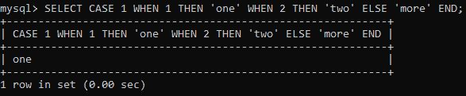
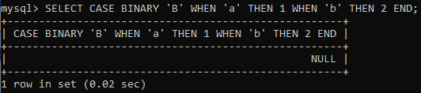
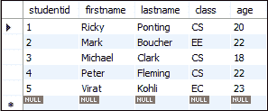
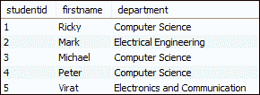

# MySQL 案例表达式

> 原文：<https://www.javatpoint.com/mysql-case-expression>

MySQL CASE 表达式是控制流函数的一部分，它为我们编写查询的 **if-else 或 if-then else**逻辑。此表达式可用于任何使用有效程序或查询的地方，如 SELECT、where、ORDER BY 子句等。

CASE 表达式验证各种条件，当第一个条件为**真**时返回结果。一旦满足条件，它就停止遍历并给出输出。如果没有发现任何条件为真，则执行**否则阻止**。当没有找到 else 块时，它返回一个**空值**。 [MySQL](https://www.javatpoint.com/mysql-tutorial) CASE 语句的主要目标是处理 SELECT 子句中的多个 IF 语句。

我们可以通过两种方式使用 CASE 语句，如下所示:

## 1.简单的案例陈述:

第一种方法是获取一个值，并将其与给定的语句进行匹配，如下所示。

### 句法

```sql

CASE value 
	WHEN [compare_value] THEN result 
	[WHEN [compare_value] THEN result ...] 
	[ELSE result] 
END

```

当第一次 **compare_value** 比较为真时，返回结果。否则，它将返回 else 子句。

### 例子

```sql

mysql> SELECT CASE 1 WHEN 1 THEN 'one' WHEN 2 THEN 'two' ELSE 'more' END;

```

**输出**

成功执行上述命令后，我们将看到以下输出。



## 2.搜索的案例陈述:

第二种方法是在 **WHEN** 子句中考虑一个 **search_condition** ，如果找到，则在相应的 THEN 子句中返回结果。否则，它将返回 else 子句。如果没有指定 else 子句，它将返回空值。

### 句法

```sql

CASE 
	WHEN [condition] THEN result 
	[WHEN [condition] THEN result ...] 
	[ELSE result] 
END

```

### 例子

```sql

mysql> SELECT CASE BINARY 'B' WHEN 'a' THEN 1 WHEN 'b' THEN 2 END;

```

**输出**



### 返回类型

CASE 表达式根据使用它的上下文返回结果。例如:

*   如果在字符串上下文中使用它，它将返回字符串结果。
*   如果在数值上下文中使用，它将返回整数、浮点、十进制值。

## MySQL 版本支持

CASE 语句可以支持以下 [MySQL 版本](https://www.javatpoint.com/mysql-versions):

*   MySQL 8.0
*   MySQL 5.7
*   MySQL 5.6
*   MySQL 5.5
*   MySQL 5.1
*   MySQL 5.0
*   MySQL 4.1
*   MySQL 4.0
*   MySQL 3.23.3

让我们创建一个表“**学生”**，并在这个表上执行 CASE 语句。



在上表中，我们可以看到**类列**包含了学生所在系的简写形式。这就是为什么我们将把部门的简写形式改为完整形式。现在，执行以下查询来执行该操作。

```sql

SELECT studentid, firstname,
 CASE class 
	WHEN 'CS' THEN 'Computer Science' 
	WHEN 'EC' THEN 'Electronics and Communication' 
	ELSE 'Electrical Engineering' 
END AS department from students;

```

成功执行上述查询后，我们将获得以下输出。在这里，我们可以看到**部门**列包含完整形式而不是简短形式。



* * *