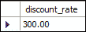
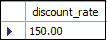
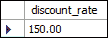

# MySQL IF 语句

> 原文：<https://www.javatpoint.com/mysql-if-statement>

IF 语句用于在 MySQL 中实现基本条件构造的存储程序。基于某种条件，它允许我们执行一组 SQL 语句。它返回三个值之一“真”、“假”或“空”。

我们可以在 IF-THEN、IF-THEN-ELSE、IF-THEN-ELSEIF-ELSE 子句中以三种方式使用此语句，并且可以以 END-IF 结尾。让我们详细看看这些陈述。

## 如果-那么陈述

该语句基于某些条件或表达式执行一组 [SQL](https://www.javatpoint.com/sql-tutorial) 查询。IF-THEN 语句的语法如下:

```

IF condition THEN 
   statements;
END IF;

```

在上面的语法中，我们必须指定执行代码的条件。如果该语句评估为真，它将在 IF-THEN 和 END-IF 之间执行该语句。否则，它将执行 END-IF 后面的语句。

### 例子

综合框架...ENDIF 块使用存储的程序执行，并以分号结束，如下例所示。

```

DELIMITER $$
CREATE PROCEDURE myResult(original_rate NUMERIC(6,2),OUT discount_rate NUMERIC(6,2))
     NO SQL
      BEGIN
         IF (original_rate>200) THEN
            SET discount_rate=original_rate*.5;
         END IF;
	     select discount_rate;
     END$$
DELIMITER $$;

```

接下来，取两个变量，并按如下方式设置这两个变量的值:

```

mysql> set @p = 600;
mysql> set @dp = 500;

```

现在，调用存储过程函数来检查输出。

```

mysql> call myResult(@p, @dp)

```

我们将获得以下输出:



## 如果-那么-否则语句

如果我们想在 If 块中指定的条件没有计算为真时执行其他语句，可以使用该语句。IF-THEN-ELSE 语句的语法如下:

```

IF condition THEN
   statements;
ELSE
   else-statements;
END IF;

```

在上面的语法中，我们必须指定执行代码的条件。如果该语句的计算结果为真，它将在 IF-THEN 和 ELSE 之间执行该语句。否则，它将执行 ELSE 和 END-IF 后面的语句。

让我们修改上面的 **myResult()** 存储过程。因此，首先，使用下面的命令删除 myResult()存储过程:

```

Mysql> DROP procedure myResult;

```

接下来，为此编写新代码，如下所示:

```

DELIMITER $$
CREATE PROCEDURE myResult(original_rate NUMERIC(6,2),OUT discount_rate NUMERIC(6,2))
     NO SQL
      BEGIN
         IF (original_rate>200) THEN
            SET discount_rate=original_rate*.5;
		ELSE
            SET discount_rate=original_rate;
         END IF;
	     select discount_rate;
     END$$
DELIMITER ;

```

接下来，创建**两个变量**，并如下设置两者的值:

```

mysql> set @p = 150;
mysql> set @dp = 180;

```

现在，调用存储过程函数来获取输出。

```

mysql> call myResult(@p, @dp)

```

它将给出以下输出:



## 如果-那么-ELSEIF-ELSE 语句

如果我们想要执行基于多个条件的语句，可以使用这个语句。IF-THEN-ELSE 语句的语法如下:

```

IF condition THEN
   statements;
ELSEIF elseif-condition THEN
   elseif-statements;
...
ELSE
   else-statements;
END IF;

```

在上面的语法中，如果条件变为真，它将执行 IF-THEN 分支。否则，它将评估其他条件。当 elseif 条件变为真时，它将执行 elseif 语句。如果此条件也为假，它将评估下一个 elseif 条件。因此，这里我们将计算多个 elseif 条件，如果 if 和 ELSE IF 中的任何条件不为真，它将执行 ELSE 分支的语句。

让我们修改上面的 myResult()存储过程。因此，首先，使用下面的命令删除 myResult()存储过程:

```

Mysql> DROP procedure myResult;

```

接下来，为此编写新代码，如下所示:

```

DELIMITER $$
CREATE PROCEDURE myResult(original_rate NUMERIC(6,2),OUT discount_rate NUMERIC(6,2))
     NO SQL
      BEGIN
         IF (original_rate>500) THEN
            SET discount_rate=original_rate*.5;
		ELSEIF (original_rate<=500 AND original_rate>250) THEN
            SET discount_rate=original_rate*.8;
		ELSE
            SET discount_rate=original_rate;
         END IF;
	     select discount_rate;
     END$$
DELIMITER ;

```

接下来，创建两个变量，并按如下方式设置这两个变量的值:

```

mysql> set @p = 150;
mysql> set @dp = 150;

```

现在，调用存储过程函数来获取输出。

```

mysql> call myResult(@p, @dp)

```

它将给出以下输出:



* * *