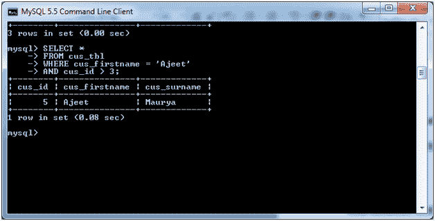

# MySQL 与条件

> 原文：<https://www.javatpoint.com/mysql-and>

MySQL AND 条件与 SELECT、INSERT、UPDATE 或 DELETE 语句一起使用，以测试单个查询中的两个或多个条件。

### 语法:

```
WHERE condition1
AND condition2
...
AND condition_n;

```

## 参数说明:

**条件 1，条件 2，...condition_n:** 指定要选择的记录必须满足的所有条件。

## MySQL 和示例

下面的例子说明了如何在带有 SELECT 语句的 [MySQL](https://www.javatpoint.com/mysql-tutorial) 中使用 AND 条件。

考虑一个表“cus_tbl”，它有以下数据:


**执行以下查询:**

```
SELECT *
FROM cus_tbl
WHERE cus_firstname = 'Ajeet'
AND cus_id > 3;

```

**输出:**



* * *