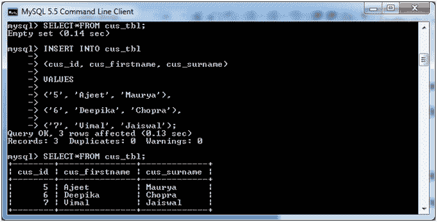
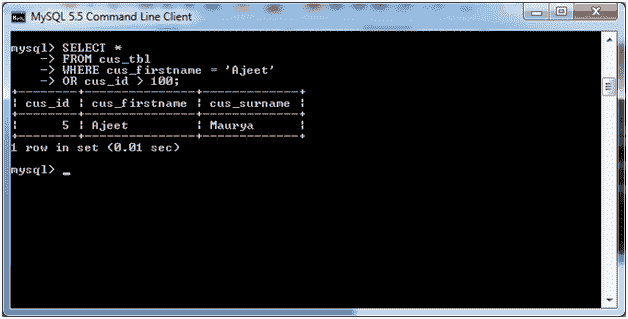

# MySQL 或条件

> 原文：<https://www.javatpoint.com/mysql-or>

MySQL 或条件指定，如果您接受两个或多个条件，那么必须满足其中一个条件才能得到结果记录。

**语法:**

```sql
WHERE condition1
OR condition2
...
OR condition_n;

```

## 参数说明

**条件 1，条件 2，...condition_n:** 指定要选择的记录必须满足的所有条件。

## MySQL 或示例

以下示例指定如何在 MySQL 中使用“或”条件和 SELECT 语句。

考虑一个表“cus_tbl”，它有以下数据:



**执行以下查询:**

```sql
SELECT *
FROM cus_tbl
WHERE cus_firstname = 'Ajeet'
OR cus_id > 100;

```

**输出:**



**注意:**在上面的例子中，可以看到第二个条件“cus_id”是错误的，但是由于 OR 条件，查询显示的是正确的结果。