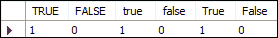
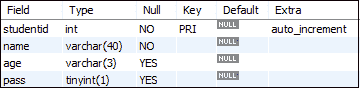
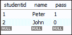
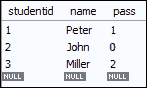
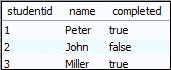
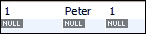
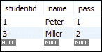

# MySQL 布尔值

> 原文：<https://www.javatpoint.com/mysql-boolean>

布尔值是最简单的数据类型，它总是返回两个可能的值，真或假。它总是可以用来以“是”或“否”值的形式获得确认。

MySQL 不包含内置的布尔或 Bool 数据类型。它们提供了一个 **TINYINT** 数据类型，而不是布尔或布尔数据类型。 [MySQL](https://www.javatpoint.com/mysql-tutorial) 认为零值为假，非零值为真。如果要使用布尔值，请使用 true 或 false，该值始终计算为 0 和 1。0 和 1 代表整数值。

执行以下语句查看布尔文字的整数值:

```

Mysql> Select TRUE, FALSE, true, false, True, False;

```

成功执行后，会出现以下结果:



### MySQL 布尔示例

我们可以将一个布尔值作为整数数据类型存储在 MySQL 表中。让我们创建一个学生表，演示布尔数据类型在 MySQL 中的使用:

```

mysql> CREATE TABLE student (
    studentid INT PRIMARY KEY AUTO_INCREMENT,
    name VARCHAR(40) NOT NULL,
    age VARCHAR(3),
    pass BOOLEAN
);

```

在上面的查询中，我们可以看到在显示一个表的定义时，pass 字段被定义为一个布尔值；它包含如下 TINIINT:

```

mysql> DESCRIBE student;

```



让我们借助以下查询在上表中添加两个新行:

```

mysql> INSERT INTO student(name, pass) VALUES('Peter',true), ('John',false);

```

当执行上述查询时，MySQL 会立即检查表中的布尔数据类型。如果找到布尔文字，它将被转换为 0 和 1 的整数值。执行以下查询从学生表中获取数据:

```

Mysql> SELECT  studentid, name, pass FROM student;

```

您将获得以下输出，其中 true 和 false 文本被转换为 0 和 1 值。



由于 MySQL 总是使用 TINYINT 作为布尔值，所以我们也可以在布尔列中插入任何整数值。执行以下语句:

```

Mysql> INSERT INTO student(name, pass) VALUES('Miller',2);

```

您将获得以下结果:



在某些情况下，你需要得到真值和假值的结果。在这种情况下，您需要使用 select 语句执行 if()函数，如下所示:

```

Mysql> SELECT  studentid, name, IF(pass, 'true', 'false') completed FROM student1;

```

它将给出以下输出:



### MySQL 布尔运算符

MySQL 还允许我们对布尔数据类型使用运算符。执行以下查询以获得学生表的所有通过结果。

```

SELECT studentid, name, pass FROM student1 WHERE pass = TRUE;

```

该语句返回以下输出:



上面的语句只在值等于 1 时返回传递结果。我们可以通过使用 **IS** 运算符来修复它。该运算符使用布尔值验证该值。以下陈述对此进行了解释:

```

SELECT studentid, name, pass FROM student1 WHERE pass is TRUE;

```

执行此语句后，您将获得以下结果:



如果你想看到待定的结果，使用如下的**为假**或**不为真**运算符:

```

SELECT studentid, name, pass FROM student1 WHERE pass IS FALSE;

OR,

SELECT studentid, name, pass FROM student1 WHERE pass IS NOT TRUE;

```

您将获得以下输出:


* * *