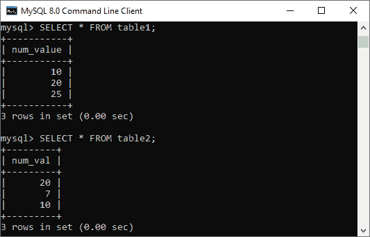
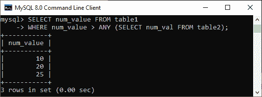

# MySQL ANY

> 原文：<https://www.javatpoint.com/mysql-any>

ANY 关键字是一个 MySQL 运算符，如果任何子查询条件的比较结果为真，则**返回布尔值真**。换句话说，如果在执行 SQL 查询时满足任何子查询条件，该关键字将返回 true。ANY 关键字必须**跟随比较运算符**。请注意， **ALL SQL** 运算符与 ANY 运算符相关，但当 MySQL 中的条件满足所有子查询值时，它返回 true。

ANY 运算符的工作方式类似于将表的值与子查询条件提供的结果集中的每个值进行比较。然后，如果它找到任何与子查询的至少一个值/行匹配的值，它将返回真结果。

### 句法

以下是说明在 MySQL 中使用 ANY 运算符的语法:

```sql

operand comparison_operator ANY (subquery)

```

其中比较运算符可以是下列之一:

```sql

=  >  <  >=  <=  <>  !=

```

该语法也可以写成:

```sql

SELECT column_lists FROM table_name1 WHERE column_name Operator ANY (SELECT column_name FROM table_name2 WHERE condition); 

```

我们可以通过下面的语句了解 ANY 在 [MySQL](https://www.javatpoint.com/mysql-tutorial) 中是如何工作的:

```sql

SELECT colm1 FROM table1 WHERE colm1 > ANY (SELECT colm1 FROM table2);

```

假设**表 1** 有一行包含一个**数字(10)** 。在这种情况下，如果**表 2** 包含(20，15 和 6)，上述表达式返回**真**。这是因为表 2 中有一个值 6，小于 10。如果表 2 包含(15，20)，或者如果表 2 为空，则该表达式返回 **false** 。如果所有表字段都包含(空、空、空)，则该表达式为**未知**。

### 例子

让我们创建一个名为**表 1** 和**表 2** 的两个表，然后使用下面的语句在其中插入一些值:

```sql

CREATE TABLE table1 (
	num_value INT
); 
INSERT INTO table1 (num_value) 
VALUES(10), (20), (25);

CREATE TABLE table2 (
	num_val int
); 
INSERT INTO table2 (num_val)
VALUES(20), (7), (10);

```

上述语句成功执行后，我们可以使用 [**SELECT** 语句](https://www.javatpoint.com/mysql-select)进行验证，如下所示:



现在，我们将执行下面的语句来理解 ANY 运算符的用法:

```sql

SELECT num_value FROM table1 
WHERE num_value > ANY (SELECT num_val FROM table2);

```

此语句返回 true 并给出下面的输出，因为表 2 包含(20、10 和 7)，并且表 2 中的值 7 小于表 1 中的 10、20 和 25。



当与语句中的子查询一起使用时，MySQL 中的 **IN 关键字**是= ANY 的**别名。因此，以下两个语句在 MySQL 中是相同的:**

```sql

SELECT colm1 FROM table1 WHERE colm1 = ANY (SELECT colm1 FROM table2);
SELECT colm1 FROM table1 WHERE colm1 IN (SELECT colm1 FROM table2);

```

但是，当我们将其与表达式列表一起使用时，我们不能说 IN 和= ANY 是同义词。这是因为 IN 可以接受一个表达式列表，但是= ANY 不能。

另外， **NOT IN** 不能作为 **< > ANY** 运算符的别名，但可以用于 **< > ALL** 。

MySQL 中的 **SOME** 这个词可以是 ANY 的别名。因此，这两个 [SQL](https://www.javatpoint.com/sql-tutorial) 语句是等价的:

```sql

SELECT colm1 FROM table1 WHERE colm1 <>ANY (SELECT colm1 FROM table2);
SELECT colm1 FROM table1 WHERE colm1 <> SOME (SELECT colm1 FROM table2);

```

### MySQL 中 ANY 运算符的优势

*   ANY 是返回布尔值的逻辑运算符。它允许我们选择 select 语句的任意行或某些行。
*   由于比较运算符位于此运算符之前，因此如果任何子查询满足指定条件，它将始终返回真。
*   它提供结果，该结果是与第二个表中的任何记录匹配的表中的唯一列值。
*   我们可以使用带有 SELECT 和 WHERE 关键字的 ANY 运算符进行几次比较。

在本文中，我们学习了如何在 MySQL 中使用 ANY 运算符。只有当任何值满足条件时，它才从 SQL 语法中过滤结果集。否则，它会给出一个错误的值。

* * *