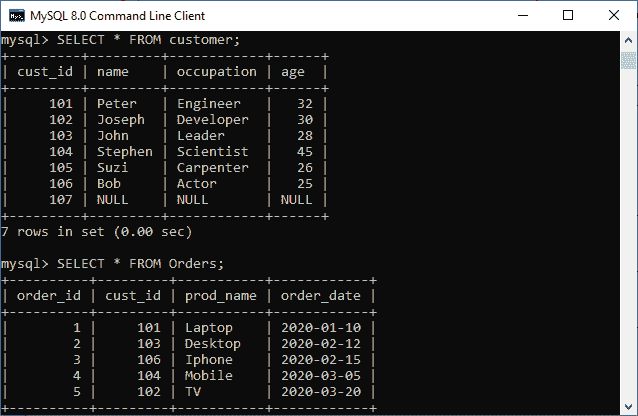
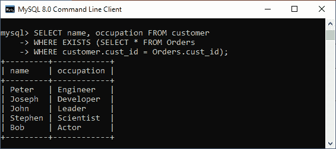
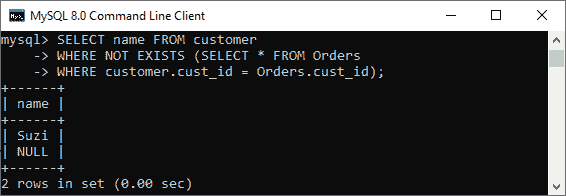
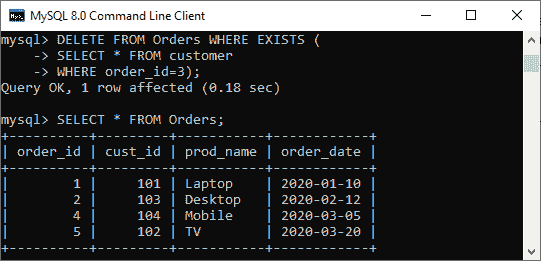
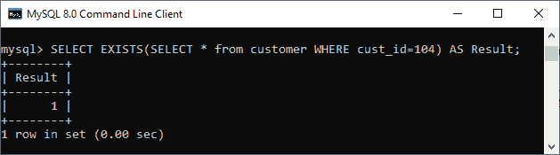

# MySQL 存在

> 原文：<https://www.javatpoint.com/mysql-exists>

MySQL 中的 EXISTS 运算符是一种布尔运算符，它返回**真或假的**结果。它与子查询结合使用，并检查子查询中数据的存在。这意味着如果子查询返回任何记录，该运算符将返回 true。否则，它将返回 false。真值始终表示为数值 1，而假值表示为 0。我们可以将它与 SELECT、UPDATE、DELETE、INSERT 语句一起使用。

### 句法

以下是在 [MySQL](https://www.javatpoint.com/mysql-tutorial) 中使用 EXISTS 运算符的语法:

```sql

SELECT col_names
FROM tab_name
WHERE [NOT] EXISTS (
	SELECT col_names 
	FROM tab_name 
	WHERE condition
);

```

NOT 运算符用于否定 EXISTS 运算符。当子查询不返回任何行时，它返回 true。否则，它返回 false。

通常，EXISTS 查询以 SELECT *开头，但也可以以 SELECT 列、SELECT _ a 常量或子查询中的任何内容开头。它将给出相同的输出，因为 MySQL 忽略了 SUBSCRIBE 中的选择列表。

找到匹配结果后，该运算符立即终止，以便进一步处理。这个特性提高了 MySQL 中查询的性能。

### 参数说明

以下是 EXISTS 运算符中使用的参数:

| 参数名称 | 描述 |
| 列名 | 它是指定表中包含的列的名称。 |
| 选项卡名称 | 这是我们将从中执行 EXISTS 运算符的表的名称。 |
| 情况 | 它指定从表中搜索特定值。 |
| 子查询 | 通常是 SELECT 语句以 SELECT *开头，但是 MySQL 在子查询中忽略了它。 |

### MySQL EXISTS 运算符示例

让我们理解 EXISTS 操作符在 MySQL 中是如何工作的。在这里，我们将首先使用以下语句创建两个名为**“客户”和“订单”**的表:

```sql

CREATE TABLE customer(
  cust_id int NOT NULL,
  name varchar(35),
  occupation varchar(25),
  age int
);

```

```sql

CREATE TABLE orders (
	order_id int NOT NULL, 
	cust_id int, 
	prod_name varchar(45),
	order_date date
);

```

接下来，我们需要在两个表中插入值。执行以下语句:

```sql

INSERT INTO customer(cust_id, name, occupation, age) 
VALUES (101, 'Peter', 'Engineer', 32),
(102, 'Joseph', 'Developer', 30),
(103, 'John', 'Leader', 28),
(104, 'Stephen', 'Scientist', 45),
(105, 'Suzi', 'Carpenter', 26),
(106, 'Bob', 'Actor', 25),
(107, NULL, NULL, NULL);

```

```sql

INSERT INTO orders (order_id, cust_id, prod_name, order_date) 
VALUES (1, '101', 'Laptop', '2020-01-10'),
(2, '103', 'Desktop', '2020-02-12'),
(3, '106', 'Iphone', '2020-02-15'),
(4, '104', 'Mobile', '2020-03-05'),
(5, '102', 'TV', '2020-03-20');

```

要验证表格，运行[选择命令](https://www.javatpoint.com/mysql-select)如下:

```sql

msql> SELECT * FROM customer;
AND,
mysql> SELECT * FROM orders;

```

我们将获得以下输出:



### MySQL SELECT EXISTS 示例

在本例中，我们将使用 EXISTS 运算符查找至少下过一次订单的客户的姓名和职业:

```sql

mysql> SELECT name, occupation FROM customer
WHERE EXISTS (SELECT * FROM Orders 
WHERE customer.cust_id = Orders.cust_id);

```

出现以下输出:



同样，如果我们想获得尚未下订单的客户的姓名，那么使用 NOT EXISTS 运算符:

```sql

mysql> SELECT name, occupation FROM customer
WHERE NOT EXISTS (SELECT * FROM Orders 
WHERE customer.cust_id = Orders.cust_id);

```

它将给出以下输出:



### 带有删除语句的 MySQL 存在示例

假设我们要从 Orders 表中删除一条 order _ id = 3 的记录，执行以下查询，从 Orders 表中永久删除该记录:

```sql

mysql> DELETE FROM Orders WHERE EXISTS (
SELECT * FROM customer 
WHERE order_id=3);

```

要验证输出，请运行以下命令:

```sql

mysql> SELECT * FROM Orders;

```

在输出中，我们可以看到 order_id=3 的表记录被成功删除。



如果我们想检查表中是否存在行，请使用以下查询:

```sql

mysql> SELECT EXISTS(SELECT * from customer WHERE cust_id=104) AS Result;

```

我们将得到表示为真的输出 1。因此，cust_id=104 存在于表中。



### 存在运算符和输入运算符之间的区别

EXISTS 和 in 运算符之间的主要区别以表格形式给出:

| 塞内加尔 | 在…里 | 存在 |
| **1。** | 它用于最小化 MySQL 中的多个或条件。 | 它用于检查子查询中是否存在数据。 |
| **2。** | 从标签名中选择列名，其中列名输入(子查询)； | 

```sql
SELECT col_names
FROM tab_name
WHERE [NOT] EXISTS (subquery);
```

 |
| **3。** | 它比较输入运算符内的所有值。 | 一旦发现第一个真正的事件，它就停止执行。 |
| **4。** | 它可以用于比较空值。 | 它不能用于比较空值。 |
| **5。** | 当子查询结果较少时，它执行得更快。 | 当子查询结果较大时，它执行得更快。 |
| **6。** | 它在父查询和子查询或子查询之间执行比较。 | 它不执行父查询和子查询或子查询之间的比较。 |

* * *