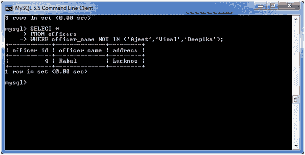
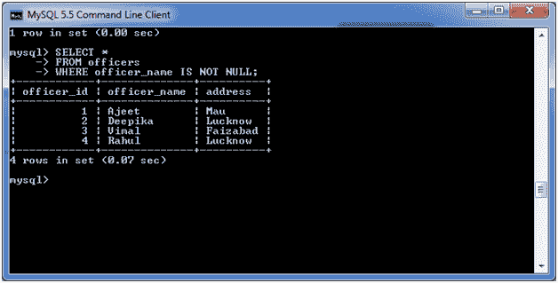
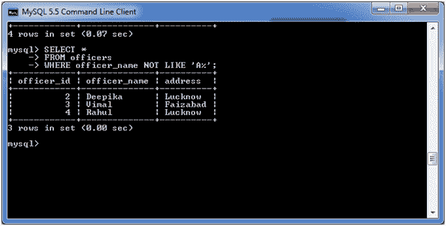
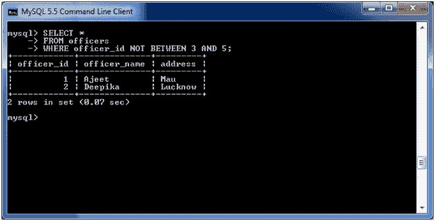

# MySQL 非条件

> 原文：<https://www.javatpoint.com/mysql-not>

MySQL 非条件与 MySQL 输入条件相反。它用于否定 SELECT、INSERT、UPDATE 或 DELETE 语句中的条件。

## 语法:

```
NOT condition

```

## 参数

**条件:**指定要否定的条件。

## 输入条件下的非运算符

考虑一个表格“官员”，有以下数据。


**执行以下查询:**

```
SELECT *
FROM officers
WHERE officer_name NOT IN ('Ajeet','Vimal','Deepika');

```

**输出:**



## 条件为空的非运算符:

**执行以下查询:**

```
SELECT *
FROM officers
WHERE officer_name IS NOT NULL;

```

**输出:**



## 具有相似条件的非操作符:

我们这次行动也采取了同样的“官”表:

**执行以下查询:**

```
SELECT *
FROM officers
WHERE officer_name NOT LIKE 'A%';

```

**输出:**



## 带有介于条件的非运算符:

我们这次行动也采取了同样的“官”表:

**执行以下查询:**

```
SELECT *
FROM officers
WHERE officer_id NOT BETWEEN 3 AND 5;

```

**输出:**



* * *