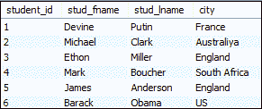
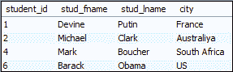
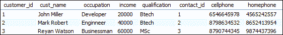
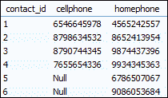
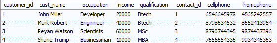

# MySQL 不平等

> 原文：<https://www.javatpoint.com/mysql-not-equal>

MySQL Not Equal 是一个**不等式运算符**，用于在比较两个不相等的表达式后返回一组行。MySQL 包含两种不等运算符，分别是(< >)和(！=).

### (< >)和(！=)运算符

MySQL 中的不等运算符同样适用于执行两个表达式之间的不等式测试。他们总是给出同样的结果。然而，它们有一个区别，那就是“< >”遵循**国际标准化组织标准**！= "不符合国际标准化组织标准。

### 例 1

让我们创建一个学生表来理解不等运算符在 MySQL 中是如何工作的。假设“学生”表包含以下数据:

**表:学生**



如果想要获取不属于**英格兰**的学生详细信息，那么需要执行以下语句:

```

SELECT * FROM students WHERE city <> "England";

```

或者，

```

SELECT * FROM students WHERE city != "England";

```

成功执行上述查询后，我们将获得如下相同的输出:



### 例 2

在本例中，我们将了解不等运算符如何与 **Group By** 子句一起工作。我们可以使用 Group By 子句对具有相同数据的行进行分组。如果我们想获得所有没有**手机号码**和**重复收入**值的客户，请执行以下语句:

```

SELECT * FROM customers
JOIN contacts ON customer_id = contact_id 
WHERE cellphone <> "Null"
GROUP BY income;

```

我们将获得以下输出:



### 例 3

在本例中，我们将了解不等运算符如何使用 **JOIN** 语句。让我们在包含以下数据的数据库中创建一个表“**联系人**”和“**客户**”:

**表格:联系人**



**表:客户**


如果我们想从手机为空的表客户和联系人那里获取所有记录，请执行以下语句，返回所有没有**手机**号码的客户:

```

SELECT * FROM customers
JOIN contacts ON customer_id = contact_id 
WHERE cellphone != "Null;

```

成功执行后，它将给出以下输出:



### 例 4

在本例中，我们将了解不等运算符如何处理 WHERE 子句中的多个条件。比如我们想得到**收入**高于 **4 万**、**职业**不是**开发商的客户明细。**执行以下语句得到结果:

```

SELECT * FROM customers Where income>40000 and occupation<>"Developer";

```

成功执行上述语句后，我们将获得以下输出。


* * *