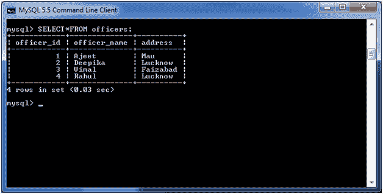
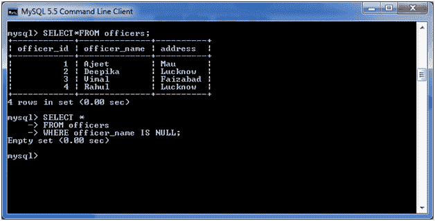

# MySQL 为空条件

> 原文：<https://www.javatpoint.com/mysql-is-null>

MySQL IS NULL 条件用于检查表达式中是否有 NULL 值。它与 SELECT、INSERT、UPDATE 和 DELETE 语句一起使用。

**语法:**

```sql
expression IS NULL

```

## 参数

**表达式:**它指定一个值来测试它是否为空值。

考虑一个包含以下数据的“官员”表。



**执行以下查询:**

```sql
SELECT *
FROM officers
WHERE officer_name IS NULL;

```

**输出:**



**注意:**这里你得到的是空结果，因为 officer_name 列没有 NULL 值。