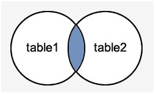
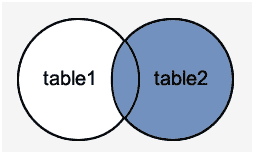

# MySQL JOINS

> 原文：<https://www.javatpoint.com/mysql-join>

MySQL JOINS 与 SELECT 语句一起使用。它用于从多个表中检索数据。每当需要从两个或多个表中获取记录时，都会执行该操作。

有三种类型的 [MySQL](https://www.javatpoint.com/mysql-tutorial) 连接:

*   MySQL INNER JOIN(或有时称为简单连接)
*   MySQL 左外连接(或有时称为左连接)
*   MySQL 右外连接(有时也称为右连接)

## MySQL 内部连接(简单连接)

[MySQL INNER JOIN](https://www.javatpoint.com/mysql-inner-join) 用于返回多个表中满足连接条件的所有行。这是最常见的连接类型。

**语法:**

```
SELECT columns
FROM table1 
INNER JOIN table2
ON table1.column = table2.column;

```

**图像表示:**



**举个例子:**

考虑两个表格“官员”和“学生”，有以下数据。


**执行以下查询:**

```
SELECT officers.officer_name, officers.address, students.course_name
FROM officers 
INNER JOIN students
ON officers.officer_id = students.student_id; 

```

**输出:**


## MySQL 左外连接

LEFT OUTER JOIN 返回左侧表中在 ON 条件中指定的所有行，并且只返回另一个表中满足 JOIN 条件的那些行。

**语法:**

```
SELECT columns
FROM table1
LEFT [OUTER] JOIN table2
ON table1.column = table2.column;

```

**图像表示:**


**举个例子:**

考虑两个表格“官员”和“学生”，有以下数据。


**执行以下查询:**

```
SELECT  officers.officer_name, officers.address, students.course_name
FROM officers
LEFT JOIN students
ON officers.officer_id = students.student_id;

```

**输出:**


## MySQL 右外连接

MySQL 右外连接返回在开条件中指定的右表中的所有行，并且只返回满足连接条件的另一个表中的那些行。

**语法:**

```
SELECT columns
FROM table1
RIGHT [OUTER] JOIN table2
ON table1.column = table2.column;

```

**图像表示:**



**举个例子:**

考虑两个表格“官员”和“学生”，有以下数据。


**执行以下查询:**

```
SELECT officers.officer_name, officers.address, students.course_name, students.student_name
FROM officers
RIGHT JOIN students
ON officers.officer_id = students.student_id;

```

**输出:**


* * *