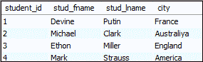
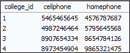
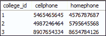
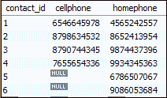
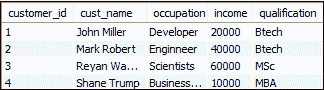

# MySQL DELETE JOIN

> 原文：<https://www.javatpoint.com/mysql-delete-join>

删除查询是数据操作语言的一个子部分，用于从表中删除行。如何在 [MySQL](https://www.javatpoint.com/mysql-tutorial) 中删除 join 是面试时非常热门的问题。在 MySQL 中使用 delete join 语句并不是一个容易的过程。在本节中，我们将描述如何在 delete 查询中使用 INNER JOIN 或 LEFT JOIN 从多个表中删除记录。

### 用内部联接删除联接

内部联接查询可以与删除查询一起使用，从一个表中删除行，从另一个表中删除满足指定条件的匹配行。

### 句法

以下是可用于使用[内部连接](https://www.javatpoint.com/mysql-inner-join)从多个表中删除行的语法。

```sql

DELETE target table 
FROM    table1  
INNER JOIN table2
ON table1.joining_column= table2.joining_column
WHERE   condition

```

这里，目标是一个表名，我们希望通过匹配指定的条件从该表中删除行。假设要删除表 **T1** 和 **T2** 中 **student_id = 2** 的行，那么可以写成如下语句:

```sql

DELETE T1, T2  
FROM    T1  
INNER JOIN T2  
ON T1.student_id=T2.student.id  
WHERE   T1.student_id=2;

```

在上面的语法中，目标表(T1 和 T2)写在 DELETE 和 FROM 关键字之间。如果我们省略其中的任何表名，那么 [delete 语句](https://www.javatpoint.com/mysql-delete)只从单个表中删除行。用 **ON** 关键字编写的表达式是与您要删除的表中的行相匹配的条件。

### 例子

假设我们有两个表**学生**和**联系人**，其中包含以下数据:

**表:学生**



**表格:联系人**



执行以下查询，了解[用内部连接删除连接](https://www.javatpoint.com/mysql-delete-join)。此语句删除两个表中具有相同 id 的行。

```sql

DELETE students, contacts FROM students
INNER JOIN contacts ON students.student_id=contacts.college_id 
WHERE students.student_id = 4;

```

成功执行后，它将给出以下消息:


现在，运行以下查询来验证已成功删除的行。

```sql

mysql> SELECT * FROM students;
mysql> SELECT * FROM contacts;

```

可以看到删除了 **student_id=4** 的行。

 

### 用左连接删除连接

我们已经学习了带有 [SELECT 语句](https://www.javatpoint.com/mysql-select)的 LEFT JOIN 子句，该语句返回左侧(第一个)表中的所有行以及另一个表中匹配或不匹配的行。同样，我们也可以将 LEFT JOIN 子句与 DELETE 关键字一起使用，从左侧(第一个)表中删除没有匹配行的行。

下面的查询更清楚地解释了为什么 DELETE 语句使用 LEFT JOIN 从**表 1** 中删除那些在**表 2** 中没有匹配行的行:

```sql

DELETE Table1 FROM Table1
LEFT JOIN Table2 ON Table1.key = Table2.key 
WHERE Table2.key IS NULL;

```

在上面的查询中，请注意，我们将只使用带有 DELETE 关键字的 Table1，而不是像在 INNER JOIN 语句中那样同时使用这两个关键字。

### 例子

让我们在包含以下数据的数据库中创建一个表“**联系人**”和“**客户**”:

**表格:联系人**



**表:客户**


执行以下语句，删除没有**手机**号码的客户:

```sql

DELETE customers FROM customers
LEFT JOIN contacts ON customers.customer_id = contacts.contact_id 
WHERE cellphone IS NULL;

```

成功执行后，它将给出以下消息:


现在，运行以下查询来验证已成功删除的行。

```sql

mysql> SELECT * FROM customers;

```

您可以看到客户没有手机号码的行被删除了。



* * *