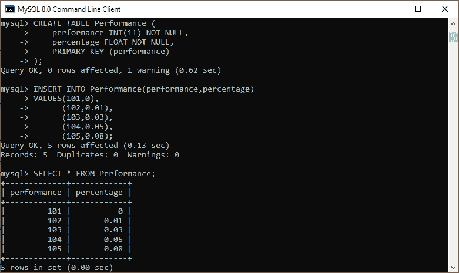
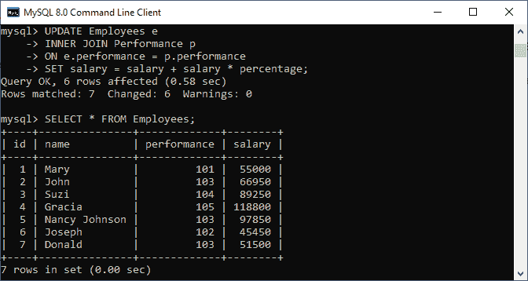
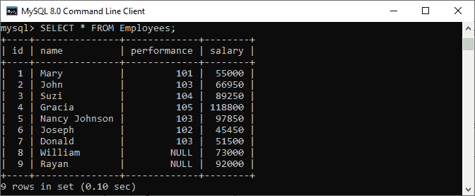
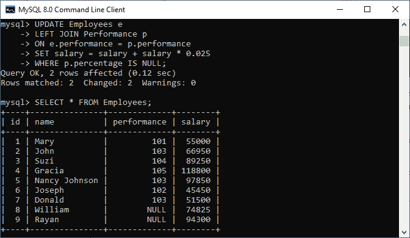

# MySQL UPDATE JOIN

> 原文：<https://www.javatpoint.com/mysql-update-join>

MySQL 中的 UPDATE 查询是一个用于修改表数据的 DML 语句。更新查询必须需要 SET 和 WHERE 子句。SET 子句用于更改 WHERE 子句中指定的列的值。

MySQL 中的 JOIN 子句在语句中用于通过在单个查询中连接多个表来检索数据。

**UPDATE JOIN 是一个 MySQL 语句，用于执行跨表更新，这意味着我们可以使用另一个表，用 JOIN 子句条件**来更新一个表。该查询基于[**主键**](https://www.javatpoint.com/mysql-primary-key)**和 [**外键**键](https://www.javatpoint.com/mysql-foreign-key)以及指定的连接条件来更新和更改连接多个表的数据。我们可以使用[更新查询](https://www.javatpoint.com/mysql-update)一次更新一列或多列。**

 **#### 注意:4.0 或更高版本支持 MySQL UPDATE JOIN 语句。

### 句法

以下是 UPDATE JOIN 语句的基本语法，用于将记录修改到 MySQL 表中:

```

UPDATE Tab1, Tab2, [INNER JOIN | LEFT JOIN] Tab1 ON Tab1.C1 = Tab2.C1
SET Tab1.C2 = Tab2.C2, Tab2.C3 = expression
WHERE Condition;

```

在上面的 MySQL UPDATE JOIN 语法中:

首先，我们指定了两个表:主表(Tab1)和 UPDATE 子句后的另一个表(tab2)。在 UPDATE 子句之后，需要指定至少一个表。接下来，我们指定了 [JOIN 子句](https://www.javatpoint.com/mysql-join)的类型，即 [INNER JOIN](https://www.javatpoint.com/mysql-inner-join) 或 [LEFT JOIN](https://www.javatpoint.com/mysql-left-join) ，它们出现在 UPDATE 子句之后，然后是在 ON 关键字之后指定的 JOIN 谓词。然后，我们必须将新值分配给表 1 和/或表 2 中的列，以便修改到表中。最后， [WHERE 子句](https://www.javatpoint.com/mysql-where)条件用于限制行的更新。

### UPDATE JOIN 在 MySQL 中是如何工作的？

[MySQL](https://www.javatpoint.com/mysql-tutorial) 中的 UPDATE JOIN 工作流程与上述语法中描述的相同。但是有时，我们会发现这个查询单独执行跨表更新，而不涉及任何连接。**以下语法是使用另一个表**更新一个表的另一种方法:

```

UPDATE Tab1, Tab2, 
SET Tab1.C2 = Tab2.C2, Tab2.C3 = expression 
WHERE Tab1.C1 = Tab2.C1 AND condition;

```

上面的 UPDATE 语句产生的结果与带有 INNER JOIN 或 LEFT JOIN 子句的 UPDATE JOIN 相同。这意味着我们可以将上面的语法重写为上面显示的 UPDATE JOIN 语法:

```

UPDATE Tab1,Tab2
INNER JOIN Tab2 ON Tab1.C1 = Tab2.C1
SET Tab1.C2 = Taba2.C2, Tab2.C3 = expression
WHERE condition

```

让我们举一些例子来理解 UPDATE JOIN 语句在 MySQL 表中是如何工作的。

### 更新连接示例

首先，我们将创建两个名为 **Performance** 和 **Employee** 的表，这两个表通过一个外键相关联。这里的“绩效”是**父表**，“员工”是**子表** **表**。以下脚本创建了这两个表及其记录。

**表:性能**

```

CREATE TABLE Performance (
    performance INT(11) NOT NULL,
    percentage FLOAT NOT NULL,
    PRIMARY KEY (performance)
);

```

接下来，使用 INSERT 语句填充表中的记录。

```

INSERT INTO Performance (performance, percentage)
VALUES(101,0),
      (102,0.01),
      (103,0.03),
      (104,0.05),
      (105,0.08);

```

然后，执行 SELECT 查询来验证数据，如下图所示:



**表:员工**

```

CREATE TABLE Employees (
    id INT(11) NOT NULL AUTO_INCREMENT PRIMARY KEY,
    name VARCHAR(255) NOT NULL,
    performance INT(11) DEFAULT NULL,
    salary FLOAT DEFAULT NULL,
    CONSTRAINT fk_performance FOREIGN KEY (performance) REFERENCES Performance (performance)
);

```

接下来，使用 INSERT 语句填充表中的记录。

```

INSERT INTO Employees (name, performance, salary)      
VALUES('Mary', 101, 55000),
      ('John', 103, 65000),
      ('Suzi', 104, 85000),
      ('Gracia', 105, 110000),
      ('Nancy Johnson', 103, 95000),
      ('Joseph', 102, 45000),
      ('Donald', 103, 50000);

```

然后，执行 SELECT 查询来验证数据，如下图所示:


### 用内部连接更新连接示例

假设我们想根据员工的表现更新**员工的工资**。我们可以使用 UPDATE INNER JOIN 语句在 Employees 表中更新员工的工资，因为绩效**百分比**存储在绩效表中。

在上表中，我们必须使用**绩效**字段来加入员工和绩效表。请参见下面的查询:

```

UPDATE Employees e
INNER JOIN Performance p 
ON e.performance = p.performance
SET salary = salary + salary * percentage;

```

执行完上面的语句后，我们将得到下面的输出，在这里我们可以看到员工的工资列更新成功。



让我们了解一下这个查询在 MySQL 中是如何工作的。在查询中，我们只在 UPDATE 子句后指定了 Employees 表。这是因为我们只想更改“员工”表中的记录，而不是两个表中的记录。

该查询对照“绩效”表的绩效列检查“员工”表中每行的绩效列值。如果它将获得匹配的绩效列，那么它将采用“绩效”表中的百分比，并更新“员工”表的“工资”列。此查询更新雇员表中的所有记录，因为我们没有在更新连接查询中指定 WHERE 子句。

### 用左连接更新连接示例

为了理解使用左连接的更新连接，我们首先需要在雇员表中插入两个新行:

```

INSERT INTO Employees (name, performance, salary)
VALUES('William', NULL, 73000),
      ('Rayan', NULL, 92000);

```

由于这些员工是新员工，因此他们的绩效记录不可用。请参见以下输出:



**如果要更新新入职员工的薪资**，则不能使用 UPDATE INNER JOIN 查询。这是因为性能表中没有他们的性能数据。因此，我们将使用 UPDATE LEFT JOIN 语句来满足这一需求。

MySQL 中的 UPDATE LEFT JOIN 语句用于在另一个表的相应行中没有找到记录时更新表中的一行。

**例如**，如果我们想给新入职的员工加薪 2.5%，我们可以借助以下语句来实现:

```

UPDATE Employees e
LEFT JOIN Performance p 
ON e.performance = p.performance 
SET salary = salary + salary * 0.025
WHERE p.percentage IS NULL;

```

执行上述查询后，我们将获得如下图所示的输出，我们可以看到新雇佣员工的工资已成功更新。



在本文中，我们学习了 MySQL Update Join 语句，该语句允许我们使用另一个表中带有 Join 子句条件的新数据来更改一个表中的现有数据。当我们需要修改 WHERE 子句中指定的某些列以及使用 INNER JOIN 或 LEFT JOIN 子句时，这个查询是有利的。

* * ***