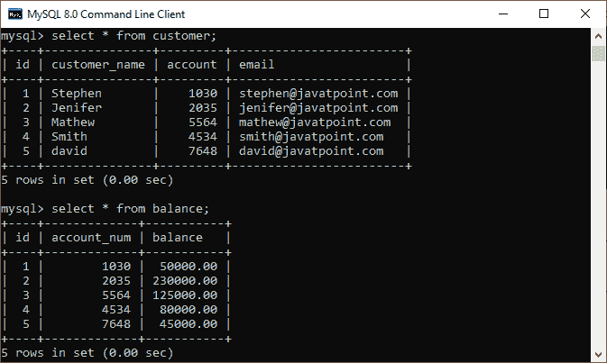
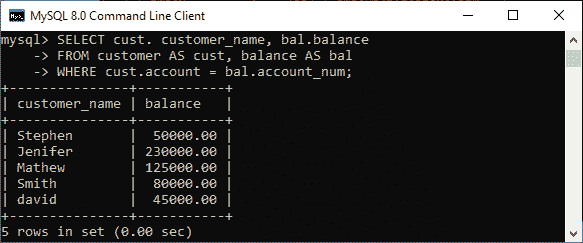
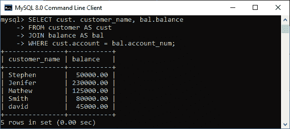
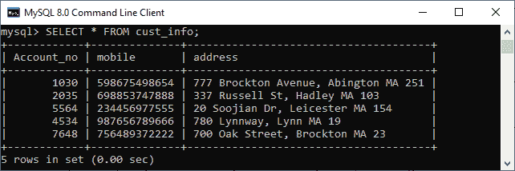
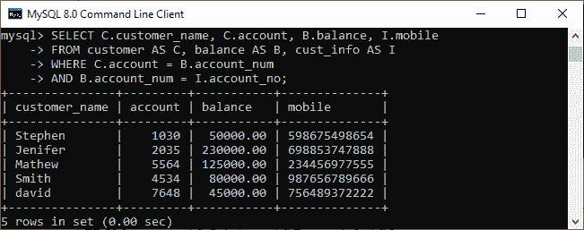

# MySQL EquiJoin

> 原文：<https://www.javatpoint.com/mysql-equijoin>

当我们基于一些公共列和一个连接条件组合两个或多个表时，这个过程称为连接。**等联接是一种基于相等或匹配关联表中的列值来组合多个表的操作**。

我们可以使用**等号(=)比较运算符**来表示 [**WHERE** 子句](https://www.javatpoint.com/mysql-where)中的相等。当我们将 [JOIN 关键字](https://www.javatpoint.com/mysql-join)与 **ON** 子句一起使用，然后指定列名及其关联的表时，该连接操作返回相同的结果。

Equijoin 是内部联接的一种分类类型，它通过基于两个表中存在的公共列执行联接操作来返回输出。此联接仅返回基于公共主字段名的两个表中可用的数据。它不会在结果集中显示空记录或不匹配的数据。

### 需要记住的要点:

*   不需要相同的列名。
*   结果可以有重复的列名。
*   我们还可以对两个以上的表执行相等连接操作。

### 语法:

以下是说明等价连接操作的基本语法:

```

SELECT column_name (s)
FROM table_name1, table_name2, ...., table_nameN
WHERE table_name1.column_name = table_name2.column_name;

```

运筹学

```

SELECT (column_list | *)
FROM table_name1 
JOIN table_name2 
ON table_name1.column_name = table_name2.column_name;

```

在这个语法中，我们需要在[选择关键字](https://www.javatpoint.com/mysql-select)之后指定要包含在结果集中的**列名**。如果我们想从两个表中选择所有列，将使用*运算符。接下来，我们将在 FROM 关键字后指定用于连接的**表名**，最后在 **WHERE** 和 **ON** 子句中写入**连接条件**。

### 等价连接示例

让我们通过例子来了解 equijoin 在 [MySQL](https://www.javatpoint.com/mysql-tutorial) 中是如何工作的。假设我们已经有两个名为**客户**和**余额**的表，其中包含以下数据:



为联接表执行下面的 equijoin 语句:

```

mysql> SELECT cust. customer_name, bal.balance 
FROM customer AS cust, balance AS bal
WHERE cust.account = bal.account_num;

```

我们将得到以下结果:



我们也可以通过使用下面的语句得到相同的结果:

```

mysql> SELECT cust. customer_name, bal.balance 
FROM customer AS cust 
JOIN balance AS bal
WHERE cust.account = bal.account_num;

```

请参见下面的输出，该输出与上一个查询返回的结果相同:



### 使用三个表的等价连接

我们知道 equijoin 也可以对两个以上的表执行连接操作。为了理解这一点，让我们使用下面的语句创建另一个名为 **cust_info** 的表:

```

CREATE TABLE cust_info (
	account_no int,
	mobile VARCHAR(15),
	address VARCHAR(65)
);

```

然后，我们将记录填入此表:

```

INSERT INTO cust_info (account_no, mobile, address)
VALUES(1030, '598675498654', '777 Brockton Avenue, Abington MA 251'), 
	(2035, '698853747888', '337 Russell St, Hadley MA 103'), 
	(5564, '234456977555', '20 Soojian Dr, Leicester MA 154'), 
	(4534, '987656789666', '780 Lynnway, Lynn MA 19'), 
	(7648, '756489372222', '700 Oak Street, Brockton MA 23');

```

我们可以使用 SELECT 语句来验证数据。请参见下图:



要使用 equijoin 连接三个表，我们需要执行如下语句:

```

mysql> SELECT C.customer_name, C.account, B.balance, I.mobile 
FROM customer AS C, balance AS B, cust_info AS I
WHERE C.account = B.account_num 
AND B.account_num = I.account_no;

```

它会给出下面的结果。



### 自然连接、等价连接和内部连接的区别

让我们以下面给出的表格形式总结自然、等价和内部连接操作之间的区别:

| 自然连接 | 平等加入 | 内部连接 |
| 它基于相同的列名及其数据类型连接表。 | 它基于关联表中的相等或匹配列值来连接表。 | 它基于在 on 子句中显式指定的列名来联接表。它只返回存在于两个表中的那些行。 |
| 它总是在结果集中返回唯一的列。 | 它可以返回两个表的所有属性以及与联接条件匹配的重复列。 | 它返回两个表的所有属性以及符合 ON 子句条件的重复列。 |
| The syntax of a natural join is given below:从表名 1 中选择[列名&#124; *]

自然连接表名 2； | The syntax of equijoin is given below:
SELECT column_name (s)从表名 1，表名 2，....，table _ nameN
WHERE table _ name 1 . column _ name = table _ name 2 . column _ name； | The syntax of inner join is given below:
SELECT [column_names &#124; *]从表名 1INNER JOIN table _ name 2
ON table _ name 1 . column _ name = table _ name 2 . column _ name； |

* * *