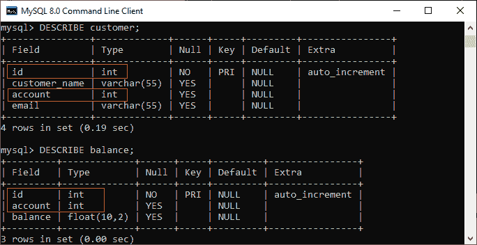
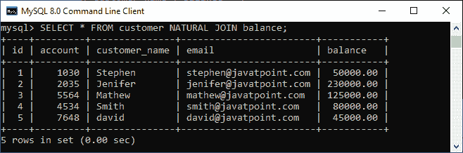
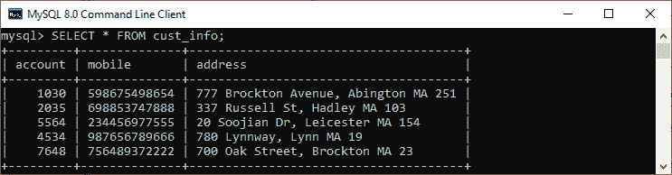
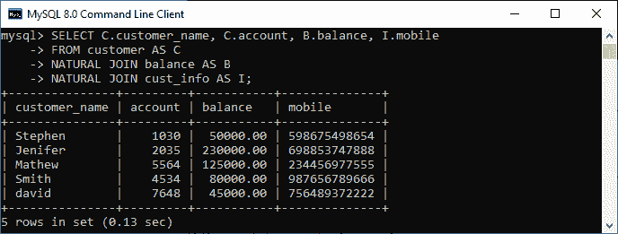

# MySQL 自然加入

> 原文：<https://www.javatpoint.com/mysql-natural-join>

当我们基于两个或多个表之间的公共列来组合它们的行时，这个操作被称为联接。**自然联接是一种联接操作，通过基于具有相同名称和数据类型的列组合表来创建隐式联接**。它类似于 [INNER](https://www.javatpoint.com/mysql-inner-join) 或 [LEFT JOIN](https://www.javatpoint.com/mysql-left-join) ，但是我们不能像在它们中使用的那样将 ON 或 USING 子句与自然连接一起使用。

### 需要记住的要点:

*   不需要指定要连接的列名。
*   结果表总是包含唯一的列。
*   可以对两个以上的表执行自然连接。
*   不要使用 ON 子句。

### 语法:

以下是说明自然连接的基本语法:

```sql

SELECT [column_names | *] 
FROM table_name1 
NATURAL JOIN table_name2;

```

在这个语法中，我们需要在 SELECT 关键字之后指定要包含在结果集中的**列名**。如果我们想从两个表中选择所有列，将使用 ***** 运算符。接下来，我们将在 FROM 关键字后指定用于联接的**表名**，并在它们之间编写 **NATURAL JOIN** 子句。

### 自然连接示例

让我们通过例子来了解自然连接在 [MySQL](https://www.javatpoint.com/mysql-tutorial) 中是如何工作的。首先，我们将使用以下语句创建两个名为**客户**和**余额**的表:

```sql

/* -- Table name: customer -*/
CREATE TABLE customer (
	id INT AUTO_INCREMENT PRIMARY KEY,
	customer_name VARCHAR(55),
	account int,
	email VARCHAR(55)
);  

/* -- Table name: balance -*/
CREATE TABLE balance (
	id INT AUTO_INCREMENT PRIMARY KEY,
	account int,
	balance FLOAT(10, 2)
);

```

接下来，我们将使用以下语句在两个表中填充一些记录:

```sql

/* -- Data for customer table -*/
INSERT INTO customer(customer_name, account, email)
VALUES('Stephen', 1030, 'stephen@javatpoint.com'),
	('Jenifer', 2035, 'jenifer@javatpoint.com'),
	('Mathew', 5564, 'mathew@javatpoint.com'),
	('Smith', 4534, 'smith@javatpoint.com'),
	('David', 7648, 'david@javatpoint.com');

/* -- Data for balance table -*/
INSERT INTO balance(account, balance)
VALUES(1030, 50000.00), 
	(2035, 230000.00), 
	(5564, 125000.00), 
	(4534, 80000.00), 
	(7648, 45000.00);

```

接下来，我们将执行 [SELECT 语句](https://www.javatpoint.com/mysql-select)来验证表数据:


现在，我们将看到满足自然连接标准的条件。我们可以通过使用**description**语句检查表结构来做到这一点。请参见下图:



在此图中，我们可以看到**列名 id 和 account 及其数据类型**是相同的，满足自然连接标准。因此我们可以使用自然连接。

执行以下语句，使用自然连接来连接表:

```sql

mysql> SELECT cust. customer_name, bal.balance 
FROM customer AS cust 
NATURAL JOIN balance AS bal;

```

我们将得到以下结果:


在 **INNER JOIN 的帮助下，我们可以使用 ON 子句**完成同样的工作。以下是解释该连接的查询:

```sql

mysql> SELECT cust. customer_name, bal.balance 
FROM customer AS cust 
INNER JOIN balance AS bal 
ON cust.id = bal.id;

```

成功执行后，我们将获得与自然连接相同的结果:


现在，我们将使用(*)代替列名，如下所示:

```sql

mysql> SELECT * FROM customer NATURAL JOIN balance;

```

假设我们在列名中使用星号(*)，那么自然连接会自动搜索相同的列名及其数据类型，并在内部连接它们。此外，它不会在输出中显示重复的列。因此，我们应该在执行上面的语句后获得下面的输出:



### 带有 WHERE 子句的自然连接

[WHERE 子句](https://www.javatpoint.com/mysql-where)用于从表中返回过滤结果。以下示例用自然联接子句说明了这一点:

```sql

mysql> SELECT cust. customer_name, bal.balance 
FROM customer AS cust 
NATURAL JOIN balance AS bal
WHERE bal.balance > 50000;

```

显示**账户余额大于 50000** 的客户信息，我们会得到如下结果。


### 使用三个表的自然连接

我们知道自然连接也可以在两个以上的表上执行连接操作。为了理解这一点，我们将使用如下语法:

```sql

SELECT [column_names | *] 
FROM table_name1 
NATURAL JOIN table_name2
NATURAL JOIN table_name3;

```

让我们使用下面的语句创建另一个名为 **cust_info** 的表:

```sql

CREATE TABLE cust_info (
	account int,
	mobile VARCHAR(15),
	address VARCHAR(65)
);

```

然后，我们将记录填入此表:

```sql

INSERT INTO cust_info(account, mobile, address)
VALUES(1030, '598675498654', '777 Brockton Avenue, Abington MA 251'), 
	(2035, '698853747888', '337 Russell St, Hadley MA 103'), 
	(5564, '234456977555', '20 Soojian Dr, Leicester MA 154'), 
	(4534, '987656789666', '780 Lynnway, Lynn MA 19'), 
	(7648, '756489372222', '700 Oak Street, Brockton MA 23');

```

我们可以使用 SELECT 语句来验证数据。请参见下图:



要使用自然连接来连接三个表，我们需要执行如下语句:

```sql

mysql> SELECT C.customer_name, C.account, B.balance, I.mobile 
FROM customer AS C
NATURAL JOIN balance AS B
NATURAL JOIN cust_info AS I;

```

它会给出下面的结果。在这里，我们可以看到帐号出现在所有三列中，但是在满足自然连接标准的输出中只出现了一次。



### 自然连接和内部连接的区别

| 塞内加尔 | 自然连接 | 内部连接 |
| **1。** | 它基于相同的列名及其数据类型连接表。 | 它基于在 on 子句中显式指定的列名来联接表。 |
| **2。** | 它总是在结果集中返回唯一的列。 | 它返回两个表的所有属性以及符合 ON 子句条件的重复列。 |
| **3。** | 如果我们没有在这个连接中指定任何条件，它将根据公共列返回记录。 | 它只返回存在于两个表中的那些行。 |
| **4。** | 自然联接的语法如下:
SELECT[column _ name &#124; *]
FROM table _ name 1
NATURAL JOIN table _ name 2； | 内部联接的语法如下:
SELECT[column _ name &#124; *]
FROM table _ name 1
INNER JOIN table _ name 2
ON table _ name 1 . column _ name = table _ name 2 . column _ name； |

* * *