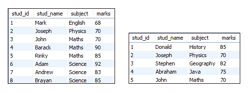
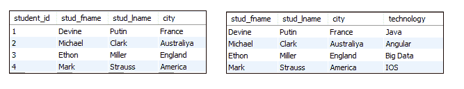
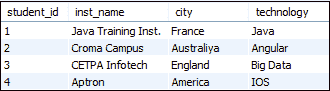

# MySQL 联合和加入的区别

> 原文：<https://www.javatpoint.com/mysql-union-vs-join>

联合和连接是用于在关系数据库管理系统(RDBMS)中对多个表执行操作的 [SQL](https://www.javatpoint.com/sql-tutorial) 子句。他们通过**合并来自两个或更多表格的数据**产生一个结果。但是，在这两个子句中，组合来自两个或多个关系的数据的方式是不同的。在进行比较之前，我们先简单讨论一下这些子句。

## 什么是工会子句？

[MySQL Union 子句](https://www.javatpoint.com/mysql-union)允许我们使用多个 SELECT 查询将两个或多个关系组合成一个结果集。默认情况下，它具有从结果集中删除重复行的功能。

[MySQL](https://www.javatpoint.com/mysql-tutorial) 中的联合子句必须遵循以下规则:

*   所有表中列的顺序和数量必须相同。
*   数据类型必须与每个选择查询的相应位置兼容。
*   SELECT 查询中的列名应该是相同的顺序。

**语法**

```sql

SELECT column_name(s) FROM table_name1  
UNION  
SELECT column_name(s) FROM table_name2;

```

## 什么是连接子句？

[加入 MySQL](https://www.javatpoint.com/mysql-inner-join) 与 [SELECT 语句](https://www.javatpoint.com/mysql-select)一起使用**从多个表中检索数据**。每当我们需要从多个表中获取记录时，都会执行该操作。它只返回表中符合指定条件的记录。

**语法**

```sql

SELECT column_name(s) FROM table_name1   
JOIN table_name2  ON conditions;

```

## 联合与加入

让我们用下面的对比图来讨论 Union 和 [Join](https://www.javatpoint.com/mysql-join) 的本质区别。


| 塞内加尔 | 联盟 | 加入 |
| **1。** | 它用于使用 SQL 查询组合来自多个表的结果。 | 它用于使用 SQL 查询从多个表中获取记录。 |
| **2。** | 它将记录合并成新的行。 | 它将记录合并成新的列。 |
| **3。** | 它允许我们垂直连接桌子。 | 它将使我们能够垂直连接桌子。 |
| **4。** | 它作为多个表的连词，汇总所有记录。 | 它在表的交集中产生结果。 |
| **5。** | 在这种情况下，所有表中列的顺序和数量必须相同。 | 在这种情况下，列的顺序和数量不需要在所有表中都相同。 |
| **6。** | 它具有从结果集中删除重复行的默认功能。 | 它不会消除结果集中的重复行。 |
| **7。** | 在这种情况下，所有 SELECT 语句中的数据类型必须相同。 | 在这种情况下，不需要相同的数据类型。它可以是不同的。 |
| **8。** | Union 子句仅适用于列数和相应属性具有相同域的情况。 | 只有当要使用的两个表至少有一列时，Join 子句才适用。 |
| **9。** | 联合子句主要有以下两种类型:

*   unite
*   Union all

 | 联接子句可以有不同的类型，如下所示:

*   [Internal connection (sometimes connection)
*   【 Left connection (left external connection)
*   [Right external connection]
*   Fully connected _ external connection)

 |

现在，我们将借助一个例子来理解它。

### 工会示例

假设我们的数据库有以下表格:**“student 1”**和**“student 2”**，其中包含以下数据:



下面的语句通过组合两个表产生包含所有学生姓名和科目的输出。

```sql

SELECT stud_name, subject FROM student1  
UNION  
SELECT stud_name, subject FROM student2;  

```

成功执行后，我们将获得包含所有唯一学生姓名和科目的输出:


### 加入示例

假设我们的数据库有以下表格:**“学生”****“技术”**包含以下数据:



我们可以使用以下查询从这两个表中获取记录:

```sql

SELECT students.stud_fname, students.stud_lname, students.city, technologies.technology    
FROM students   
JOIN technologies    
ON students.student_id = technologies.tech_id;

```

我们将获得以下输出:



* * *