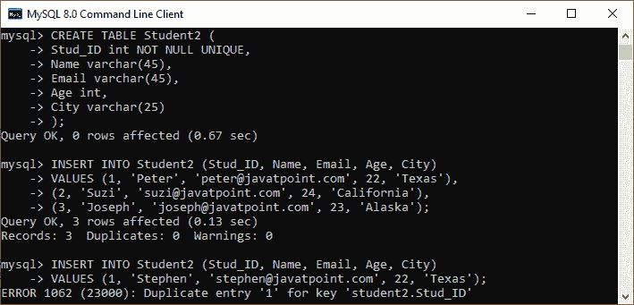
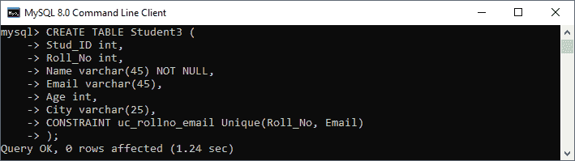
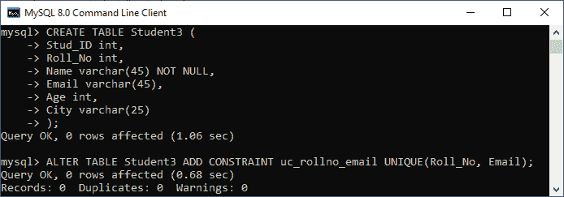
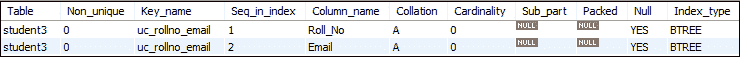

# MySQL 唯一密钥

> 原文：<https://www.javatpoint.com/mysql-unique-key>

MySQL 中的唯一键是一个字段或多个字段的组合，确保存储到列中的所有值都是唯一的。意味着一列不能存储**重复值**。例如，“学生信息”表中的电子邮件地址和学生人数或“员工”表中的员工联系人数应该是唯一的。

MySQL 允许我们在一个表中使用多个带有 UNIQUE 约束的列。它可以接受一个 **null** 值，但是 MySQL 每列只允许一个 null 值。它确保了列或列组的**完整性**以将不同的值存储到一个表中。

### 唯一密钥的需求

*   这有助于防止两个记录将相同的值存储到列中。
*   它只存储维护数据库完整性和可靠性的不同值，以便以有组织的方式访问信息。
*   它还使用外键来保持表的唯一性。
*   它可以在表中包含空值。

### 句法

以下语法用于在 [MySQL](https://www.javatpoint.com/mysql-tutorial) 中创建唯一键。

如果我们只想在表中创建一个唯一键列，请使用如下语法:

```sql

CREATE TABLE table_name(
    col1 datatype,
    col2 datatype UNIQUE,
    ...
);

```

如果我们想在一个表中创建多个唯一键列，请使用如下语法:

```sql

CREATE TABLE table_name(
  col1 col_definition,
  col2 col_definition,
  ...
  [CONSTRAINT constraint_name]
  UNIQUE(column_name(s))
);

```

如果我们没有为唯一约束指定名称，MySQL 会自动为该列生成一个名称。因此，建议在创建表时使用约束名称。

### 参数说明

下表详细解释了这些参数。

| 参数名称 | 描述 |
| 表名 | 这是我们要创建的表的名称。 |
| 第 1 栏，第 2 栏 | 表中包含的是列名。 |
| 约束名称 | 这是唯一键的名称。 |
| 列名 | 将成为唯一键的是列名。 |

### 唯一关键示例

下面的例子解释了如何在 MySQL 中使用唯一键。

该语句创建了一个带有唯一约束的表“ **Student2** :

```sql

CREATE TABLE Student2 (
	Stud_ID int NOT NULL UNIQUE, 
	Name varchar(45), 
	Email varchar(45),
	Age int, 
	City varchar(25)
);

```

接下来，执行下面列出的插入查询，了解其工作原理:

```sql

mysql> INSERT INTO Student2 (Stud_ID, Name, Email, Age, City)
VALUES (1, 'Peter', 'peter@javatpoint.com', 22, 'Texas'),
(2, 'Suzi', 'suzi@javatpoint.com', 24, 'California'),
(3, 'Joseph', 'joseph@javatpoint.com', 23, 'Alaska');

mysql> INSERT INTO Student2 (Stud_ID, Name, Email, Age, City)
VALUES (1, 'Stephen', 'stephen@javatpoint.com', 22, 'Texas');

```

**输出**

在下面的输出中，我们可以看到第一个 [INSERT 查询](https://www.javatpoint.com/mysql-insert)执行正确，但是第二个语句失败并给出一个错误，表示:键 Stud_ID 的重复条目‘1’。



如果要在**多列**上定义唯一键，使用如下查询:

```sql

CREATE TABLE Student3 (
	Stud_ID int, 
	Roll_No int,
	Name varchar(45) NOT NULL, 
	Email varchar(45),
	Age int, 
	City varchar(25),
	CONSTRAINT uc_rollno_email Unique(Roll_No, Email)
);

```

在输出中，我们可以看到唯一键值包含两列，分别是 **Roll_No** 和 **Email** 。



要验证这一点，请执行以下语句:

```sql

mysql> SHOW INDEX FROM Student3;

```

在这里，我们可以看到唯一约束已成功添加到表中:


### 删除唯一键

ALTER TABLE 语句还允许我们从表中删除唯一键。以下语法用于删除唯一键:

```sql

ALTER TABLE table_name  DROP INDEX constraint_name;

```

在上面的语法中， **table_name** 是我们要修改的表的名称， **constraint_name** 是我们要删除的唯一键的名称。

**例**

该语句将从表中永久删除 **uc_rollno_email** 约束。

```sql

mysql> ALTER TABLE Student3 DROP INDEX uc_rollno_email;

```

我们可以执行 SHOW INDEX 语句来实现这一点。

### 使用 ALTER TABLE 语句的唯一键

这个语句允许我们修改现有的表。有时我们想给现有表的列添加一个唯一的键；然后，该语句用于添加该列的唯一键。

**语法**

以下是添加唯一键的 [ALTER TABLE 语句](https://www.javatpoint.com/mysql-alter-table)的语法:

```sql

ALTER TABLE table_name ADD CONSTRAINT constraint_name UNIQUE(column_list);

```

**例**

此语句创建一个表“ **Students3** ”，该表在表定义中没有唯一的键列。

```sql

CREATE TABLE Student3 (
	Stud_ID int, 
	Roll_No int,
	Name varchar(45) NOT NULL, 
	Email varchar(45),
	Age int, 
	City varchar(25)
);

```

在创建一个表之后，如果我们想给这个表添加一个唯一的键，我们需要执行如下的 ALTER TABLE 语句:

```sql

mysql> ALTER TABLE Student3 ADD CONSTRAINT uc_rollno_email UNIQUE(Roll_No, Email);

```

我们可以看到两个语句成功执行的输出。



要验证这一点，请执行以下语句:

```sql

mysql> SHOW INDEX FROM Student3;

```

在这里，我们可以看到唯一约束已成功添加到表中:



* * *