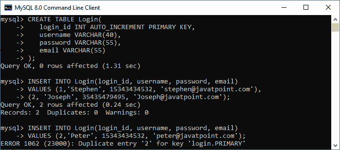
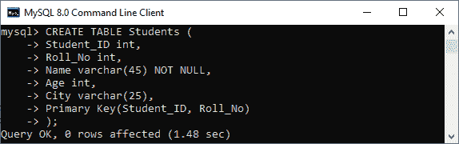
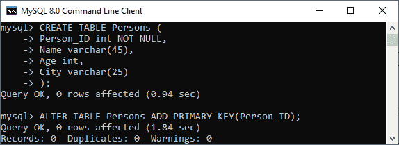

# MySQL 主键

> 原文：<https://www.javatpoint.com/mysql-primary-key>

MySQL 主键是字段的单个或组合，用于唯一地识别表**中的每条记录**。如果该列包含主键约束，则它不能为 **null 或空**。一个表可能有重复的列，但它只能包含一个主键。它总是在列中包含唯一的值。

在表中插入新行时，主键列也可以使用 **AUTO_INCREMENT** 属性自动为该行生成一个序号。 [MySQL](https://www.javatpoint.com/mysql-tutorial) 在表中定义主键后，会自动创建一个名为“ **Primary** 的索引。因为它有一个关联的索引，所以我们可以说主键使查询性能更快。

### 主键规则

以下是主键的规则:

1.  主键列值必须唯一。
2.  每个表只能包含一个主键。
3.  主键列不能为空。
4.  MySQL 不允许我们用现有的主键插入新行。
5.  建议主键列使用 INT 或 BIGINT 数据类型。

我们可以通过两种方式创建主键:

*   创建表语句
*   更改表语句

让我们详细讨论每一个。

### 使用创建表语句的主键

在本节中，我们将看到如何使用 [CREATE TABLE](https://www.javatpoint.com/mysql-create-table) 语句创建主键。

**语法**

以下是用于在 MySQL 中创建主键的语法。

如果我们只想在表中创建一个主键列，请使用以下语法:

```sql

CREATE TABLE table_name(
    col1 datatype PRIMARY KEY,
    col2 datatype,
    ...
);

```

如果我们想在表中创建多个主键列，请使用以下语法:

```sql

CREATE TABLE table_name
(
  col1 col_definition,
  col2 col_definition,
  ...

  CONSTRAINT [constraint_name] 
   PRIMARY KEY (column_name(s))
);

```

### 参数说明

下表详细解释了这些参数。

| 参数名称 | 描述 |
| 表名 | 这是我们要创建的表的名称。 |
| 第 1 栏，第 2 栏 | 表中包含的是列名。 |
| 约束名称 | 它是主键的名称。 |
| 列名 | 列名将成为主键。 |

### 主键示例

下面的例子解释了一个主键是如何在 MySQL 中使用的。

该语句创建一个名为“ **Login** 的表，该表的“ **login_id** 列包含主键:

```sql

Mysql> CREATE TABLE Login(
   login_id INT AUTO_INCREMENT PRIMARY KEY,
   username VARCHAR(40),
   password VARCHAR(55),
   email VARCHAR(55)
);

```

接下来，使用 insert 查询将数据存储到表中:

```sql

mysql> INSERT INTO Login(login_id, username, password, email) 
VALUES (1,'Stephen', 15343434532, 'stephen@javatpoint.com'), 
(2, 'Joseph', 35435479495, 'Joseph@javatpoint.com');

mysql> INSERT INTO Login(login_id, username, password, email) 
VALUES (1,'Peter', 15343434532, 'peter@javatpoint.com');

```

**输出**

在下面的输出中，我们可以看到第一个插入查询成功执行。而第二个 insert 语句失败，并给出一个错误，指出:主键列的条目重复。



如果要在**多列**上定义主键，使用如下查询:

```sql

mysql> CREATE TABLE Students (
		Student_ID int, 
		Roll_No int,
		Name varchar(45) NOT NULL, 
		Age int, 
		City varchar(25),
		Primary Key(Student_ID, Roll_No)
	);

```

在输出中，我们可以看到主键值包含两列，分别是**学生号**和 **Roll_No** 。



### 使用 ALTER TABLE 语句的主键

这个语句允许我们修改现有的表。当表没有主键时，此语句用于将主键添加到现有表的列中。

**语法**

以下是在 MySQL 中创建主键的 ALTER TABLE 语句的语法:

```sql

ALTER TABLE table_name ADD PRIMARY KEY(column_list);

```

### 例子

下面的语句创建了一个表“**人员**”，该表定义中没有主键列。

```sql

mysql> CREATE TABLE Persons (
		Person_ID int NOT NULL, 
		Name varchar(45), 
		Age int, 
		City varchar(25)
	);

```

在创建一个表之后，如果我们想给这个表添加一个主键，我们需要执行如下的 ALTER TABLE 语句:

```sql

mysql> ALTER TABLE Persons ADD PRIMARY KEY(Person_ID);

```

我们可以看到两个语句成功执行的输出。



如果表需要将主键添加到已经有数据的表中，则必须确保该列不包含重复或空值。

### 删除主键

ALTER TABLE 语句还允许我们从表中删除主键。以下语法用于删除主键:

```sql

ALTER TABLE table_name  DROP PRIMARY KEY;

```

**例**

```sql

mysql> ALTER TABLE Login DROP PRIMARY KEY;

```

### 主键与唯一键

下面的对比图解释了它们之间的一些常见差异:

| 塞内加尔 | 主关键字 | 唯一密钥 |
| **1。** | 它是字段的单个或组合，用于唯一标识表中的每条记录。 | 它还在没有主键的情况下唯一地确定表的每一行。 |
| **2。** | 它不允许在主键列中存储空值。 | 它只能在唯一键列中接受一个空值。 |
| **3。** | 一个表只能有一个主键。 | 一个表可以有多个唯一键。 |
| **4。** | 它创建聚集索引。 | 它创建一个非聚集索引。 |

* * *