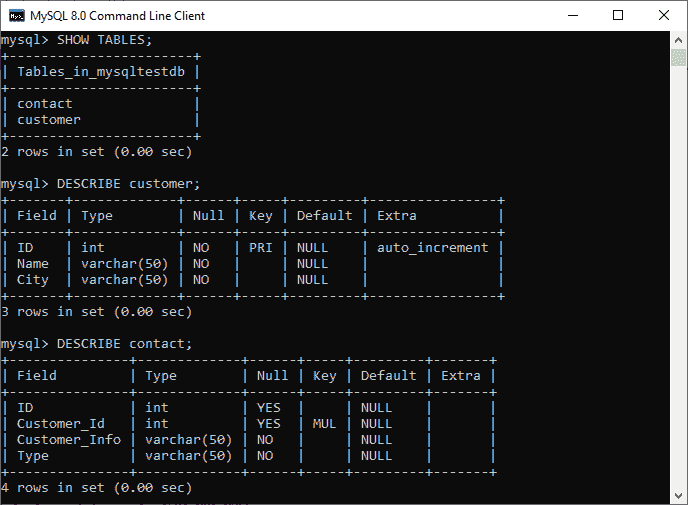
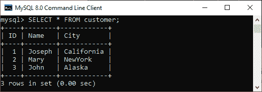
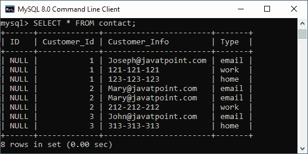
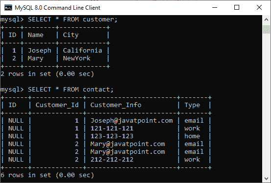
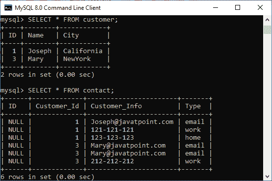
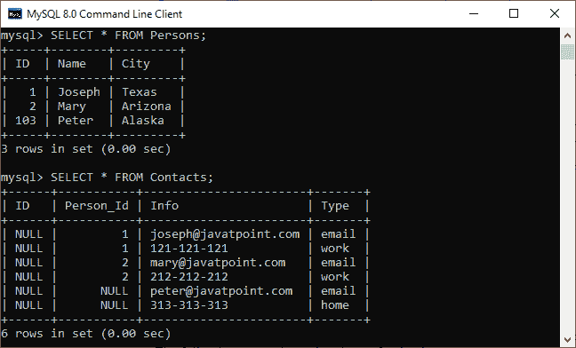
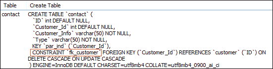
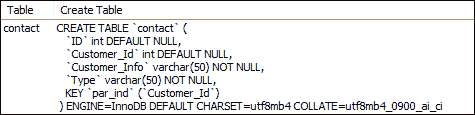

# MySQL 外键

> 原文：<https://www.javatpoint.com/mysql-foreign-key>

外键用于将一个或多个表链接在一起。也称为参考键的**。外键与另一个表的主键字段匹配。这意味着一个表中的外键字段引用另一个表的主键字段。它唯一地标识了另一个表的每一行，该表维护了 MySQL 中的**参照完整性**。**

外键使得创建与表的父子关系成为可能。在这种关系中，父表保存初始列值，子表的列值引用父列值。MySQL 允许我们在子表上定义一个外键约束。

[MySQL](https://www.javatpoint.com/mysql-tutorial) 通过两种方式定义外键:

1.  使用创建表语句
2.  使用变更表语句

### 句法

以下是在 MySQL 中使用 CREATE TABLE 或 ALTER TABLE 语句定义外键时使用的基本语法:

```

[CONSTRAINT constraint_name]
    FOREIGN KEY [foreign_key_name] (col_name, ...)
    REFERENCES parent_tbl_name (col_name,...)
    ON DELETE referenceOption
    ON UPDATE referenceOption

```

在上面的语法中，我们可以看到以下参数:

**constraint_name:** 指定外键约束的名称。如果我们没有提供约束名称，MySQL 会自动生成它的名称。

**col_name:** 是我们要制作外键的列的名称。

**parent_tbl_name:** 它指定父表的名称，后跟引用外键列的列名。

**reference _ option:**它用于确保外键如何使用父表和子表之间的 ON DELETE 和 ON UPDATE 子句来维护引用完整性。

MySQL 包含**五个**不同的引用选项，如下所示:

**CASCADE:** 用于当我们从父表中删除或更新任何一行时，子表中匹配行的值会被自动删除或更新。

**设置 NULL:** 用于当我们从父表中删除或更新任意一行时，将子表中外键列的值设置为 NULL。

**RESTRICT:** 用于当我们从父表中删除或更新任何在引用(子)表中有匹配行的行时，MySQL 不允许删除或更新父表中的行。

**无动作:**类似于 RESTRICT。但是它有一个不同之处，它在试图修改表后检查引用完整性。

**SET DEFAULT:**MySQL 解析器识别这个动作。然而，InnoDB 和 NDB 的桌子都拒绝了这一行动。

#### 注意:MySQL 主要提供对 CASCADE、RESTRICT 和 SET NULL 操作的完全支持。如果我们没有指定 ON DELETE 和 ON UPDATE 子句，MySQL 将采取默认操作 RESTRICT。

### 外键示例

让我们了解一下外键在 MySQL 中是如何工作的。首先，我们将创建一个名为“ **mysqltestdb** ”的数据库，并使用下面的命令开始使用它:

```

mysql> CREATE DATABASE mysqltestdb;
mysql> use mysqltestdb;

```

接下来，我们需要使用下面的语句创建两个名为“**客户**”和“**联系人**”的表:

**表:客户**

```

CREATE TABLE customer (
  ID INT NOT NULL AUTO_INCREMENT,
  Name varchar(50) NOT NULL,
  City varchar(50) NOT NULL,
  PRIMARY KEY (ID)
);

```

**表:联系方式**

```

CREATE TABLE contact (
  ID INT,
  Customer_Id INT,
  Customer_Info varchar(50) NOT NULL,
  Type varchar(50) NOT NULL,
  INDEX par_ind (Customer_Id),
  CONSTRAINT fk_customer FOREIGN KEY (Customer_Id)
  REFERENCES customer(ID)
  ON DELETE CASCADE
  ON UPDATE CASCADE
);

```

### 表格结构验证

在这里，我们将使用以下查询来了解我们的数据库结构是什么样子的:

```

mysql> SHOW TABLES;
mysql> DESCRIBE customer;
mysql> DESCRIBE contact;

```

我们将得到如下结构:



在上面的输出中，我们可以看到客户表的键列中的 **PRI** 告诉我们这个字段是主索引值。接下来，联系值的键列中的 **MUL** 告诉 **Customer_Id** 字段可以存储多个具有相同值的行。

### 向表中插入数据

现在，我们必须将记录插入到两个表中。执行以下语句将数据插入客户表:

```

INSERT INTO customer(Name, City) VALUES
('Joseph', 'California'),
('Mary', 'NewYork'),
('John', 'Alaska');

```

插入后，执行 SELECT TABLE 命令检查客户表数据，如下所示:



执行以下 insert 语句将数据添加到表联系人中:

```

INSERT INTO contact (Customer_Id, Customer_Info, Type) VALUES
(1, 'Joseph@javatpoint.com', 'email'),
(1, '121-121-121', 'work' ),
(1, '123-123-123', 'home'),
(2, 'Mary@javatpoint.com', 'email'),
(2, 'Mary@javatpoint.com', 'email'),
(2, '212-212-212', 'work'),
(3, 'John@javatpoint.com', 'email'),
(3, '313-313-313', 'home');

```

我们的联系人表如下所示:



现在，让我们看看 MySQL 中的外键是如何保持数据完整性的。

因此，在这里，我们将删除从两个表中删除记录的引用数据。我们将联系人表中的外键定义为:

```

FOREIGN KEY (Customer_Id) REFERENCES customer(ID) 
ON DELETE CASCADE 
ON UPDATE CASCADE.

```

这意味着如果我们从客户表中删除任何客户记录，那么联系人表中的相关记录也应该被删除。ON UPDATE CASCADE 会自动将父表中的字段更新为子表中的引用字段(这里是 Customer_Id)。

执行以下语句，从名为**约翰**的表中删除一条记录。

```

mysql> DELETE FROM customer WHERE Name='John';

```

同样，如果我们查看我们的表，我们可以看到两个表都被更改了。这意味着名为 JOHN 的字段将从两个表中完全删除。



现在，测试更新级联上的**。在此，我们将联系表中**玛丽**的客户标识更新为:**

```

mysql> UPDATE customer SET id=3 WHERE Name='Mary';

```

同样，如果我们查看我们的表，我们可以看到两个表都被更改了，玛丽的客户标识=3。



### 使用设置空操作的外键示例

在这里，我们将了解 SET NULL 操作如何使用外键。首先，我们必须创建两个名为**人员**和**联系人**的表，如下所示:

**表:人员**

```

CREATE TABLE Persons (
  ID INT NOT NULL AUTO_INCREMENT,
  Name varchar(50) NOT NULL,
  City varchar(50) NOT NULL,
  PRIMARY KEY (ID)
);

```

**表:客户**

```

CREATE TABLE Contacts (
  ID INT,
  Person_Id INT,
  Info varchar(50) NOT NULL,
  Type varchar(50) NOT NULL,
  INDEX par_ind (Person_Id),
  CONSTRAINT fk_person FOREIGN KEY (Person_Id)
  REFERENCES Persons(ID)
  ON DELETE SET NULL
  ON UPDATE SET NULL
);

```

接下来，我们需要使用以下语句将数据插入到两个表中:

```

INSERT INTO Persons(Name, City) VALUES
('Joseph', 'Texas'),
('Mary', 'Arizona'),
('Peter', 'Alaska');

```

```

INSERT INTO Contacts (Person_Id, Info, Type) VALUES
(1, 'joseph@javatpoint.com', 'email'),
(1, '121-121-121', 'work' ),
 (2, 'mary@javatpoint.com', 'email'),
(2, '212-212-212', 'work'),
(3, 'peter@javatpoint.com', 'email'),
(3, '313-313-313', 'home');

```

现在，更新“人员”表的标识:

```

mysql> UPDATE Persons SET ID=103 WHERE ID=3;

```

最后，使用下面给出的 SELECT 语句验证更新:



如果我们看看我们的表，我们可以看到两个表都被改变了。“联系人”表中带有**个人标识=3** 的行会自动设置为**空值**，这是由于“打开更新设置空值”操作。

### 如何删除外键

MySQL 允许 ALTER TABLE 语句从表中移除现有的外键。以下语法用于删除外键:

```

ALTER TABLE table_name DROP FOREIGN KEY fk_constraint_name;

```

这里， **table_name** 是我们要从中移除外键的表的名称。**约束名称**是在创建表的过程中添加的外键的名称。

如果我们不知道表中现有外键的名称，请执行以下命令:

```

mysql> SHOW CREATE TABLE contact;

```

它将给出如下输出，我们可以看到表联系人有一个名为 fk_customer 的外键，显示在红色矩形中。



现在，要从 contact 表中删除这个外键约束，请执行如下语句:

```

mysql> ALTER TABLE contact DROP FOREIGN KEY fk_customer;

```

我们可以使用 SHOW CREATE TABLE 语句来验证外键约束是否被移除。它将给出如下输出，我们可以看到外键在表联系中不再可用。



### 使用 ALTER TABLE 语句定义外键

这个语句允许我们修改现有的表。有时需要向现有表的列中添加外键；然后，该语句用于添加该列的外键。

**语法**

以下是在现有表中添加外键的 ALTER TABLE 语句的语法:

```

ALTER TABLE table_name
    ADD [CONSTRAINT [symbol]] FOREIGN KEY
    [index_name] (column_name, ...)
    REFERENCES table_name (column_name,...)
    ON DELETE referenceOption
    ON UPDATE referenceOption

```

当我们使用 ALTER TABLE 语句添加外键时，建议首先在外键引用的列上创建一个**索引**。

**例**

下面的语句创建了两个表，“**人员**”和“**联系人**”，表定义中没有外键列。

**表:人**

```

CREATE TABLE Person (
  ID INT NOT NULL AUTO_INCREMENT,
  Name varchar(50) NOT NULL,
  City varchar(50) NOT NULL,
  PRIMARY KEY (ID)
);

```

**表:联系人**

```

CREATE TABLE Contact (
  ID INT,
  Person_Id INT,
  Info varchar(50) NOT NULL,
  Type varchar(50) NOT NULL
);

```

创建表后，如果我们想向现有表添加外键，我们需要执行如下的 ALTER TABLE 语句:

```

ALTER TABLE Contact ADD INDEX par_ind ( Person_Id );
ALTER TABLE Contact ADD CONSTRAINT fk_person
FOREIGN KEY ( Person_Id ) REFERENCES Person ( ID ) ON DELETE CASCADE ON UPDATE RESTRICT;

```

### 外键检查

MySQL 有一个特殊的变量 **foreign_key_cheks** 来控制外键对表的检查。默认情况下，它被启用以在对表的正常操作期间实施引用完整性。这个变量本质上是动态的，因此它同时支持全局和会话范围。

有时需要禁用外键检查，这在以下情况下非常有用:

*   我们删除一个外键引用的表。
*   我们将数据从 CSV 文件导入到一个表中。它加快了导入操作。
*   我们在具有外键的表上使用 ALTER TABLE 语句。
*   我们可以以任何顺序执行将数据加载到表中的操作，以避免外键检查。

以下语句允许我们**禁用**外键检查:

```

SET foreign_key_checks = 0;

```

以下语句允许我们**启用**外键检查:

```

SET foreign_key_checks = 1;

```

* * *