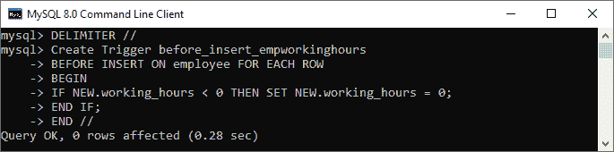
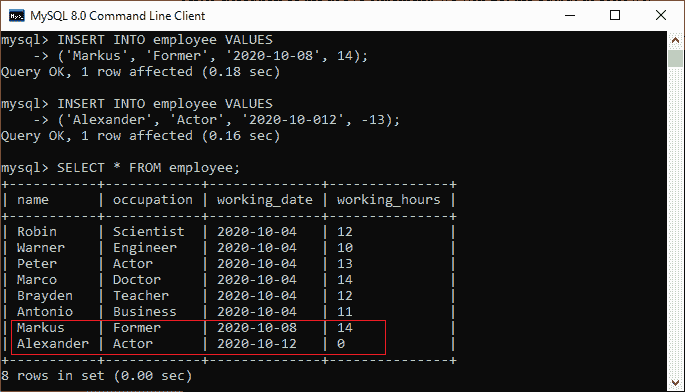

# MySQL 创建触发器

> 原文：<https://www.javatpoint.com/mysql-create-trigger>

在本文中，我们将学习如何在 MySQL 中创建第一个触发器。我们可以使用 CREATE TRIGGER 语句在 MySQL 中创建新的触发器。这是为了确保我们在使用 CREATE TRIGGER 命令时拥有触发器权限。以下是创建触发器的基本语法:

```

CREATE TRIGGER trigger_name  trigger_time trigger_event
ON table_name FOR EACH ROW
BEGIN
	--variable declarations
	--trigger code
END;  

```

### 参数说明

创建触发器语法包含以下参数:

**trigger_name:** 是我们要创建的触发器的名称。必须写在 CREATE [TRIGGER 语句](mysql-trigger)之后。这是为了确保触发器名称在模式中是唯一的。

**触发 _ 时间:**是触发动作时间，应该是 BEFORE 或者 AFTER。它是定义触发器时必需的参数。它指示触发器将在表中发生每一行修改之前或之后被调用。

**trigger_event:** 激活触发器的是操作名称的类型。可以是[插入](https://www.javatpoint.com/mysql-insert)、[更新](https://www.javatpoint.com/mysql-update)或[删除](https://www.javatpoint.com/mysql-delete)操作。触发器一次只能调用一个事件。如果我们想定义一个被多个事件调用的触发器，需要定义多个触发器，每个事件一个。

**table_name:** 是与触发器关联的表的名称。必须写在 ON 关键字之后。如果我们不指定表名，触发器就不存在。

**BEGIN END Block:** 最后，我们将指定触发器激活时要执行的语句。如果我们想要执行多个语句，我们将使用包含一组查询的 BEGIN END 块来定义触发器的逻辑。

触发器主体可以访问受 DML 语句影响的列值。 **NEW** 和 **OLD** 修饰符用于区分执行 DML 语句之前的列值**和之后的列值**。我们可以使用带有新旧修饰符的列名作为 **OLD.col_name** 和 **NEW.col_name** 。OLD.column_name 表示在更新或删除发生之前现有行的列。NEW.col_name 表示将要插入的新行的列或更新后的现有行。****

**例如**，假设我们想使用触发器更新列名 **message_info** 。在触发器主体中，我们可以访问更新前的列值 **OLD.message_info** 和新值 **NEW.message_info** 。

我们可以通过下表了解新旧修饰语的可用性:

| 触发事件 | 老的 | 新的 |
| 插入 | 不 | 是 |
| 更新 | 是 | 是 |
| 头冠 | 是 | 不 |

### MySQL 触发器示例

让我们开始在 [MySQL](https://www.javatpoint.com/mysql-tutorial) 中创建一个触发器，在雇员表中进行修改。首先，我们将通过执行以下语句创建一个名为**员工**的新表:

```

CREATE TABLE employee(
    name varchar(45) NOT NULL,  
    occupation varchar(35) NOT NULL,  
    working_date date,
    working_hours varchar(10)
);

```

接下来，执行以下语句**将记录**填入员工表:

```

INSERT INTO employee VALUES  
('Robin', 'Scientist', '2020-10-04', 12),
('Warner', 'Engineer', '2020-10-04', 10),
('Peter', 'Actor', '2020-10-04', 13),
('Marco', 'Doctor', '2020-10-04', 14),
('Brayden', 'Teacher', '2020-10-04', 12),
('Antonio', 'Business', '2020-10-04', 11);

```

接下来，执行 **[SELECT 语句](https://www.javatpoint.com/mysql-select)** 验证插入的记录:


接下来，我们将在插入触发器之前创建一个。如果有人试图插入**工作时间< 0** ，该触发器将被自动调用插入**工作时间= 0** 。

```

mysql> DELIMITER //
mysql> Create Trigger before_insert_empworkinghours 
BEFORE INSERT ON employee FOR EACH ROW
BEGIN
IF NEW.working_hours < 0 THEN SET NEW.working_hours = 0;
END IF;
END //

```

如果触发器创建成功，我们将获得如下输出:



现在，我们可以使用以下语句来调用这个触发器:

```

mysql> INSERT INTO employee VALUES  
('Markus', 'Former', '2020-10-08', 14);

mysql> INSERT INTO employee VALUES  
('Alexander', 'Actor', '2020-10-012', -13);

```

执行上述语句后，我们将获得如下输出:



在这个输出中，我们可以看到，在将负值插入表的 working_hours 列时，将通过触发器自动填充零值。

* * *