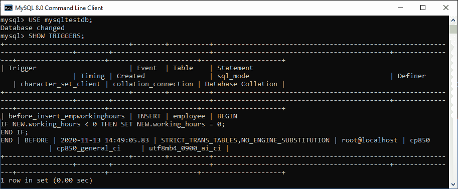
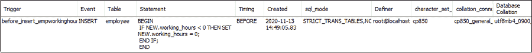
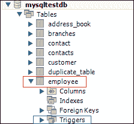
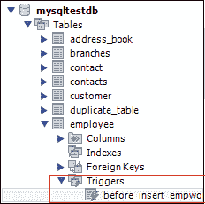

# MySQL 显示/列表触发器

> 原文：<https://www.javatpoint.com/mysql-show-or-list-triggers>

当我们有许多包含各种表的数据库时，非常需要 show 或 list 触发器。有时我们在许多数据库中有相同的触发器名称；在这种情况下，这个查询起着重要的作用。我们可以使用下面的语句在数据库服务器中获取触发器信息。此语句返回所有数据库中的所有触发器:

```

mysql> SHOW TRIGGERS;  

```

**获取所有触发器列表需要以下步骤:**

**第一步:**打开 [MySQL](https://www.javatpoint.com/mysql-tutorial) 命令提示符，使用您在 [MySQL 安装](https://www.javatpoint.com/how-to-install-mysql)时创建的密码登录数据库服务器。连接成功后，我们可以执行所有的 [SQL](https://www.javatpoint.com/sql-tutorial) 语句。

**步骤 2:** 接下来，使用下面的命令选择特定的数据库:

```

mysql> USE database_name;  

```

**步骤 3:** 最后，执行 SHOW TRIGGERS 命令。

让我们用下面给出的例子来理解它。假设我们有一个数据库名**“MySQL testdb”**，它包含许多表。然后执行以下语句，列出[触发器](mysql-trigger):

```

mysql> USE mysqltestdb;  
mysql>SHOW TRIGGERS;  

```

以下输出更清楚地解释了这一点:



如果我们想在不切换的情况下显示或列出当前数据库中特定数据库的触发信息，MySQL 允许我们使用**[【FROM】](https://www.javatpoint.com/mysql-from)**或 **IN** 子句，后面跟着数据库名称。以下陈述更清楚地解释了这一点:

```

mysql> SHOW TABLES IN database_name;  

```

上述声明也可以写成:

```

mysql> SHOW TABLES FROM database_name;  

```

当我们执行上述语句时，我们将得到相同的结果。

### 使用模式匹配显示触发器

MySQL 还提供了一个 **LIKE** 子句选项，使我们能够使用不同的模式匹配来过滤触发器名称。以下是将模式匹配用于 show trigger 命令的语法:

```

mysql> SHOW TRIGGERS LIKE pattern;  
OR,  
mysql> SHOW TRIGGERS FROM database_name LIKE pattern; 

```

如果我们想根据特定的搜索条件列出/显示触发器名称，我们可以使用 [WHERE 子句](https://www.javatpoint.com/mysql-where)如下:

```

mysql> SHOW TRIGGERS WHERE search_condition;  
OR,  
mysql> SHOW TRIGGERS FROM database_name WHERE search_condition;

```

### 例子

假设我们想要显示属于**员工**表的所有触发器，执行如下语句:

```

mysql> SHOW TRIGGERS FROM mysqltestdb WHERE table = 'employee';

```

我们将获得如下输出:



#### 注意:需要注意的是，我们必须有超级特权来执行 SHOW TRIGGERS 语句。

show trigger 语句在结果集中包含几列。让我们详细解释每一栏。

*   **触发器:**它是我们想要创建的触发器的名称，并且在模式中必须是唯一的。
*   **事件:**调用触发器的是操作名称的类型。它可以是插入、更新或删除操作。
*   **表:**是触发器所属表的名称。
*   **语句:**触发器激活时包含触发器逻辑的是触发器主体。
*   **计时:**是触发器的激活时间，可以是 BEFORE，也可以是 AFTER。它指示触发器将在表上的每一行修改发生之前或之后被调用。
*   **Created:** 表示触发器创建的时间和日期。
*   **sql_mode:** 执行触发器时显示 sql_mode。
*   **定义者:**它是创建触发器的用户帐户的名称，应该采用“user _ name”@“host _ name”格式。
*   **character_set_client:** 这是创建触发器时 character_set_client 系统变量的会话值。
*   **collection _ connection:**是创建触发器时 character_set_client 系统变量的会话值。
*   **数据库排序:**确定字符串的比较和排序规则。它是触发器所属的数据库的排序规则。

### 如何在 MySQL 工作台显示触发器？

它是一个可视化的图形用户界面工具，用于快速有效地创建数据库、表、索引、视图和存储过程。要使用这个工具显示一个触发器，我们首先需要启动 MySQL 工作台，并使用我们之前创建的用户名和密码登录。我们将获得如下屏幕:


现在，请执行以下步骤来显示触发器:

1.转到导航选项卡，点击包含 MySQL 服务器中所有可用数据库的**模式菜单**。

2.选择数据库(例如 **mysqltestdb** ，双击它，显示包含表、视图、函数和存储过程的**子菜单**。请参见下面的屏幕。


3.点击**表格子菜单**，选择您已经创建了触发器的表格。请参见下图:



4.点击**触发器子菜单**，我们可以看到与所选表格相关的所有触发器。见下图。



* * *