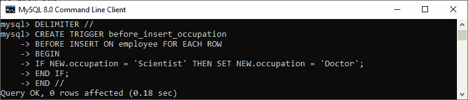
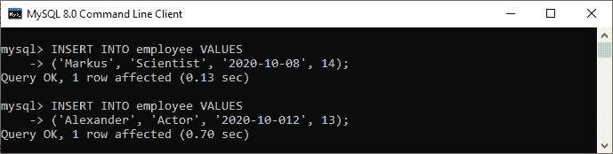
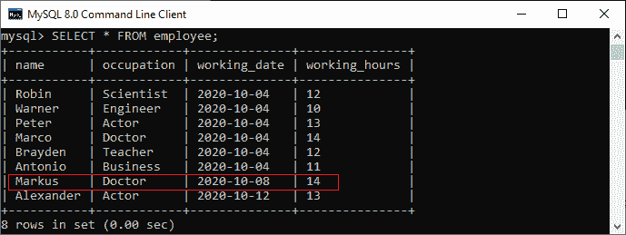
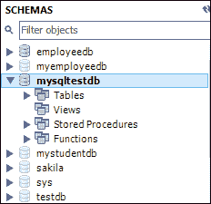
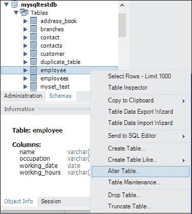
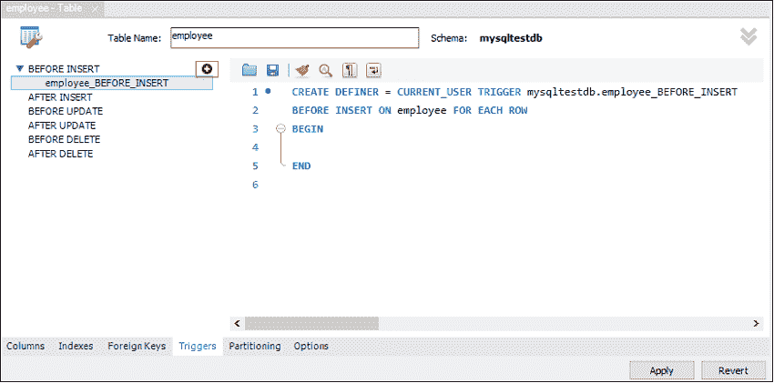
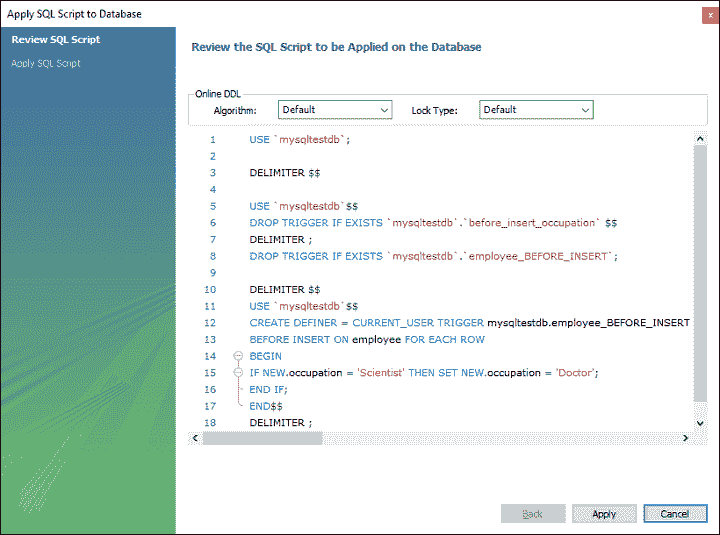
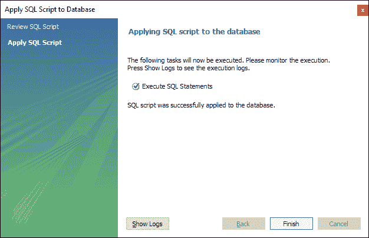
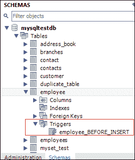

# 插入触发器之前的 MySQL

> 原文：<https://www.javatpoint.com/mysql-before-insert-trigger>

每次执行插入操作时，都会自动调用 MySQL 中的“插入前触发器”。在本文中，我们将学习如何创建一个 before insert 触发器及其语法和示例。

### 句法

以下是在 MySQL 中创建 BEFORE INSERT [触发器的语法:](mysql-trigger)

```

CREATE TRIGGER trigger_name 
BEFORE INSERT
ON table_name FOR EACH ROW
Trigger_body ;

```

“插入前”触发器语法参数可以解释如下:

*   首先，我们将指定我们想要创建的触发器的**名称。它在模式中应该是唯一的。**
*   第二，我们将指定**触发动作时间**，应该是在 INSERT 之前。该触发器将在表中的每一行修改发生之前被调用。
*   第三，我们将指定与触发器关联的表的**名称。必须写在 ON 关键字之后。如果我们不指定表名，触发器就不存在。**
*   最后，我们将指定触发器激活时要执行的语句。

如果我们想要执行多个语句，我们将使用包含一组查询的 **BEGIN END** 块来定义触发器的逻辑。请参见以下语法:

```

DELIMITER $$ 
CREATE TRIGGER trigger_name BEFORE INSERT
ON table_name FOR EACH ROW
BEGIN
   variable declarations
   trigger code
END$$
DELIMITER ;

```

### 限制

*   我们只能在“插入前”触发器中访问和更改**新的**值。
*   我们无法访问 **OLD** 如果我们试图访问 OLD 值，我们会得到一个错误，因为 OLD 值不存在。
*   我们不能在**视图**上创建“插入前”触发器。

### 插入触发器前示例

让我们通过一个例子来了解如何使用 [MySQL](https://www.javatpoint.com/mysql-tutorial) 中的 [CREATE TRIGGER 语句](mysql-create-trigger)来创建一个 BEFORE INSERT 触发器。

假设我们创建了一个名为**员工**的表，如下所示:

```

CREATE TABLE employee(
    name varchar(45) NOT NULL,  
    occupation varchar(35) NOT NULL,  
    working_date date,
    working_hours varchar(10)
);

```

接下来，我们将在员工表中插入一些记录，然后执行 [SELECT 语句](https://www.javatpoint.com/mysql-select)查看表数据，如下所示:


接下来，我们将使用 **CREATE TRIGGER** 语句来创建一个 BEFORE INSERT 触发器。如果有人试图插入**职业=“科学家”**，则自动调用插入**职业=“领导者”**的触发器。

```

mysql> DELIMITER //
mysql> Create Trigger before_insert_occupation
BEFORE INSERT ON employee FOR EACH ROW
BEGIN
IF NEW.occupation = 'Scientist' THEN SET NEW.occupation = 'Doctor';
END IF;
END //

```

如果触发器创建成功，我们将获得如下输出:



### 如何调用 BEFORE INSERT 触发器？

我们可以使用以下语句来调用上面创建的触发器:

```

mysql> INSERT INTO employee VALUES  
('Markus', 'Scientist', '2020-10-08', 14);

mysql> INSERT INTO employee VALUES  
('Alexander', 'Actor', '2020-10-012', 13);

```

执行上述语句后，我们将获得如下输出:



执行 SELECT 语句以验证输出:



在此输出中，我们可以看到，在将职业列值插入为“科学家”时，该表将通过调用触发器自动填充“医生”值。

### 如何在 MySQL 工作台中创建 BEFORE INSERT 触发器？

要使用这个工具创建一个 before insert 触发器，我们首先需要启动 [MySQL Workbench](https://www.javatpoint.com/mysql-workbench) 并使用我们之前创建的用户名和密码登录。我们将获得如下屏幕:


现在执行以下步骤来创建“插入前”触发器:

1.转到导航选项卡，点击包含 MySQL Server 中所有可用数据库的**模式菜单**。

2.选择数据库(例如 **mysqltestdb** ，双击即可)。它将显示包含表、视图、函数和存储过程的**子菜单**。请参见下面的屏幕。



3.展开**表格子菜单**，选择要创建触发器的表格。选择表格后，右键单击所选表格(例如**员工**，然后单击**更改表格**选项。请参见下图:



4.点击更改表格选项，屏幕如下:


5.现在，点击上一部分红色矩形框中显示的**触发标签**，然后选择插入前计时/事件。我们会注意到有一个(+)图标按钮来添加触发器。点击该按钮，我们将获得基于选择定时/事件的触发器默认代码:



6.现在，完成触发代码，再次查看，没有发现错误，点击**应用按钮**。



7.点击应用按钮后，点击**完成按钮**完成。



8.如果我们查看模式菜单，我们会在雇员表下看到**雇员 _BEFORE_INSERT** 触发器，如下所示:



* * *