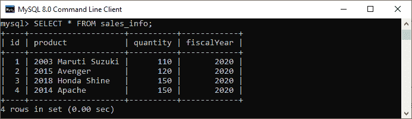
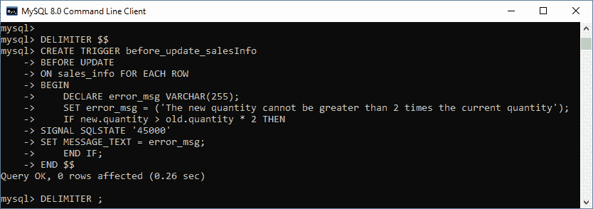
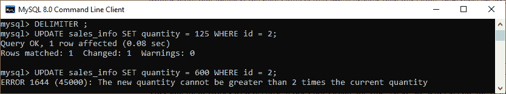
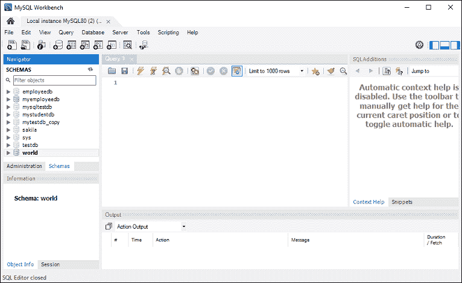
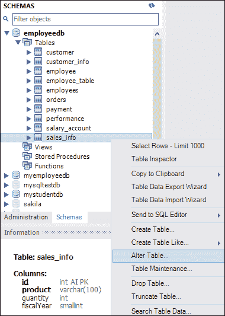
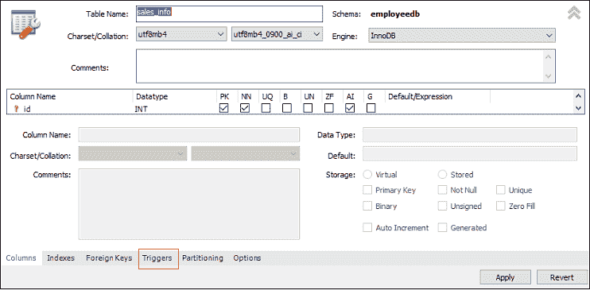
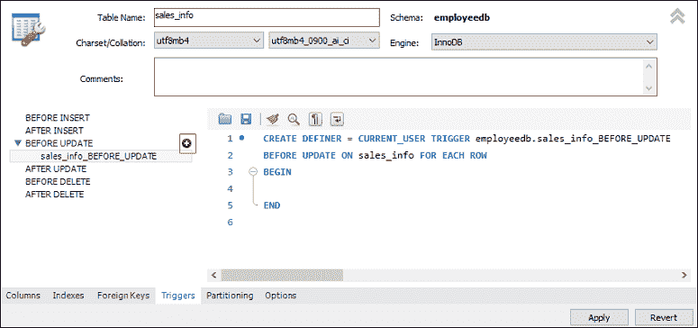
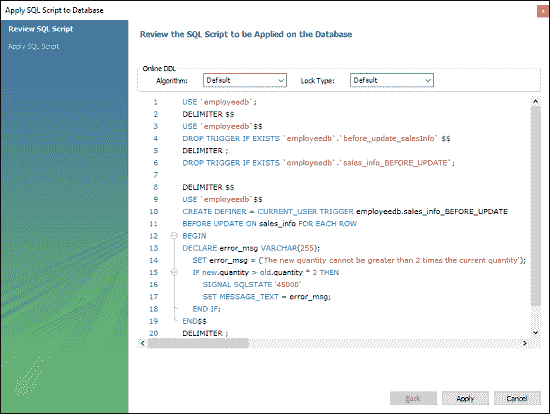
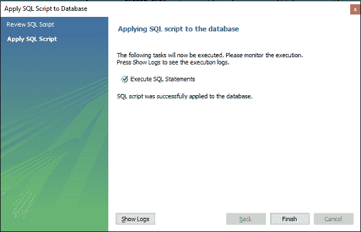

# 更新触发前的 MySQL

> 原文：<https://www.javatpoint.com/mysql-before-update-trigger>

每当在与触发器相关联的表上触发更新操作时，都会自动调用 MySQL 中的“更新前触发器”。在本文中，我们将学习如何使用其语法和示例来创建更新前触发器。

### 句法

以下是在 MySQL 中创建“更新前”触发器的语法:

```

CREATE TRIGGER trigger_name 
BEFORE UPDATE
ON table_name FOR EACH ROW
trigger_body ;

```

更新前触发器语法参数解释如下:

*   首先，我们将指定我们想要创建的**触发器名称**。它在模式中应该是唯一的。
*   第二，我们将指定**触发动作时间**，应该是在 UPDATE 之前。该触发器将在表上的每一行更改发生之前被调用。
*   第三，我们将指定与触发器关联的表的名称。必须写在 **ON 关键字**之后。如果我们不指定表名，触发器就不存在。
*   最后，我们将指定**触发器主体**，它包含一条语句，用于在触发器被激活时执行。

如果我们想要执行多个语句，我们将使用包含一组查询的 **BEGIN END** 块来定义触发器的逻辑。请参见以下语法:

```

DELIMITER $$ 
CREATE TRIGGER trigger_name BEFORE UPDATE
ON table_name FOR EACH ROW
BEGIN
   variable declarations
   trigger code
END$$
DELIMITER ;

```

### 限制

*   我们不能在“更新前”触发器中更新旧值。
*   我们可以改变新的价值观。
*   我们无法在视图上创建“更新前”触发器。

### 更新前触发示例

让我们通过一个例子来了解如何在 MySQL 中使用 [CREATE TRIGGER 语句创建一个 BERN UPDATE 触发器。](mysql-create-trigger)

假设我们创建了一个名为 **sales_info** 的表，如下所示:

```

CREATE TABLE sales_info (
    id INT AUTO_INCREMENT,
    product VARCHAR(100) NOT NULL,
    quantity INT NOT NULL DEFAULT 0,
    fiscalYear SMALLINT NOT NULL,
    CHECK(fiscalYear BETWEEN 2000 and 2050),
    CHECK (quantity >=0),
    UNIQUE(product, fiscalYear),
    PRIMARY KEY(id)
);

```

接下来，我们将在 sales_info 表中插入一些记录，如下所示:

```

INSERT INTO sales_info(product, quantity, fiscalYear)
VALUES
    ('2003 Maruti Suzuki',110, 2020),
    ('2015 Avenger', 120,2020),
    ('2018 Honda Shine', 150,2020),
	('2014 Apache', 150,2020);

```

然后，执行 **SELECT 语句**查看表格数据如下:



接下来，我们将使用 **CREATE TRIGGER** 语句来创建一个 BEFORE UPDATE 触发器。在表中发生更新事件之前，会自动调用此触发器。

```

DELIMITER $$

CREATE TRIGGER before_update_salesInfo
BEFORE UPDATE
ON sales_info FOR EACH ROW
BEGIN
    DECLARE error_msg VARCHAR(255);
    SET error_msg = ('The new quantity cannot be greater than 2 times the current quantity');
    IF new.quantity > old.quantity * 2 THEN
	SIGNAL SQLSTATE '45000' 
	SET MESSAGE_TEXT = error_msg;
    END IF;
END $$

DELIMITER ;

```

如果触发器创建成功，我们将获得如下输出:



如果我们将“数量”列中的值更新为比当前值大两倍的新值，触发器会产生一条错误消息并停止更新。

让我们详细了解创建的触发器:

首先，我们在 CREATE TRIGGER 子句中将触发器名称指定为 befor_update_salesInfo。其次，指定触发事件，然后指定与触发器关联的表名。第三，我们已经声明了一个变量并设置了它的值。最后，我们指定了触发器主体，它检查新值是否比旧值大两倍，然后引发错误。

### 如何调用“更新前”触发器？

首先，我们可以使用以下语句来更新 id = 2 的行的数量:

```

mysql> UPDATE sales_info SET quantity = 125 WHERE id = 2; 

```

这种说法效果很好，因为它没有违反规则。接下来，我们将执行以下语句，将行的数量更新为 600，其 id = 2

```

mysql> UPDATE sales_info SET quantity = 600 WHERE id = 2; 

```

它会给出如下错误，因为它违反了规则。参见下面的输出。



### 如何在 MySQL 工作台中创建 BEFORE UPDATE 触发器？

要使用 [MySQL 工作台](https://www.javatpoint.com/mysql-workbench)创建一个 BEFORE UPDATE 触发器，我们首先需要启动它，然后使用我们之前创建的用户名和密码登录。我们将获得如下屏幕:



现在，请执行以下步骤来创建“更新前”触发器:

1.转到导航选项卡，点击**模式菜单**，该菜单包含 [MySQL](https://www.javatpoint.com/mysql-tutorial) 服务器中所有可用的数据库。

2.选择数据库(例如， **employeedb** ，双击它，显示包含表、视图、函数和存储过程的**子菜单**。请参见下面的屏幕。


3.展开**表格子菜单**，选择要创建触发器的表格。选择表格后，右键单击所选表格(例如，sales_info)，然后单击**更改表格**选项。请参见下图:



4.点击更改表格选项，屏幕如下:



5.现在，点击上一部分红色矩形框中显示的**触发标签**，然后选择更新前计时/事件。我们会注意到有一个(+)图标按钮来添加触发器。点击该按钮，我们将获得基于选择定时/事件的默认触发代码:



6.现在，完成触发代码，再次查看，如果没有发现错误，点击**应用**按钮。



7.点击应用按钮后，点击**完成**按钮完成。



8.如果我们看一下模式菜单，我们会看到[触发](https://www.javatpoint.com/mysql-trigger)**sales_info _ before _ update**在 sales _ info 表下如下:


* * *