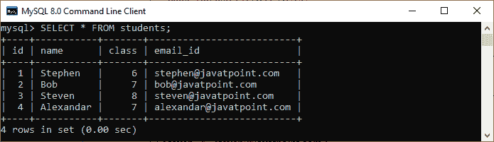
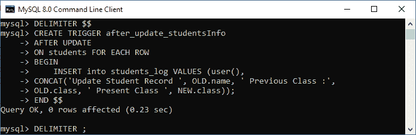
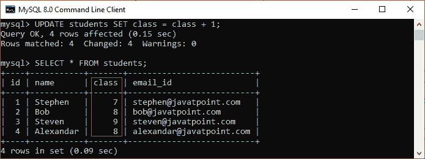
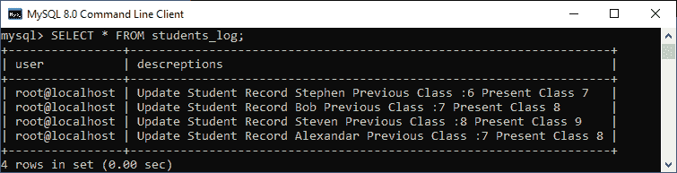
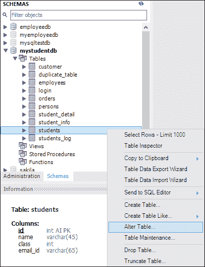
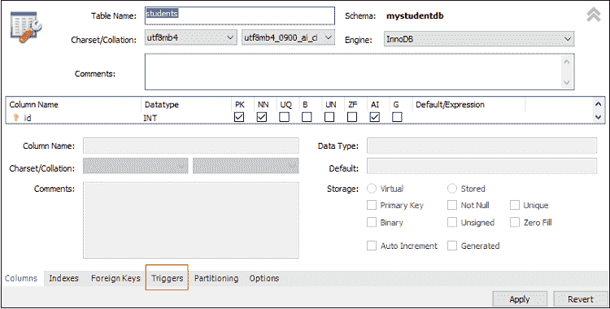
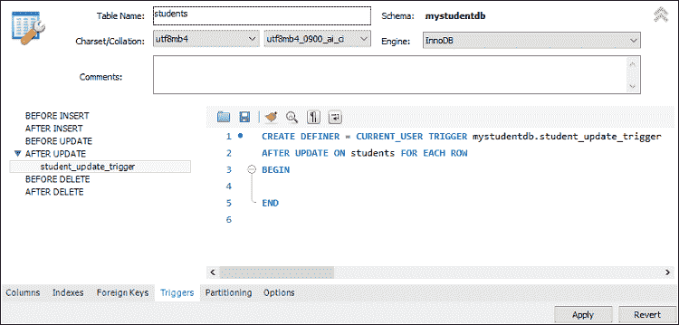
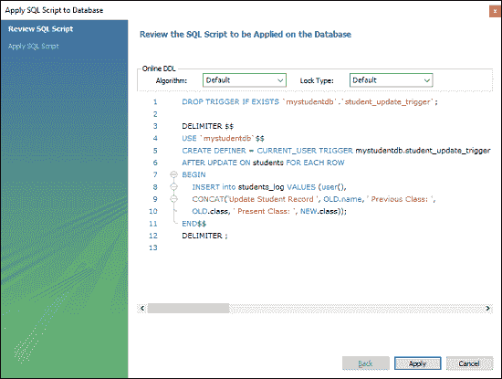
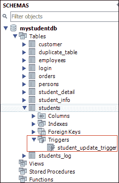

# 更新触发器后的 MySQL

> 原文：<https://www.javatpoint.com/mysql-after-update-trigger>

每当在与触发器相关联的表上触发更新事件时，MySQL 中的 AFTER UPDATE 触发器就会自动调用。在本文中，我们将学习如何使用其语法和示例来创建 AFTER UPDATE 触发器。

### 句法

以下是在 MySQL 中创建【更新后的 T0】触发器的语法:

```sql

CREATE TRIGGER trigger_name 
AFTER UPDATE
ON table_name FOR EACH ROW
trigger_body ;

```

我们可以如下解释 AFTER UPDATE 触发器语法的参数:

*   首先，我们将指定我们想要创建的**触发器名称**。它在模式中应该是唯一的。
*   第二，我们会指定**触发动作时间**，应该是 AFTER UPDATE。该触发器将在表上的每一行更改发生后被调用。
*   第三，我们将指定触发器关联的**表名**。它必须写在**之后**上如果我们不指定表名，触发器就不存在。
*   最后，我们将指定**触发器主体**，它包含一条语句，用于在触发器被激活时执行。

如果我们想要执行多个语句，我们将使用包含一组 SQL 查询的 **BEGIN END** 块来定义[触发器](https://www.javatpoint.com/mysql-trigger)的逻辑。请参见以下语法:

```sql

DELIMITER $$ 
CREATE TRIGGER trigger_name AFTER UPDATE
ON table_name FOR EACH ROW
BEGIN
   variable declarations
   trigger code
END$$
DELIMITER ;

```

### 限制

*   我们可以访问旧行，但不能更新它们。
*   我们可以访问新行，但不能更新它们。
*   我们不能在**视图**上创建更新后触发器。

### 更新后触发示例

让我们通过一个例子来了解如何在 MySQL 中使用 [CREATE TRIGGER 语句创建 AFTER UPDATE 触发器。](mysql-create-trigger)

假设我们创建了一个名为**学生**的表来存储学生的信息，如下所示:

```sql

mysql> CREATE TABLE students(  
    id int NOT NULL AUTO_INCREMENT,  
    name varchar(45) NOT NULL,  
    class int NOT NULL,  
    email_id varchar(65) NOT NULL,  
    PRIMARY KEY (id)  
);

```

接下来，我们将使用下面的语句在该表中插入一些记录:

```sql

INSERT INTO students (name, class, email_id)   
VALUES ('Stephen', 6, 'stephen@javatpoint.com'), 
('Bob', 7, 'bob@javatpoint.com'), 
('Steven', 8, 'steven@javatpoint.com'), 
('Alexandar', 7, 'alexandar@javatpoint.com');

```

执行 **[选择](https://www.javatpoint.com/mysql-select)** 查询查看表格数据。



第三，我们将创建另一个名为 **students_log** 的表，该表保存所选用户的更新信息。

```sql

mysql> CREATE TABLE students_log(  
    user varchar(45) NOT NULL,  
    descreptions varchar(65) NOT NULL
);

```

然后我们将创建一个 AFTER UPDATE **触发器，提升下一个班级**的所有学生，即 6 将是 7，7 将是 8，以此类推。每当对“**学生**表中的单个行执行更新时，新的一行将被插入到**学生 _ 日志**表中。该表保存了**当前用户 id** 和一个关于当前更新的**描述**。请参见下面的触发代码。

```sql

DELIMITER $$

CREATE TRIGGER after_update_studentsInfo
AFTER UPDATE
ON students FOR EACH ROW
BEGIN
    INSERT into students_log VALUES (user(), 
	CONCAT('Update Student Record ', OLD.name, ' Previous Class :',
	OLD.class, ' Present Class ', NEW.class));
END $$

DELIMITER ;

```



在这个触发器中，我们首先在 _ update _ studentinfo 之后指定了触发器名称**。然后，指定触发事件。第三，我们指定了与触发器关联的表名。最后，我们在触发器主体内部编写了触发器逻辑，在“学生”表中执行更新，并将日志信息保存在“学生 _ 日志”表中。**

### 如何调用 AFTER UPDATE 触发器？

首先，我们将使用以下调用上面创建的触发器的语句来更新“学生”表:

```sql

mysql> UPDATE students SET class = class + 1;

```

接下来，我们将从**学生**和**学生 _ 日志表**中查询数据。我们可以看到该表在执行查询后已经更新。请参见以下输出:



同样，我们将从 students_log 表中查询数据，该表保存了当前用户 id 和关于当前更新的描述。请参见以下输出:



### 如何在 MySQL 工作台创建 AFTER UPDATE 触发器？

要在工作台创建 AFTER UPDATE 触发器，我们首先**启动 [MySQL 工作台](https://www.javatpoint.com/mysql-workbench)** 并使用用户名和密码登录。我们将获得如下用户界面:


现在，请执行以下步骤来创建“更新后”触发器:

1.进入**导航**选项卡，点击**模式**菜单。它将显示 [MySQL](https://www.javatpoint.com/mysql-tutorial) 数据库服务器中所有可用的数据库。


2.选择数据库(例如 **mystudentdb** )。然后，双击选定的模式。它显示包含表、视图、函数和存储过程的**子菜单**。请参见下面的屏幕。


3.展开**表格**子菜单，选择要创建触发器的表格。然后，右键单击所选表格(例如**，学生)，并单击**更改表格**选项。请参见下图:**

**

4.点击选项，屏幕如下:



5.现在，点击上一节**红色矩形框**中显示的**触发**选项卡，然后选择【更新后的 T4】计时/事件。我们会注意到有一个 **(+)图标按钮**来添加触发器。点击该按钮，我们将获得基于选择定时/事件的触发器默认代码:



6.现在，完成触发代码，再次查看，如果没有发现错误，点击**应用**按钮。



7.点击应用按钮后，点击**完成按钮**完成该过程。


8.如果我们查看模式菜单，我们可以在“**学生”**表下看到**学生 _ 更新 _ 触发**如下:



* * ***