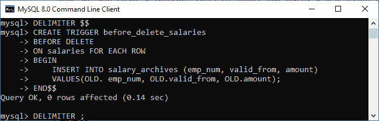
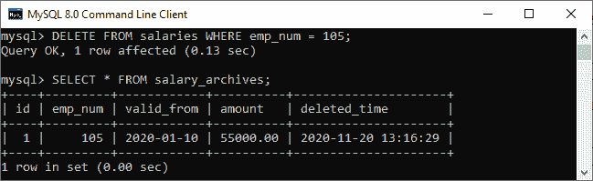
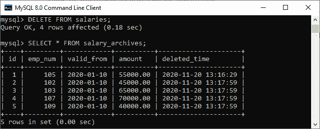
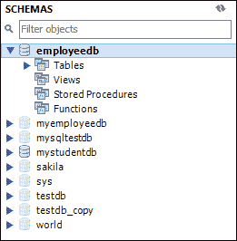
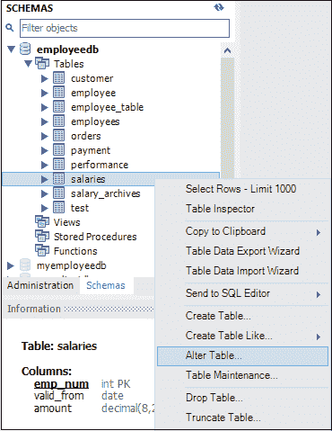
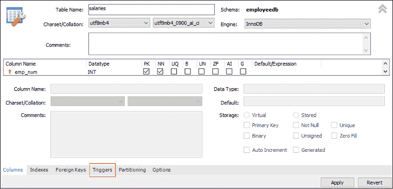
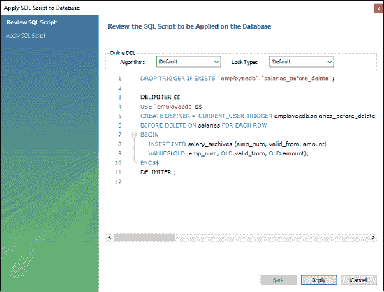
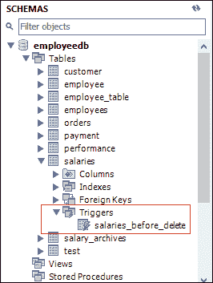

# 删除触发器之前的 MySQL

> 原文：<https://www.javatpoint.com/mysql-before-delete-trigger>

每当对表执行删除操作时，都会自动调用 MySQL 中的 BEFORE DELETE 触发器。在本文中，我们将学习如何创建一个 before delete 触发器及其语法和示例。

### 句法

以下是在 MySQL 中创建“删除前”触发器的语法:

```sql

CREATE TRIGGER trigger_name 
BEFORE DELETE
ON table_name FOR EACH ROW
Trigger_body ;

```

“删除前”触发器语法参数可以解释如下:

*   首先，我们将指定要创建的触发器的名称。它在模式中应该是唯一的。
*   其次，我们会指定触发动作时间，应该是 BEFORE DELETE。该触发器将在表上的每一行更改发生之前被调用。
*   第三，我们将指定与触发器关联的表的名称。必须写在 ON 关键字之后。如果我们不指定表名，触发器就不存在。
*   最后，我们将指定触发器激活时要执行的语句。

如果我们想要执行多个语句，我们将使用包含一组查询的 BEGIN END 块来定义触发器的逻辑。请参见以下语法:

```sql

DELIMITER $$ 
CREATE TRIGGER trigger_name BEFORE DELETE
ON table_name FOR EACH ROW
BEGIN
   variable declarations
   trigger code
END$$
DELIMITER ;

```

### 限制

*   我们可以访问旧行，但不能在“删除前”触发器中更新它们。
*   我们无法访问新行。这是因为没有新的行存在。
*   我们不能在视图上创建“删除前”触发器。

### 删除前触发示例

让我们通过一个例子来了解如何在 MySQL 中使用 [CREATE TRIGGER 语句创建一个 BERN DELETE 触发器。](mysql-create-trigger)

假设我们创建了一个名为“薪资”的表来存储员工的薪资信息，如下所示:

```sql

CREATE TABLE salaries (
    emp_num INT PRIMARY KEY,
    valid_from DATE NOT NULL,
    amount DEC(8 , 2 ) NOT NULL DEFAULT 0
);

```

接下来，我们将使用下面的语句在该表中插入一些记录:

```sql

INSERT INTO salaries (emp_num, valid_from, amount)
VALUES
    (102, '2020-01-10', 45000),
    (103, '2020-01-10', 65000),
    (105, '2020-01-10', 55000),
    (107, '2020-01-10', 70000),
    (109, '2020-01-10', 40000);

```

执行 SELECT 查询以查看表数据。


第三，我们将创建另一个名为 salary_archives 的表，该表保存已删除薪资的信息。

```sql

CREATE TABLE salary_archives (
    id INT PRIMARY KEY AUTO_INCREMENT,
    emp_num INT,
    valid_from DATE NOT NULL,
    amount DEC(18 , 2 ) NOT NULL DEFAULT 0,
    deleted_time TIMESTAMP DEFAULT NOW()
);

```

然后，我们将创建一个 BEFORE DELETE 触发器，在从薪资表中删除一行之前，在 salary_archives 表中插入一条新记录。

```sql

DELIMITER $$

CREATE TRIGGER before_delete_salaries
BEFORE DELETE
ON salaries FOR EACH ROW
BEGIN
    INSERT INTO salary_archives (emp_num, valid_from, amount)
    VALUES(OLD. emp_num, OLD.valid_from, OLD.amount);
END$$ 

DELIMITER ;

```



在这个触发器中，我们首先在 _ delete _ salaries 之前指定了触发器名称。然后，指定触发事件。第三，我们指定了与触发器关联的表名。最后，我们在触发器主体内部编写了触发器逻辑，将删除的行插入到 salary_archives 表中。

### 如何调用 BEFORE DELETE 触发器？

让我们测试一下上面创建的 BEFORE DELETE 触发器，以及如何调用它们。首先，我们将从薪资表中删除一行:

```sql

mysql> DELETE FROM salaries WHERE emp_num = 105;

```

其次，我们将使用 select 语句查询 salary_archives 表中的数据，以验证是否调用了上面创建的触发器:

```sql

mysql> SELECT * FROM salary_archives;

```

在执行一条语句后，我们可以看到触发器被成功调用，并在 salary_archives 表中插入了一条新记录。



第三，我们将从薪资表中删除所有行:

```sql

mysql> DELETE FROM salaries;

```

最后，我们将再次从薪资档案表中查询数据。该触发器被调用了四次，因为 DELETE 语句从薪资表中删除了四条记录。请参见以下输出:



### 如何在 MySQL 工作台中创建 BEFORE DELETE 触发器？

要使用 [MySQL 工作台](https://www.javatpoint.com/mysql-workbench)创建一个 BEFORE DELETE 触发器，我们首先需要启动它，然后使用我们之前创建的用户名和密码登录。我们将获得如下屏幕:


现在，请执行以下步骤来创建“删除前”触发器:

1.转到导航选项卡，点击**模式菜单**，该菜单包含 [MySQL](https://www.javatpoint.com/mysql-tutorial) 服务器中所有可用的数据库。

2.选择数据库(例如，employeedb)，双击它。它将显示包含表、视图、函数和存储过程的**子菜单**。请参见下面的屏幕。



3.展开**表格子菜单**，选择您想要在其上创建[触发器](https://www.javatpoint.com/mysql-trigger)的表格。选择表格后，右键单击所选表格(例如工资)，然后单击 **[更改表格](https://www.javatpoint.com/mysql-alter-table)** 选项。请参见下图:



4.点击更改表格选项，屏幕如下:



5.现在，点击上一节红色矩形框中显示的**触发标签**，然后选择删除前的计时/事件。我们会注意到有一个(+)图标按钮来添加触发器。点击该按钮，我们将获得基于选择定时/事件的默认触发代码:


6.现在，完成触发代码，再次查看，如果没有发现错误，点击**应用**按钮。



7.点击应用按钮后，点击**完成**按钮完成。


8.如果我们查看模式菜单，我们会在薪资表下看到触发器**薪资 _before_trigger** ，如下所示:



* * *