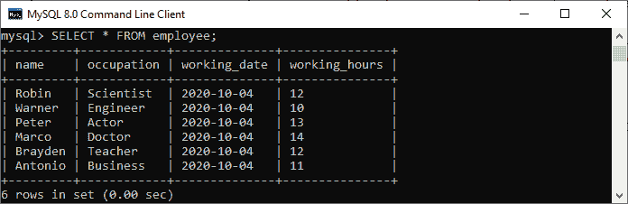
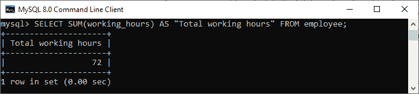
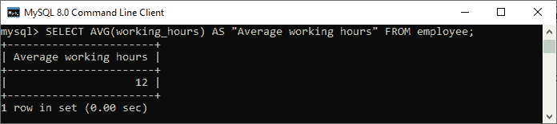
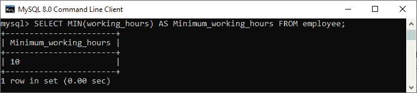
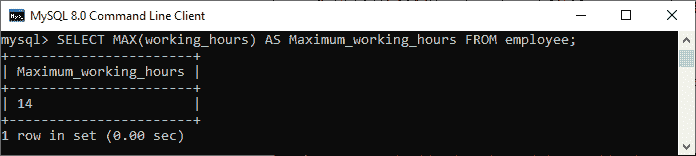
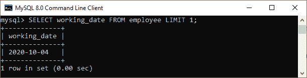
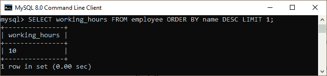
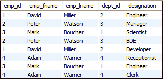
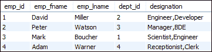

# MySQL 聚合函数

> 原文：<https://www.javatpoint.com/mysql-aggregate-functions>

MySQL 的聚合函数用于**对多个值执行计算，并返回单个值的结果，如所有值的平均值、**所有值的总和以及某些值组中的最大&最小值。在数据查询语言中，我们主要使用带有 [SELECT 语句](https://www.javatpoint.com/mysql-select)的聚合函数。

### 语法:

以下是在 MySQL 中使用聚合函数的语法:

```sql
function_name (DISTINCT | ALL expression)

```

在上面的语法中，我们使用了以下参数:

*   首先，我们需要指定聚合函数的名称。
*   其次，当我们想要基于不同的值计算结果时，我们使用 **DISTINCT** 修改器，或者当我们计算所有的值时，使用 **ALL** 修改器，包括重复的值。默认值为“全部”。
*   第三，我们需要指定包含列和算术运算符的表达式。

[MySQL](https://www.javatpoint.com/mysql-tutorial) 中有各种聚合函数可用。下表总结了一些最常用的聚合函数:

| 聚合函数 | 描述 |
| [计数()](https://www.javatpoint.com/mysql-count) | 它返回行数，包括组中具有空值的行。 |
| [sum()](https://www.javatpoint.com/mysql-sum) | 它返回集合中的总计值(非空)。 |
| [平均值()](https://www.javatpoint.com/mysql-average) | 它返回表达式的平均值。 |
| [分钟()](https://www.javatpoint.com/mysql-min) | 它返回集合中的最小(最低)值。 |
| [最大值()](https://www.javatpoint.com/mysql-max) | 它返回集合中的最大值。 |
| [灌浆 p_concat()](https://www.javatpoint.com/mysql-group_concat-function) | 它返回一个串联的字符串。 |
| [第一个()](https://www.javatpoint.com/mysql-first) | 它返回表达式的第一个值。 |
| [最后()](https://www.javatpoint.com/mysql-last) | 它返回表达式的最后一个值。 |

## 为什么我们使用聚合函数？

我们主要在数据库、电子表格和许多其他数据操作软件包中使用聚合函数。在商业环境中，不同的组织层次需要不同的信息，比如高层管理者感兴趣的是整体数据，而不是个人细节。这些函数从我们的数据库中生成汇总数据。因此，它们在经济学和金融学中被广泛用于代表经济健康或股票和行业表现。

让我们以 myflix(拥有大量电影收藏的视频流网站)数据库为例，其中的管理可能需要以下细节:

*   大多数租来的电影。
*   租得最少的电影。
*   每部电影一个月平均出租的数量。

借助聚合函数，我们可以轻松生成这些细节。

让我们详细讨论最常用的聚合函数。首先，我们将为所有聚合函数的演示创建一个新表。

执行以下语句创建一个**员工**表:

```sql
CREATE TABLE employee(
    name varchar(45) NOT NULL,  
    occupation varchar(35) NOT NULL,  
    working_date date,
    working_hours varchar(10)
);

```

执行以下语句**将记录**插入员工表:

```sql
INSERT INTO employee VALUES  
('Robin', 'Scientist', '2020-10-04', 12),
('Warner', 'Engineer', '2020-10-04', 10),
('Peter', 'Actor', '2020-10-04', 13),
('Marco', 'Doctor', '2020-10-04', 14),
('Brayden', 'Teacher', '2020-10-04', 12),
('Antonio', 'Business', '2020-10-04', 11);

```

现在，执行 **[SELECT 语句](https://www.javatpoint.com/mysql-select)** 显示记录:



### 计数()函数

MySQL count()函数**返回表达式中值的总数**。该函数根据指定的条件生成表的所有行或仅生成部分行，其返回类型为 **BIGINT** 。如果找不到任何匹配的行，它将返回零。它可以处理数字和非数字数据类型。

**例**

假设我们想要获取 employee 表中的雇员总数，我们需要使用 count()函数，如下查询所示:

```sql
mysql> SELECT COUNT(name) FROM employee;   

```

**输出:**

执行后，我们可以看到这张表有六名员工。


要阅读更多信息，[点击此处](https://www.javatpoint.com/mysql-count)。

### 求和()函数

MySQL sum()函数**返回一个表达式的合计(非空)值**。如果结果集没有任何行，它将返回空值。它仅适用于数字数据类型。

假设我们要计算表中所有员工的总工作时间，我们需要使用 sum()函数，如下查询所示:

```sql
mysql> SELECT SUM(working_hours) AS "Total working hours" FROM employee;  

```

**输出:**

执行后，我们可以在表格中看到所有员工的总工作时间。



要阅读更多信息，[点击此处](https://www.javatpoint.com/mysql-sum)。

### AVG()函数

MySQL AVG()函数**计算列中指定的值**的平均值。与 SUM()函数类似，它也只适用于数字数据类型。

假设我们想得到表中所有员工的平均工作时间，我们需要使用 AVG()函数，如下查询所示:

```sql
mysql> SELECT AVG(working_hours) AS "Average working hours" FROM employee;  

```

**输出:**

执行后，我们可以看到组织中所有员工的平均工作时间:



要阅读更多信息，[点击此处](https://www.javatpoint.com/mysql-average)。

### 最小()函数

MySQL MIN()函数**返回指定列的最小(最低)值**。它也只适用于数字数据类型。

假设我们想要获得表中可用的员工的最小工作时间，我们需要使用 MIN()函数，如下查询所示:

```sql
mysql> SELECT MIN(working_hours) AS Minimum_working_hours FROM employee;  

```

**输出:**

执行后，我们可以在表中看到员工的最低工作时间:



要阅读更多信息，[点击此处](https://www.javatpoint.com/mysql-min)。

### 最大()函数

MySQL MAX()函数**返回指定列的最大(最高)值**。它也只适用于数字数据类型。

假设我们想要获得表中员工的最大工作时间，我们需要使用 MAX()函数，如下查询所示:

```sql
mysql> SELECT MAX(working_hours) AS Maximum_working_hours FROM employee;  

```

**输出:**

执行后，我们可以在表中看到员工的最大工作时间:



要阅读更多信息，[点击此处](https://www.javatpoint.com/mysql-max)。

### 第一个()函数

该函数**返回指定列的第一个值**。要获得列的第一个值，我们必须使用 **LIMIT** 子句。因为 FIRST()函数只支持在 MS Access 中使用。

假设我们想要获取表中某个员工的第一个工作日期，我们需要使用以下查询:

```sql
mysql> SELECT working_date FROM employee LIMIT 1;  

```

**输出:**

执行后，我们可以在表中看到员工的第一个工作日期:



要阅读更多信息，[点击此处](https://www.javatpoint.com/mysql-first)。

### 最后()函数

该函数**返回指定列的最后一个值**。要获得列的最后一个值，我们必须使用 [**ORDER BY**](https://www.javatpoint.com/mysql-order-by) 和 **LIMIT** 子句。因为 LAST()函数只支持在 MS Access 中使用。

假设我们想在表中获得员工的最后工作时间，我们需要使用以下查询:

```sql
mysql> SELECT working_hours FROM employee ORDER BY name DESC LIMIT 1;  

```

**输出:**

执行后，我们可以在表中看到员工的最后工作时间:



要阅读更多信息，[点击此处](https://www.javatpoint.com/mysql-last)。

### 函数

函数**将多行连接的字符串返回到单个字符串**中。如果该组至少包含一个非空值，它将始终返回一个字符串值。否则，我们将得到一个空值。

假设我们有另一个员工表，如下所示:



如果我们想在 employee 表中连接相同 dept_id 的指定，我们需要使用以下查询:

```sql
mysql> SELECT emp_id, emp_fname, emp_lname, dept_id,   
GROUP_CONCAT(designation) as "designation" FROM employee group by emp_id;  

```

**输出:**

执行后，我们可以看到相同 dept_id 的指定成功连接:



要阅读更多信息，[点击此处](https://www.javatpoint.com/mysql-group_concat-function)。

* * *