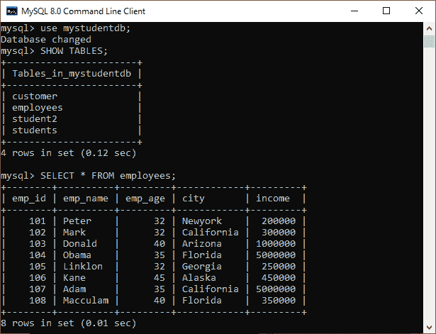
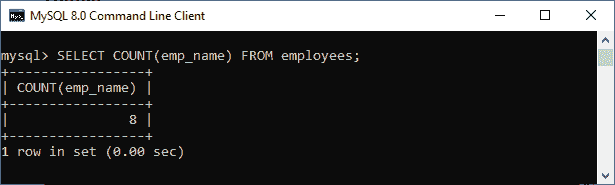
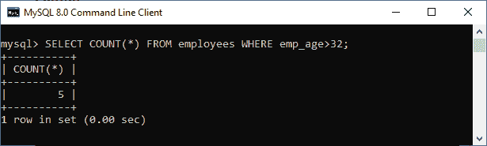
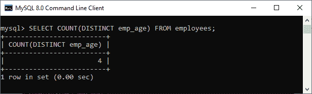
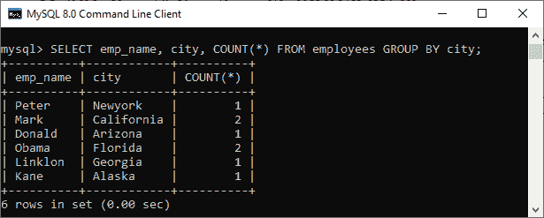
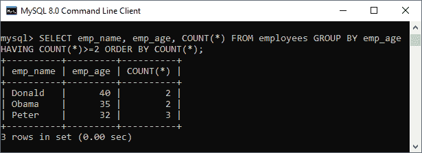

# MySQL 计数()函数

> 原文：<https://www.javatpoint.com/mysql-count>

函数的作用是:返回一个表达式的计数。它允许我们对表中符合指定条件的所有行或仅部分行进行计数。它是一种聚合函数，返回类型是 BIGINT。如果没有找到任何匹配的行，此函数将返回 0。

我们可以使用三种形式的计数函数，解释如下:

*   计数(*)
*   计数(表达式)
*   计数(独特)

让我们详细讨论每一个。

**COUNT(*)函数:**该函数使用 [SELECT 语句](https://www.javatpoint.com/mysql-select)返回结果集中的行数。结果集包含所有非空、空和重复的行。

**COUNT(表达式)函数:**该函数返回不包含 Null 行的结果集作为表达式的结果。

**COUNT(distinct expression)函数:**该函数返回不包含 NULL 值的不同行的计数作为表达式的结果。

### 句法

下面是 COUNT()函数的语法:

```
SELECT COUNT (aggregate_expression)  
FROM table_name  
[WHERE conditions];  

```

### 参数说明

**aggregate_expression:** 指定将计算其非空值的列或表达式。

**表名:**指定要从中检索记录的表。 [FROM 子句](https://www.javatpoint.com/mysql-from)中必须至少有一个表。

**所在条件:**可选。它指定了要选择的记录必须满足的条件。

### MySQL count()函数示例

考虑一个名为“employees”的表，它包含以下数据。



让我们了解 count()函数在 [MySQL](https://www.javatpoint.com/mysql-tutorial) 中是如何工作的。

**示例 1**

执行以下查询，使用 COUNT(表达式)函数计算表中可用的员工姓名总数:

```
mysql> SELECT COUNT(emp_name) FROM employees;  

```

**输出:**



**示例 2**

执行以下语句，返回雇员表中的所有行，并且 [WHERE 子句](https://www.javatpoint.com/mysql-where)指定 emp_age 列中值大于 32 的行:

```
mysql> SELECT COUNT(*) FROM employees WHERE emp_age>32;  

```

**输出:**



**示例 3**

此语句使用 COUNT(非重复表达式)函数对 emp_age 列中的非空行和重复行进行计数:

```
mysql> SELECT COUNT(DISTINCT emp_age) FROM employees;

```

**输出:**



### 带有 GROUP BY 子句的 MySQL Count()函数

我们还可以在 GROUP BY 子句中使用 count()函数，该函数返回每个组中元素的计数。例如，以下语句返回每个城市的员工人数:

```
mysql> SELECT emp_name, city, COUNT(*) FROM employees GROUP BY city;

```

成功执行后，我们将得到如下结果:



### 带有 HAVING 和 ORDER BY 子句的 MySQL Count()函数

让我们看看另一个子句，它使用了带有 count()函数的 [ORDER BY](https://www.javatpoint.com/mysql-order-by) 和 [Having 子句](https://www.javatpoint.com/mysql-having)。执行以下语句，给出至少两个年龄相同的员工姓名，并根据计数结果对其进行排序:

```
mysql> SELECT emp_name, emp_age, COUNT(*) FROM employees 
GROUP BY emp_age 
HAVING COUNT(*)>=2 
ORDER BY COUNT(*);

```

该语句将给出如下输出:



* * *