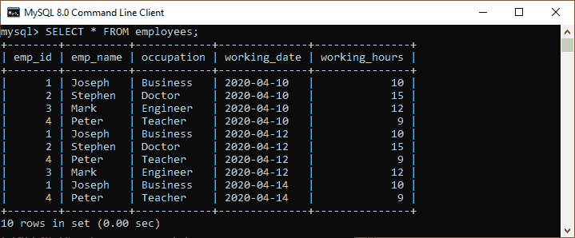
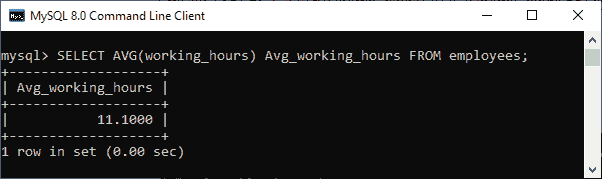
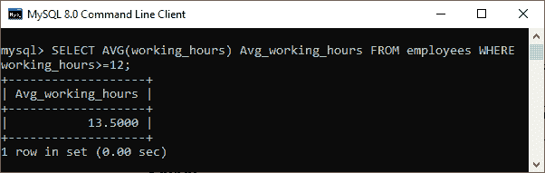
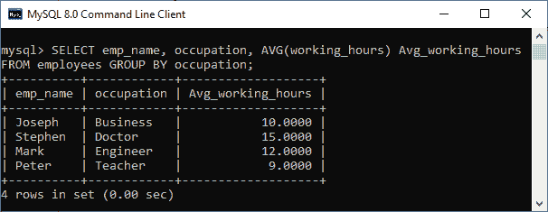
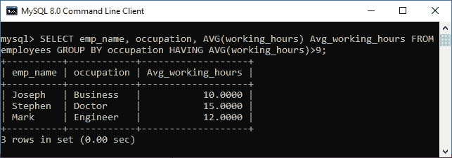
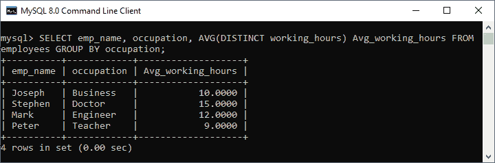

# MySQL avg()函数

> 原文：<https://www.javatpoint.com/mysql-average>

MySQL avg()是一个聚合函数，用于返回各种记录中表达式的平均值。

### 句法

以下是 MySQL 中 avg()函数的基本语法:

```sql
SELECT AVG(aggregate_expression)  
FROM tables  
[WHERE conditions];

```

### 参数说明

**aggregate_expression:** 它指定我们要查找平均结果的列或表达式。

**table_name:** 它指定了我们要从中检索记录的表。FROM 子句中必须至少列出一个表。

**所在条件:**可选。它指定了要选择的记录必须满足的条件。

### MySQL avg()函数示例

假设我们的数据库有一个名为**员工**的表，有以下数据。现在，我们将通过各种例子来理解这个函数:



**1。基本示例**

执行以下查询，计算表中所有员工的**平均工作时间**:

```sql
mysql> SELECT AVG(working_hours) Avg_working_hours FROM employees;

```

**输出:**

我们将得到如下结果:



**2。带有 WHERE 子句的 MySQL AVG()函数**

WHERE 子句指定了所选记录必须满足的条件。执行以下查询，计算**工作时间> = 12** 的员工的总平均工作时间。

```sql
mysql> SELECT AVG(working_hours) Avg_working_hours FROM employees WHERE working_hours>=12;

```

**输出:**

它将给出以下输出:



**3。带有 GROUP BY 子句的 MySQL AVG()函数**

GROUP BY 子句用于按一列或多列返回每个组的结果。例如，此语句使用 AVG()函数计算每个员工的平均工作时间，然后使用 GROUP BY 子句对结果进行分组:

```sql
mysql> SELECT emp_name, occupation, AVG(working_hours) Avg_working_hours FROM employees GROUP BY occupation;

```

**输出:**

在这里，我们可以看到每个员工的总工作时间是根据他们的**职业**分组计算的。



**4。带有 HAVING 子句的 MySQL AVG()函数**

HAVING 子句用于**过滤**MySQL 中组的平均值。执行以下语句，计算所有员工的平均工作时间，根据他们的职业对他们进行分组，并返回其结果 **Avg_working_hours > 9** 。

```sql
mysql> SELECT emp_name, occupation, 
AVG(working_hours) Avg_working_hours 
FROM employees 
GROUP BY occupation 
HAVING AVG(working_hours)>9;

```

**输出:**



**5。带有 DISTINCT 子句的 MySQL AVG()函数**

MySQL 使用 DISTINCT 关键字从列名中删除**重复的**行。此子句与此 avg()函数一起使用，以返回表中存在的唯一记录数的平均值。

执行以下查询，删除 employee 表的 working _ hours 列中的重复记录，然后返回平均值:

```sql
mysql> SELECT emp_name, occupation, 
AVG(DISTINCT working_hours) Avg_working_hours
FROM employees
GROUP BY occupation;

```

**输出:**



* * *