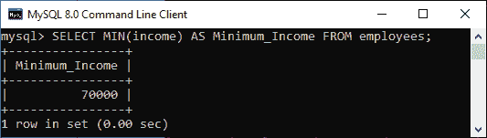
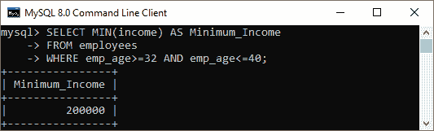
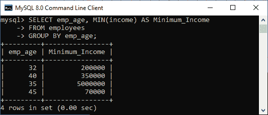
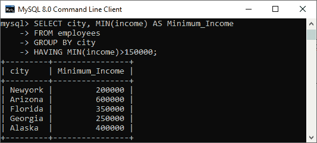
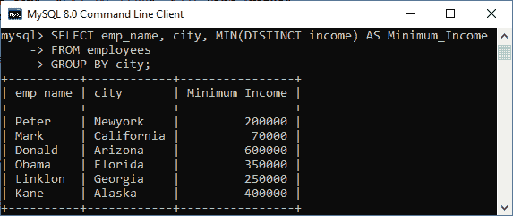

# MySQL MIN()函数

> 原文：<https://www.javatpoint.com/mysql-min>

MySQL 中的 MIN()函数用于从表中返回一组值中的**最小值**。当我们需要找到最小的数字、选择最便宜的产品等时，这是一个有用的聚合函数。

### 句法

以下是 MySQL 中 MIN() [函数的基本语法:](https://www.javatpoint.com/mysql-functions)

```
SELECT MIN ( DISTINCT aggregate_expression)
FROM table_name(s)
[WHERE conditions];

```

### 参数说明

该函数使用以下参数:

**aggregate_expression:** 是必选表达式。它指定将从中返回最小值的列或表达式名称。

**表名:**它指定了我们要从中检索记录的表。FROM 子句中必须至少列出一个表。

**所在条件:**可选。它指定了要选择的记录必须满足的条件。

**DISTINCT:** 它允许我们返回表达式中 DISTINCT 值的最小值。但是，它不影响 MIN()函数，并且在不使用此关键字的情况下会产生相同的结果。

### MySQL MIN()函数示例

借助各种例子，让我们了解一下 MIN 函数在 [MySQL](https://www.javatpoint.com/mysql-tutorial) 中是如何工作的。假设我们的数据库有一个名为“**员工**”的表，其中包含以下数据。


### 1.基本示例

执行以下查询，使用 MIN 函数在表格中找到员工的**最低收入**:

```
mysql> SELECT MIN(income) AS Minimum_Income FROM employees;  

```

**输出**

上面的查询生成所有行中最小值的结果。执行后，我们将得到如下输出:



### 2.带 WHERE 子句的 MySQL MIN()函数

[WHERE 子句](https://www.javatpoint.com/mysql-where)允许我们从选择的记录中过滤结果。以下语句在雇员表的所有行中查找最低收入，WHERE 子句指定了所有那些其 **emp_age 列**大于或等于 32 且小于或等于 40 的行。

```
mysql> SELECT MIN(income) AS Minimum_Income 
FROM employees 
WHERE emp_age >= 32 AND emp_age <= 40;

```

**输出**

上面的语句将得到如下输出:



### 3.带有 GROUP BY 子句的 MySQL MIN()函数

GROUP BY 子句允许我们从多行收集数据，并根据一列或多列对其进行分组。例如，下面的语句使用带有 GROUP BY 子句的 MIN()函数来查找每个 emp_age 组的雇员表中所有行的最低收入。

```
mysql> SELECT emp_age, MIN(income) AS Minimum_Income 
FROM employees 
GROUP BY emp_age;

```

**输出**

成功执行后，我们可以看到每个员工的收入通过根据年龄对他们进行分组来回报:



### 4.带 HAVING 子句的 MySQL MIN()函数

[HAVING 子句](https://www.javatpoint.com/mysql-having)总是与 GROUP BY 子句一起使用，以从表中筛选记录。例如，下面的语句返回所有员工的最低收入，根据他们所在的城市对他们进行分组，并返回 MIN(收入)> 150000 的结果。

```
mysql> SELECT city, MIN(income) AS Minimum_Income 
FROM employees 
GROUP BY city
HAVING MIN(income) > 150000;

```

**输出**

该语句将返回如下输出:



### 5.带 DISTINCT 子句的 MySQL MIN()函数

MySQL 使用 [DISTINCT](https://www.javatpoint.com/mysql-distinct) 关键字从列名中删除重复的行。我们还可以将此子句与 MIN()函数一起使用，以返回表中存在的唯一数量记录的最小收入值。

执行以下查询，按城市分组删除员工表收入列中的重复记录，然后返回最小值:

```
mysql> SELECT emp_name, city, MIN(DISTINCT income) AS Minimum_Income 
FROM employees 
GROUP BY city;

```

**输出**

该语句将给出如下输出:



* * *