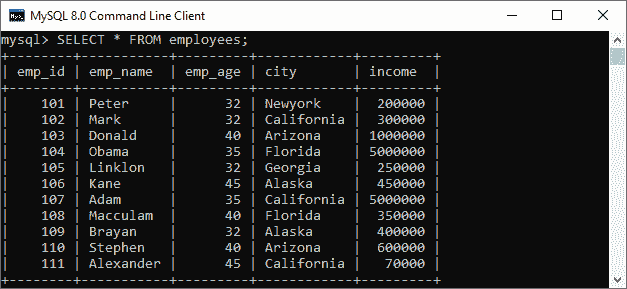
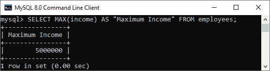
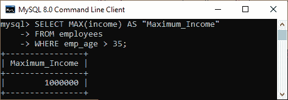
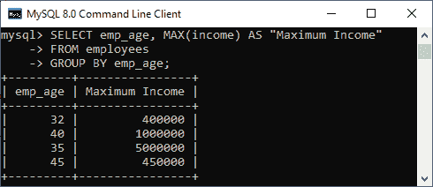
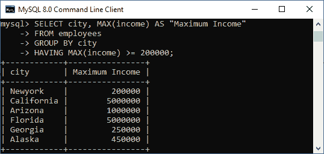
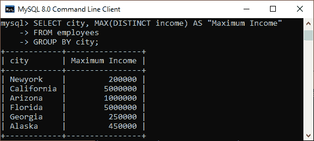
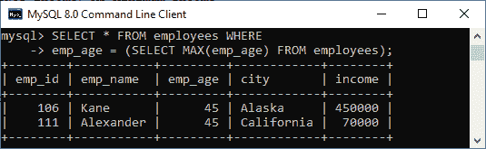

# MySQL MAX()函数

> 原文：<https://www.javatpoint.com/mysql-max>

MySQL MAX()函数用于返回表达式的一组值中的最大值。当我们需要找到最大数量、选择最贵的产品或从您的表中获得客户的最大付款时，此聚合函数非常有用。

### 句法

以下是 MySQL 中 MAX()函数的基本语法:

```sql
SELECT MAX(DISTINCT aggregate_expression)  
FROM table_name(s)  
[WHERE conditions];

```

### 参数说明

该函数使用以下参数:

**aggregate_expression:** 是必选表达式。它指定将从中返回最大值的列、表达式或公式。

**表名:**它指定了我们要从中检索记录的表。FROM 子句中必须至少列出一个表。

**所在条件:**可选。它指定了要选择的记录必须满足的条件。

**DISTINCT:** 它允许我们返回表达式中 DISTINCT 值的最大值。但是，它不影响 MAX()函数，并且在不使用此关键字的情况下会产生相同的结果。

### MySQL MAX()函数示例

借助各种例子，让我们了解 MAX 函数在 [MySQL](https://www.javatpoint.com/mysql-tutorial) 中是如何工作的。假设我们的数据库有一个名为“**员工**”的表，其中包含以下数据。



### 1.基本示例

执行以下查询，使用 MAX 函数在表格中找到员工的**最大收入**:

```sql
mysql> SELECT MAX(income) AS "Maximum Income" FROM employees;

```

**输出**

上面的查询生成所有行中最大值的结果。执行后，我们将得到如下输出:



### 2.带 WHERE 子句的 MySQL MAX()函数

[WHERE 子句](https://www.javatpoint.com/mysql-where)允许我们从选择的记录中过滤结果。下面的语句查找雇员表中所有行的最大收入。WHERE 子句指定了所有那些其 **emp_age 列**大于 35 的行。

```sql
mysql> SELECT MAX(income) AS "Maximum_Income" 
FROM employees 
WHERE emp_age > 35;

```

**输出**

上面的语句将得到如下输出:



### 3.带分组依据子句的函数

[GROUP BY 子句](https://www.javatpoint.com/mysql-group-by)允许我们从多行收集数据，并根据一列或多列对其进行分组。例如，下面的语句使用 MAX()函数和 GROUP BY 子句来查找每个 emp_age 组的雇员表中所有行的最大收入。

```sql
mysql> SELECT emp_age, MAX(income) AS "Maximum Income" 
FROM employees 
GROUP BY emp_age;

```

**输出**

成功执行后，我们可以看到员工的最大收入回报是根据他们的年龄分组的:



### 3.带 HAVING 子句的 MySQL MAX()函数

[HAVING 子句](https://www.javatpoint.com/mysql-having)总是与 GROUP BY 子句一起使用，以从表中筛选记录。例如，以下语句返回所有员工的最大收入，根据他们所在的城市对他们进行分组，并返回 MAX(收入)> = 200000 的结果。

```sql
mysql> SELECT city, MAX(income) AS "Maximum Income" 
FROM employees 
GROUP BY city
HAVING MAX(income) >= 200000;

```

**输出**

该语句将返回如下输出:



### 5.带 DISTINCT 子句的 MySQL MAX()函数

MySQL 使用 [DISTINCT](https://www.javatpoint.com/mysql-distinct) 关键字从列名中删除重复的行。我们还可以将此子句与 MAX()函数一起使用，以返回表中存在的唯一数量的记录的最大收入值。

执行以下查询，删除员工表收入列中的重复记录(按城市分组)，然后返回最大值:

```sql
mysql> SELECT city, MAX(DISTINCT income) AS "Maximum Income" 
FROM employees 
GROUP BY city;

```

**输出**

该语句将给出如下输出:



### 6.子查询示例中的 MySQL MAX()函数

有时需要使用子查询来返回表中的最大值。在这种情况下，我们使用以下查询:

```sql
mysql> SELECT * FROM employees WHERE 
emp_age = (SELECT MAX(emp_age) FROM employees);

```

子查询首先从表中查找员工的最大年龄。然后，主查询(外部查询)返回年龄等于子查询返回的最大年龄的结果以及其他信息。

**输出**



* * *