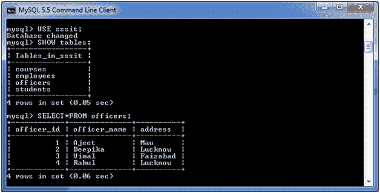
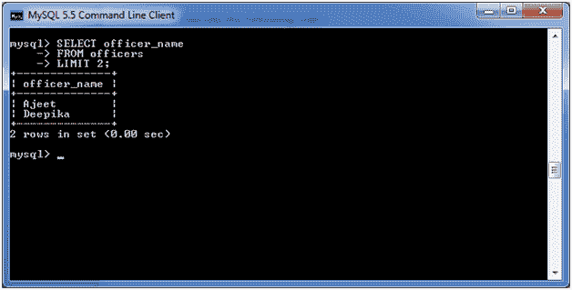

# MySQL 第一个函数

> 原文：<https://www.javatpoint.com/mysql-first>

MySQL first 函数用于返回所选列的第一个值。这里，我们使用 limit 子句选择第一条记录或更多记录。

**语法:**

```
SELECT column_name
FROM table_name
LIMIT 1;

```

## MySQL 第一个函数示例

**选择第一个元素:**

考虑一个名为“军官”的表格，它有以下数据。



**执行以下查询:**

```
SELECT officer_name 
FROM officers
LIMIT 1;

```

**输出:**


**选择前两条记录**

```
SELECT officer_name 
FROM officers
LIMIT 2;

```

**输出:**



* * *