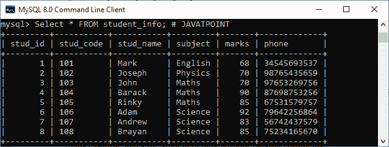
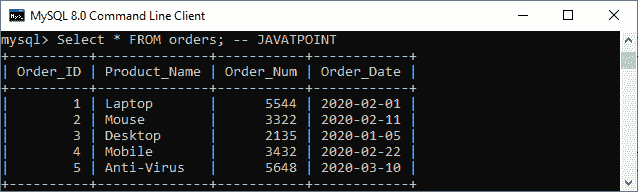
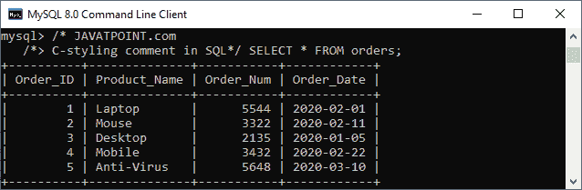
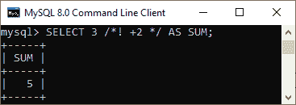

# MySQL 评论

> 原文：<https://www.javatpoint.com/mysql-comments>

注释是放在 SQL 查询中的程序员可读的解释或注释。它用于使 SQL 语句更易于人类理解的目的。在解析 SQL 代码的过程中，MySQL 通常会忽略它们。注释可以用单行或多行书写。

[MySQL](https://www.javatpoint.com/mysql-tutorial) 也可以提供一个可执行的评论。所以，在我们不用可执行注释之前，它只执行 [SQL](https://www.javatpoint.com/sql-tutorial) 部分。

在 MySQL Server 中，我们可以主要通过以下三种方式编写评论:

1.  使用#符号
2.  使用-符号
3.  使用/*和*/符号

让我们详细了解每一个。

### 使用#符号

它用于行尾或 SQL 语句。

**语法**

```

SELECT Statement; # comment goes here

```

**例**

这个例子给出了学生的详细信息，但没有解析注释。

```

Mysql> Select * FROM student_info; # JAVATPOINT  

```

**输出:**



### 使用-符号

它被放在线的末端。在这个注释样式中，我们必须确保双斜线至少有一个空白或控制字符，如制表符、空格、换行符等。

**语法**

```

SELECT Statement; - - comment goes here

```

**例**

这个例子给出了学生的详细信息，但没有解析注释。

```

mysql> SELECT * FROM orders; - - JAVATPOINT

```

**输出:**



### 使用/*和*/符号

这种类型的注释类似于可以跨多行的 [C 编程语言](https://www.javatpoint.com/c-programming-language-tutorial)。我们可以使用这个注释来记录 SQL 语句块。

**语法**

```

/* 
   comment goes here 
   comment goes here
*/  

```

**例**

```

/* JAVATPOINT.com 
C-styling comment in SQL*/ SELECT * FROM orders;

```

**输出:**



### 可执行注释

MySQL 也使用了可执行的注释。这种注释样式提供了不同数据库之间的可移植性。它允许我们在 MySQL 中嵌入唯一可执行的 SQL 代码，但是其他数据库会忽略这个扩展。

**语法**

以下是可执行注释的语法:

**语法**

```

/*! MySQL-specific code */

```

**例**

```

mysql> SELECT 3 /*! +2 */ AS SUM;

```

**输出:**



我们也可以使用下面的语法来执行评论，特别是 MySQL 的[版本](https://www.javatpoint.com/mysql-versions):

```

/*! ##### MySQL-specific code */

```

给你。####代表执行注释的 [MySQL 版本](https://www.javatpoint.com/mysql-versions)名称。主要版本使用的第一个#号，例如 5 或 8。后两个##用于次要版本，最后两个##用于补丁级别。

* * *