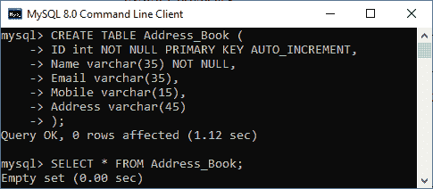
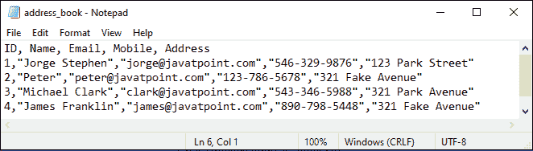
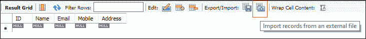
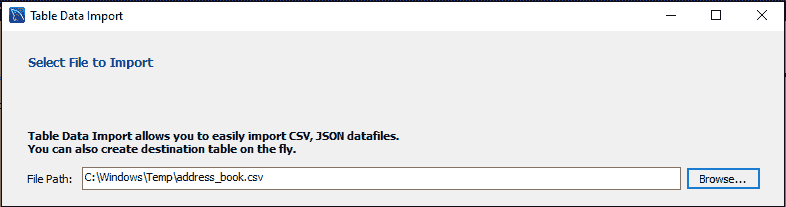
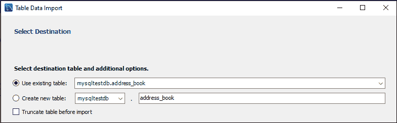
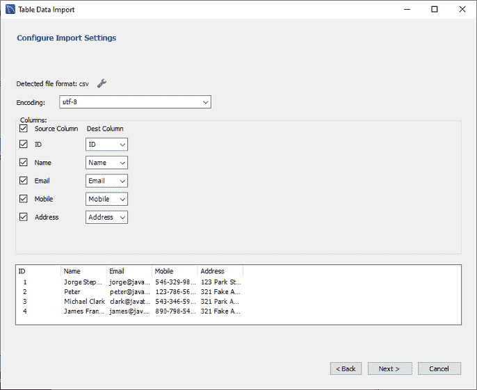
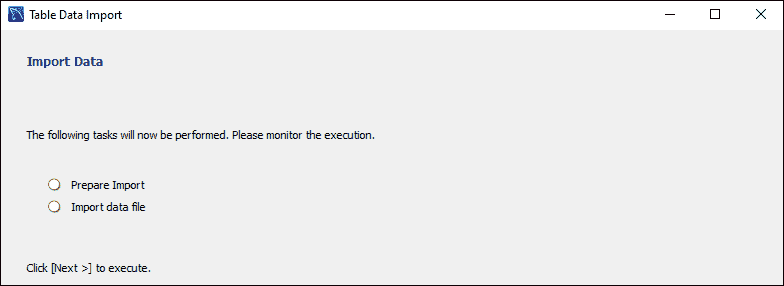

# 在数据库/表格中导入 CSV 文件

> 原文：<https://www.javatpoint.com/mysql-import-csv-file-in-database>

### 如何在 MySQL 数据库或表中导入 CSV 文件？

MySQL 有一个特性，允许我们将 CSV 文件导入到数据库或表中。CSV 代表**逗号分隔值**，这是一个包含数据列表的纯文本文件，允许我们以表格格式保存。主要用于不同应用之间的数据交换。有时也称为**字符分隔值**。通常，它与逗号字符一起用来分隔数据，但也可以使用其他字符，如分号。

当我们需要将复杂的数据从一个应用程序导出到 CSV 文件，然后将文件数据导入到另一个应用程序时，这个文件非常有用。我们可以使用 CSV 文件与各种电子表格程序，如[微软 Excel](https://www.javatpoint.com/excel-tutorial) 或谷歌电子表格。CSV 文件不允许以这种格式保存公式。

### CSV 文件的结构

CSV 文件的结构包含由逗号运算符分隔的数据列表。例如，下面的数据结构更清楚地解释了这一点:

```

Name, Email, Mobile, Address

Jorge Stephen, jorge@javatpoint.com, 546-329-9876, 123 Park Street

Peter, peter@javatpoint.com, 123-786-5678, 321 Fake Avenue

```

要导入 CSV 文件，我们将使用**加载数据文件**语句。该语句用于读取文本文件，并将其快速导入数据库表。

在将文件导入数据库表之前，我们必须确保以下事项:

*   将导入文件中数据的空表。
*   与表中每一列的顺序、列数和数据类型相匹配的 CSV 文件。
*   MySQL 中与数据库服务器连接的用户帐户具有 FILE 和 INSERT 权限。

假设我们有一个名为 **mytestdb** 的数据库。现在，我们将使用以下查询在该数据库中创建一个名为**地址簿**的空表:

```

CREATE TABLE Address_Book (
	ID int NOT NULL PRIMARY KEY AUTO_INCREMENT, 
	Name varchar(35) NOT NULL, 
	Email varchar(35),
	Mobile varchar(15), 
	Address varchar(45)
);

```

现在，我们可以使用下面输出中显示的 **SELECT** 语句来验证新创建的表是否为空:



接下来，我们将创建一个 CSV 文件。下面的 **address_book.csv** 文件包含第一行作为列标题，其他行是要插入表格的数据。

```

ID, Name, Email, Mobile, Address
1, "Jorge Stephen", "jorge@javatpoint.com", "546-329-9876", "123 Park Street"
2, "Peter", "peter@javatpoint.com", "123-786-5678", "321 Fake Avenue"
3, "Michael Clark", "clark@javatpoint.com", "543-346-5988", "321 Park Avenue"
4, "James Franklin", "james@javatpoint.com", "890-798-5448", "321 Fake Avenue"

```



最后，以下语句允许我们将数据从 address_book.csv 导入到 address_book 表中。

```

LOAD DATA INFILE 'C:/ProgramData/MySQL/MySQL Server 8.0/Uploads/address_book.csv' 
INTO TABLE address_book 
FIELDS TERMINATED BY ','
OPTIONALLY ENCLOSED BY '"'
LINES TERMINATED BY '\r\n' 
IGNORE 1 ROWS;

```

从上面来看，

**文件位置:**指定 CSV 文件进入系统的位置。

**FIELD TERMINATED BY '，':**用于表示文件的字段，以逗号结束。

**用““”括起来:**用来指定用双引号括起来的文件的字段。

**line TERMINATED BY ' \ r \ n ':**用于终止 CSV 文件的每一行。

**IGNORE 1 ROWS:** 用于忽略 CSV 文件的第一行，该行有不需要导入表中的列标题。

现在，我们可以使用 SELECT 语句来验证新创建的表是否填充了导入的数据，该语句可以在下面的输出中显示。


### 导入时转换数据

有时，在将 CSV 文件导入数据库表时，数据格式与表中相应的列不匹配。在这种情况下，我们可以使用带有 LOAD DATA INFILE 语句的 **SET 子句**来转换该列。

假设一个 CSV 文件的日期列格式为**“DD/mm/YY”**，导入时与目标表的对应列不匹配。为了克服这个问题，我们需要使用 **STR_TO_DATE()** 函数将其转换为 MySQL 日期格式，如下所示:

```

LOAD DATA INFILE 'C:/ProgramData/MySQL/MySQL Server 8.0/Uploads/address_book.csv' 
INTO TABLE address_book 
FIELDS TERMINATED BY ','
OPTIONALLY ENCLOSED BY '"'
LINES TERMINATED BY '\r\n' 
IGNORE 1 ROWS
(Mobile,@Date,Address)
SET Date = STR_TO_DATE(@Date, '%m/%d/%Y');

```

### 将 CSV 文件从客户端导入到 MySQL 服务器

LOAD DATA INFILE 语句还允许我们将 CSV 文件从客户端(本地系统)导入到**远程** MySQL 服务器。

当我们在 LOAD DATA INFILE 语句中添加 **LOCAL** 子句时，客户端程序可以读取本地系统上的 CSV 文件，并发送给 MySQL 数据库服务器。该文件将上传到数据库服务器操作系统的**临时文件夹**中，如[上的 C:\ Windows \ temp](https://www.javatpoint.com/windows)和 [Linux 操作系统上的/tmp](https://www.javatpoint.com/linux-tutorial)。这些文件夹不是由 [MySQL](https://www.javatpoint.com/mysql-tutorial) 决定或配置的。

以下陈述更清楚地解释了这一点:

```

LOAD DATA LOCAL INFILE 'C:/windows/temp/address_book.csv' 
INTO TABLE address_book 
FIELDS TERMINATED BY ','
OPTIONALLY ENCLOSED BY '"'
LINES TERMINATED BY '\r\n' 
IGNORE 1 ROWS;

```

在上面，我们可以看到我们只在语句中添加了 LOCAL 选项。但是，在使用本地选项导入大型 CSV 文件时，请使文件加载稍微慢一点。这是因为该选项在数据库服务器上传输文件需要时间。

当我们使用 LOCAL 选项时，MySQL 用户帐户不需要拥有导入它的 FILE 特权。

将文件从本地服务器导入远程服务器时，LOAD DATA LOCAL INFILE 语句存在一些安全问题。在这种情况下，我们应该意识到避免潜在的安全风险。

### 使用 MySQL 工作台导入 CSV 文件

MySQL 工作台有一个内置的工具，允许我们将 CSV 文件数据导入到一个表中。它还帮助我们在数据库或表中进行更改之前编辑数据。

以下是显示如何将 CSV 文件数据导入数据库表的步骤:

**步骤 1:** 首先，我们需要在期望的数据库中创建一个表。它确保该表的列数与 CSV 文件中的列数相同。假设我们有一个名为“address_book”的表，它不包含下图中显示的任何数据:


**第二步:**打开表格后，我们可以使用下方屏幕红色框中显示的**导入按钮**导入文件。



点击导入按钮，会弹出我们需要选择 CSV 文件的窗口屏幕，然后点击**下一步**按钮。



**第三步:**在下一个向导中，我们需要选择目的表，点击【下一步】**按钮**。这里，我们有两个选项一个是使用现有的表，或者我们可以创建一个新的表。



**第 4 步:**在下一个向导中，我们需要配置导入设置，点击**下一步**。



**第五步:**在下一个向导中，我们要监控执行过程，点击**下一步- >下一步>完成**完成该过程。



**步骤 6:** 我们可以通过执行 SELECT 查询来验证数据导入成功与否的结果天气。

#### 注意:通过以上技术，我们还可以从其他文本文件格式加载数据。

* * *