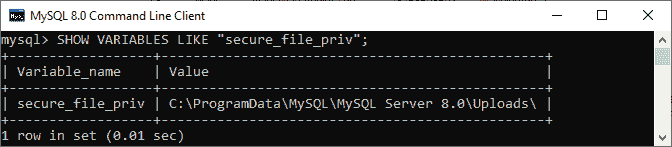
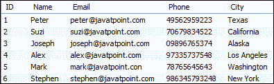
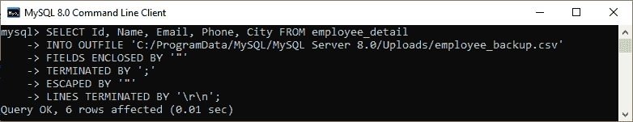
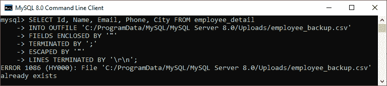
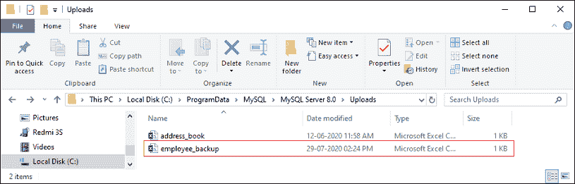
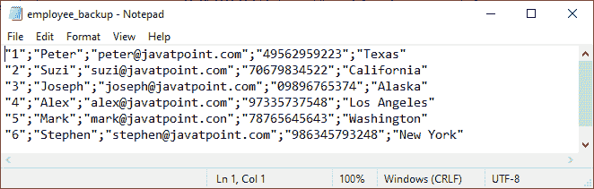
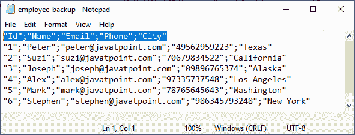
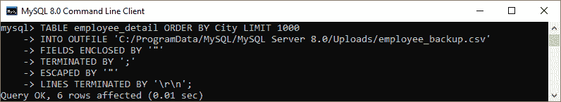

# MySQL 导出表到 CSV

> 原文：<https://www.javatpoint.com/mysql-export-table-to-cvs>

MySQL 有一个将表导出到 CSV 文件的功能。CSV 文件格式是一个逗号分隔的值，我们使用它在各种应用程序之间交换数据，如[微软 Excel](https://www.javatpoint.com/excel-tutorial) 、谷歌文档和 Open Office。CSV 文件格式的 [MySQL 数据很有用，可以让我们按照自己想要的方式进行分析和格式化。这是一个明文文件，帮助我们非常容易地导出数据。](https://www.javatpoint.com/mysql-import-csv-file-in-database)

[MySQL](https://www.javatpoint.com/mysql-tutorial) 提供了一种简单的方法，可以将任何表导出到驻留在数据库服务器中的 CSV 文件中。在导出 MySQL 数据之前，我们必须确保以下几点:

*   MySQL Server 的进程对包含 CSV 文件的指定(目标)文件夹具有读/写权限。
*   系统中不应存在指定的 CSV 文件。

要将表格导出为 CSV 文件，我们将使用**选择进入....OUTFILE** 语句。该语句是对**加载数据**命令的补充，该命令用于从表中写入数据，然后将其导出到服务器主机上的指定文件格式。这是为了确保我们拥有使用此语法的文件权限。

```

SELECT column_lists
INTO OUTFILE 'C:/ProgramData/MySQL/MySQL Server 8.0/Uploads/filename.csv'   
FIELDS TERMINATED BY ','  
OPTIONALLY ENCLOSED BY '"'  
LINES TERMINATED BY '\r\n';  

```

我们还可以将该语法与 values 语句一起使用，将数据直接导出到文件中。以下陈述更清楚地解释了这一点:

```

SELECT * FROM (VALUES ROW(1,2,3,4),ROW(5,6),ROW(7,8)) AS table1
    INTO OUTFILE '/tmp/selected_values.txt';

```

如果我们想要导出**所有的表列**，我们将使用下面的语法。有了这个声明，行数和排序将由 [**ORDER BY**](https://www.javatpoint.com/mysql-order-by) 和 **LIMIT** 子句控制。

```

TABLE table_name ORDER BY lname LIMIT 1000
INTO OUTFILE '/path/filename.txt'
FIELDS ENCLOSED BY '"' 
TERMINATED BY ';' 
ESCAPED BY '"' 
LINES TERMINATED BY '\r\n';;

```

从上面来看，

**line TERMINATED BY '，'**:用于表示文件中以逗号运算符结束的行的行。每行包含文件中每列的数据。

**用““”**括起来的字段:用来指定用双引号括起来的文件的字段。它阻止包含逗号分隔符的值。如果包含在双引号中的值，它不会将逗号识别为分隔符。

### 导出文件的存储位置

MySQL 中每个导出文件的存储位置都存储在默认变量 **secure_file_priv** 中。我们可以执行下面的命令来获取导出文件的默认路径。

```

mysql> SHOW VARIABLES LIKE "secure_file_priv";

```

执行后会给出如下结果，在这里我们可以看到这个路径:**C:/ProgramData/MySQL/MySQL Server 8.0/Uploads/**作为默认文件位置。该路径将在运行导出命令时使用。



如果我们想更改在 **secure_file_priv** 变量中指定的 CSV 文件的默认导出位置，我们需要编辑 **my.ini** 配置文件。在 Windows 平台上，该文件位于以下路径:**C:\ ProgramData \ MySQL \ MySQL Server X . Y**。

如果要导出 MySQL 数据，首先需要创建一个**数据库**，至少有一个**表**。我们将以这张表为例。

通过在我们正在使用的编辑器中执行下面的代码，我们可以创建一个**数据库和表**:

```

CREATE DATABASE testdb;
USE testdb;

CREATE TABLE employee_detail (
  ID int NOT NULL AUTO_INCREMENT,
  Name varchar(45) DEFAULT NULL,
  Email varchar(45) DEFAULT NULL,
  Phone varchar(15) DEFAULT NULL,
  City varchar(25) DEFAULT NULL,
  PRIMARY KEY (ID),
  UNIQUE KEY unique_email (Email),
  UNIQUE KEY index_name_phone (Name,Phone)
)

INSERT INTO employee_detail ( Id, Name, Email, Phone, City)   
VALUES (1, 'Peter', 'peter@javatpoint.com', '49562959223', 'Texas'),   
(2, 'Suzi', 'suzi@javatpoint.com', '70679834522', 'California'),   
(3, 'Joseph', 'joseph@javatpoint.com', '09896765374', 'Alaska'),  
(4, 'Alex', 'alex@javatpoint.com', '97335737548', 'Los Angeles'),  
(5, 'Mark', 'mark@javatpoint.com', '78765645643', 'Washington'),  
(6, 'Stephen', 'stephen@javatpoint.com', '986345793248', 'New York');  

```

如果我们执行 **SELECT** 语句，我们将看到以下输出:



### 使用 SELECT INTO 以 CSV 格式导出 MySQL 数据...OUTFILE 语句

要将表数据导出到 CSV 文件中，我们需要执行如下查询:

```

SELECT Id, Name, Email, Phone, City FROM employee_detail
INTO OUTFILE 'C:/ProgramData/MySQL/MySQL Server 8.0/Uploads/employee_backup.csv' 
FIELDS ENCLOSED BY '"' 
TERMINATED BY ';' 
ESCAPED BY '"' 
LINES TERMINATED BY '\r\n';

```

我们将获得以下输出，其中我们可以看到六行受到影响。这是因为指定的表只包含六行。



如果我们再次执行相同的语句，MySQL 会产生一条错误消息，可以在下面的输出中看到:



错误消息告诉我们指定的文件名已经存在于指定的位置。因此，如果我们以相同的名称和位置导出新的 CSV 文件，它将无法创建。我们可以通过删除指定位置的现有文件或重命名文件名来解决这个问题。

我们可以通过导航到给定路径来验证是否在指定位置创建了 CSV 文件，如下所示:



当我们打开这个文件时，它将如下图所示:



在图像中，我们可以看到数字字段在引号中。我们可以通过在括起来的前增加**optional 子句来改变这种风格:**

```

SELECT Id, Name, Email, Phone, City FROM employee_detail
INTO OUTFILE 'C:/ProgramData/MySQL/MySQL Server 8.0/Uploads/employee_backup.csv' 
FIELDS TERMINATED BY ',' 
OPTIONALLY ENCLOSED BY '"' 
LINES TERMINATED BY '\r\n';

```

### 导出带列标题的数据

有时，我们希望将数据与列标题一起导出，以方便文件。如果 CSV 文件的第一行包含列标题，则导出的文件更容易理解。我们可以使用 **UNION ALL** 语句添加列标题，如下所示:

```

SELECT 'Id', 'Name', 'Email', 'Phone', 'City'
UNION ALL
SELECT Id, Name, Email, Phone, City FROM employee_detail
INTO OUTFILE 'C:/ProgramData/MySQL/MySQL Server 8.0/Uploads/employee_backup.csv' 
FIELDS TERMINATED BY ';'
ENCLOSED BY '"' 
ESCAPED BY '"'
LINES TERMINATED BY '\r\n';

```

在这个查询中，我们可以看到我们已经为每个列名添加了标题。我们可以通过导航到指定的[网址](https://www.javatpoint.com/url-full-form)来验证输出，其中第一行包含每列的标题:



### 以 CSV 格式导出 MySQL 表

MySQL OUTFILE 还允许我们在不指定任何列名的情况下导出表。我们可以使用以下语法以 CSV 文件格式导出表格:

```

TABLE employee_detail ORDER BY City LIMIT 1000
INTO OUTFILE 'C:/ProgramData/MySQL/MySQL Server 8.0/Uploads/employee_backup.csv'
FIELDS ENCLOSED BY '"' 
TERMINATED BY ';' 
ESCAPED BY '"' 
LINES TERMINATED BY '\r\n';

```

如果我们执行上面的语句，我们的命令行工具会产生以下结果。表示指定的表包含 6 行，导出在 **employee_backup.csv** 文件中。



### 处理空值

有时结果集中的字段具有空值，那么目标文件(导出的文件类型)将包含 N 而不是空值。我们可以通过使用 **IFNULL** 功能将空值替换为**“不适用(不适用)”**来解决这个问题。下面的陈述解释得更清楚:

```

SELECT Name, Email, Phone, IFNULL(Phone, 'N/A') FROM employee_detail
INTO OUTFILE 'C:/ProgramData/MySQL/MySQL Server 8.0/Uploads/employee_backup.csv' 
FIELDS ENCLOSED BY '"' 
TERMINATED BY ';' 
ESCAPED BY '"' 
LINES TERMINATED BY '\r\n';

```

### 使用 MySQL 工作台将表格导出为 CSV 格式

如果我们不想访问数据库服务器来导出 CSV 文件，MySQL 提供了另一种方法，即使用 MySQL 工作台。工作台是一个图形用户界面工具，可以在不使用命令行工具的情况下使用 MySQL 数据库。它允许我们在本地系统中将语句的结果集导出为 CSV 格式。为此，我们需要遵循以下步骤:

*   运行语句/查询并获取其结果集。
*   然后，在结果面板中，点击**“将记录集导出到外部文件”**选项。记录集用于结果集。
*   最后，将显示一个新的对话框。这里，我们需要提供一个文件名及其格式。填写完详细信息后，点击**保存**按钮。下图更清楚地解释了这一点:


现在，我们可以通过导航到指定的路径来验证结果。

* * *