# MySQL 子查询

> 原文：<https://www.javatpoint.com/mysql-subquery>

MySQL 中的子查询是一个查询，它嵌套在另一个 SQL 查询中，并嵌入了 SELECT、INSERT、UPDATE 或 DELETE 语句以及各种运算符。我们也可以用另一个子查询嵌套子查询。子查询称为**内部查询**，包含子查询的查询称为**外部查询**。首先执行的内部查询将结果提供给外部查询，然后将执行主/外部查询。 [MySQL](https://www.javatpoint.com/mysql-tutorial) 允许我们在任何地方使用子查询，但是它必须在括号内结束。MySQL 也将支持标准支持的所有子查询形式和操作。

**以下是使用子查询的规则:**

*   子查询应该总是用在**括号中。**
*   如果主查询没有多个子查询列，则子查询在 SELECT 命令中只能有一列。
*   我们可以在子查询中使用各种比较运算符，如>、
*   我们不能在子查询中使用 **ORDER BY** 子句，尽管它可以在主查询中使用。
*   如果我们在**集合函数**中使用子查询，它不能立即包含在集合函数中。

**以下是使用子查询的优势:**

*   子查询以结构化的形式进行查询，允许我们隔离语句的每个部分。
*   子查询提供了从表中查询数据的替代方法；否则，我们需要使用复杂的连接和联合。
*   子查询比复杂的联接或联合语句更易读。

## MySQL 子查询语法

以下是在 MySQL 中使用子查询的基本语法:

```sql

SELECT column_list (s) FROM  table_name
WHERE  column_name OPERATOR
   (SELECT column_list (s)  FROM table_name [WHERE])

```

## MySQL 子查询示例

让我们借助一个例子来理解它。假设我们有一个名为**“员工”**的表，其中包含以下数据:

**表:员工**

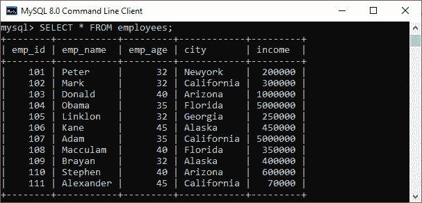

下面是一个简单的 SQL 语句，它返回子查询中 id 匹配的**员工详细信息:**

```sql

SELECT emp_name, city, income FROM employees 
   WHERE emp_id IN (SELECT emp_id FROM employees);

```

该查询将返回以下输出:

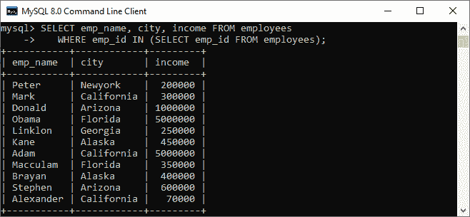

### 带有比较运算符的 MySQL 子查询

比较运算符是用于比较值并返回结果(真或假)的运算符。以下比较运算符用于 MySQL 、=、<>、<=>等。我们可以在返回单个值的比较运算符之前或之后使用子查询。返回值可以是算术表达式或列函数。之后，SQL 将子查询结果与比较运算符另一端的值进行比较。下面的例子解释得更清楚:

下面是一个简单的 [SQL](https://www.javatpoint.com/sql-tutorial) 语句，在子查询的帮助下返回收入超过 35 万的**员工详细信息:**

```sql

SELECT * FROM employees 
   WHERE emp_id IN (SELECT emp_id FROM employees 
         WHERE income > 350000);

```

该查询首先执行子查询，该子查询返回收入为> 350000 的**员工 id。其次，主查询将向雇员返回雇员 id 在子查询返回的结果集中的所有详细信息。**

执行该语句后，我们将获得下面的输出，在这里我们可以看到收入> 35 万的员工详细信息。

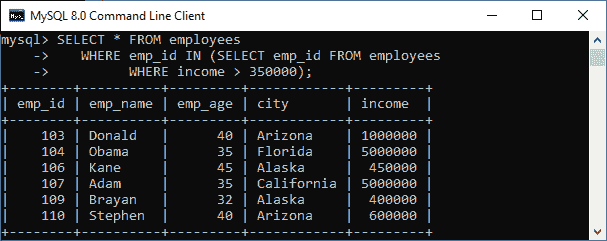

让我们来看另一个比较运算符的示例，例如 equality (=)使用子查询来查找最大收入为**的员工详细信息。**

```sql

SELECT emp_name, city, income FROM employees 
   WHERE income = (SELECT MAX(income) FROM employees);

```

它将给出输出，我们可以在其中看到两个拥有最大收入的员工的详细信息。

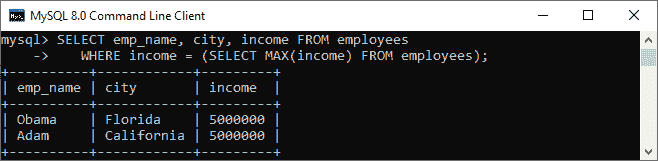

### 带输入或不输入运算符的 MySQL 子查询

如果子查询产生多个值，我们需要在 [WHERE 子句](https://www.javatpoint.com/mysql-where)中使用 IN 或 NOT IN 运算符。假设我们有一个名为**“学生”**和**“学生 2”**的表，其中包含以下数据:

**表:学生**

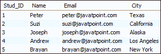

**表:学生 2**

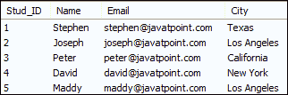

带有 NOT IN 运算符的以下子查询从两个表中返回不属于洛杉矶市的**学生详细信息，如下所示:**

```sql

SELECT Name, City FROM student
WHERE City NOT IN (
SELECT City FROM student2 WHERE City='Los Angeles');

```

执行后，我们可以看到结果包含不属于洛杉矶市的学生详细信息。

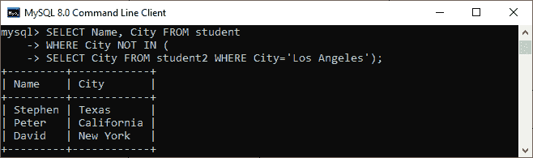

### FROM 子句中的 MySQL 子查询

如果我们在 FROM 子句中使用子查询，MySQL 将返回一个用作临时表的子查询的输出。我们将该表称为派生表、内联视图或物化子查询。

以下子查询返回订单表中项目的最大、最小和平均数量:

```sql

SELECT Max(items), MIN(items), FLOOR(AVG(items))
FROM
    (SELECT order_id, COUNT(order_id) AS items FROM orders
    GROUP BY order_date) AS Student_order_detail;

```

它将给出如下输出:

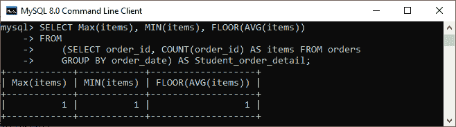

### MySQL 相关子查询

MySQL 中的相关子查询是依赖于外部查询的子查询。它使用外部查询中的数据，或者包含对也出现在外部查询中的父查询的引用。MySQL 从外部查询中的每一行对其求值一次。

```sql

SELECT emp_name, city, income
FROM employees emp WHERE income > ( 
SELECT AVG(income) FROM employees WHERE city = emp.city);

```

在上面的查询中，我们选择了一个**员工姓名和城市**，其收入高于每个城市所有员工的平均收入。

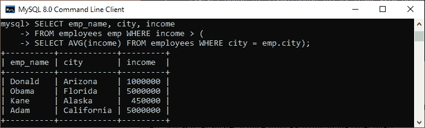

子查询针对指定表的每个城市执行，因为它将针对每一行进行更改。因此，平均收入也会发生变化。然后，主查询筛选收入高于子查询平均收入的员工详细信息。

### 存在或不存在的 MySQL 子查询

[EXISTS 运算符](https://www.javatpoint.com/mysql-exists)是一个布尔运算符，它返回真或假的结果。它与子查询一起使用，并检查子查询中是否存在数据。如果子查询返回任何记录，该运算符将返回 true。否则，它将返回 false。当子查询不返回任何行时，用于求反的 NOT EXISTS 运算符给出真值。否则，它返回 false。EXISTS 和 NOT EXISTS 都与相关子查询一起使用。下面的例子更清楚地说明了这一点。假设我们有一个表**客户和订单**，其中包含如下数据:


下面的 SQL 语句使用 EXISTS 运算符查找至少下过一次订单的客户的姓名、职业和年龄。

```sql

SELECT name, occupation, age FROM customer C
WHERE EXISTS (SELECT * FROM Orders O
WHERE C.cust_id = O.cust_id);  

```

此语句使用 NOT EXISTS 运算符返回尚未下订单的客户详细信息。

```sql

SELECT name, occupation, age FROM customer C
WHERE NOT EXISTS (SELECT * FROM Orders O
WHERE C.cust_id = O.cust_id);  

```

我们可以看到下面的输出来理解上面的查询结果。

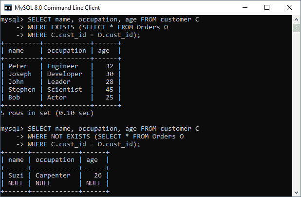

要阅读关于 EXISTS 操作符的更多信息，请点击此处。

### MySQL ROW 子查询

这是一个返回单行的子查询，我们可以在其中获得多个列值。我们可以使用以下运算符来比较行子查询=，>， =，<=, <>，！=，<=>。让我们看看下面的例子:

```sql

SELECT * FROM customer C WHERE ROW(cust_id, occupation) = (
SELECT order_id, order_date FROM Orders O WHERE C.cust_id = O.cust_id);

```

如果给定的行具有 cust_id、等于 order_id 的占用值、第一个表中任何行的 order_date 值，则 WHERE 表达式为真，并且每个查询返回这些第一个表行。否则，表达式为 FALSE，查询将生成一个空集合，如下图所示:

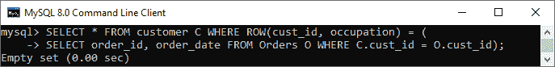

### 包含全部、任意和部分的 MySQL 子查询

我们可以使用子查询，在比较运算符后接关键字 ALL、ANY 或 SOME。以下是将子查询用于 ALL、ANY 或 SOME 的语法:

```sql

operand comparison_operator ANY (subquery)
operand comparison_operator ALL (subquery)
operand comparison_operator SOME (subquery)

```

ALL 关键字将值与子查询返回的值进行比较。因此，如果子查询返回的所有值的比较结果都为真，则返回真。如果子查询返回的任何值的比较结果为真，则 ANY 关键字返回真。ANY 和 SOME 关键字是相同的，因为它们是彼此的别名。下面的例子解释得更清楚:

```sql

SELECT cust_id, name FROM customer WHERE 
cust_id > ANY (SELECT cust_id FROM Orders);

```

我们将获得如下输出:

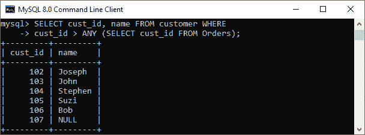

如果我们使用 ALL 代替 ANY，当子查询返回的列中所有值的比较结果为 TRUE 时，它将返回 TRUE。例如:

```sql

SELECT cust_id, name FROM customer WHERE 
cust_id > ALL (SELECT cust_id FROM Orders);

```

我们可以看到如下输出:


* * *