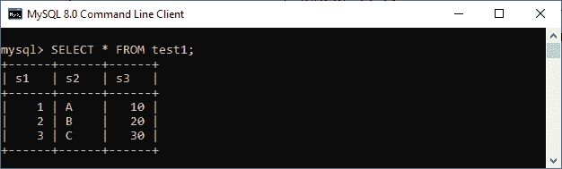
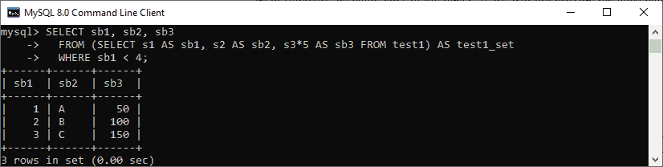
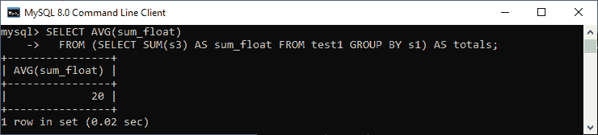

# MySQL 派生表

> 原文：<https://www.javatpoint.com/mysql-derived-table>

MySQL 中的派生表是从 SELECT…FROM 语句返回的**虚拟表。换句话说，它是一个表达式，在 SELECT 语句的 FROM 子句的范围内生成一个表。这个概念类似于临时表。但是，派生表比临时表简单，因为不需要使用临时表创建所需的所有步骤。**

大多数开发人员交替使用派生表和子查询这两个术语。因此，我们可以说，当我们在 SELECT…FROM 子句中使用**子查询**时，它被称为派生表。

### 句法

以下是在 [MySQL](https://www.javatpoint.com/mysql-tutorial) 中使用派生表的语法:

```

SELECT ... FROM (subquery) [AS] table_name (column_list) WHERE condition;

```

需要注意的是，独立子查询是一个子查询，它可以独立于包含该查询的语句来执行。

我们还应该考虑一个**派生表必须包含别名表名**，这允许我们在语句的后面引用它的名字。如果我们不为派生表提供别名，MySQL 将发出以下错误消息:

> 每个派生表都必须有自己的别名。

派生表的每一列都必须有唯一的名称。让我们借助下图来理解它。

首先，我们将使用下面的语句创建一个表:

```

mysql> CREATE TABLE test1 (s1 INT, s2 CHAR(5), s3 FLOAT);

```

接下来，使用下面的语句在该表中填充一些记录:

```

mysql> INSERT INTO test1 VALUES (1, 'A', 10.0), (2, 'B', 20.0), (3, 'C', 30.0); 

```

执行 [SELECT 语句](https://www.javatpoint.com/mysql-select)验证输出:



现在，执行下面的语句来理解我们如何在 [FROM 子句](https://www.javatpoint.com/mysql-from)中使用子查询:

```

SELECT sb1, sb2, sb3
  FROM (SELECT s1 AS sb1, s2 AS sb2, s3*5 AS sb3 FROM test1) AS test1_set
  WHERE sb1 < 4;

```

它将返回如下输出:



让我们再举一个例子，我们将得到浮点值列的**平均值。执行以下语句:**

```

SELECT AVG(sum_float)
  FROM (SELECT SUM(s3) AS sum_float FROM test1 GROUP BY s1) AS totals;

```

在上面的语句中，派生表计算 float 列的总和，然后返回外部查询的平均值。请参见以下输出:



### MySQL 中的派生表有以下限制:

*   MySQL 不使用相关子查询作为派生表。
*   MySQL 不允许派生表使用对同一 SELECT 语句的其他表的引用。
*   我们不能在派生表中使用外部引用。

* * *