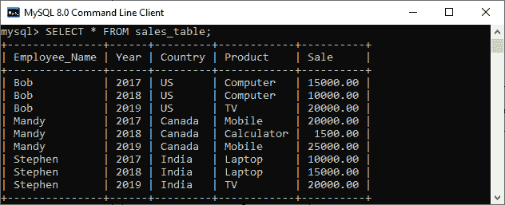
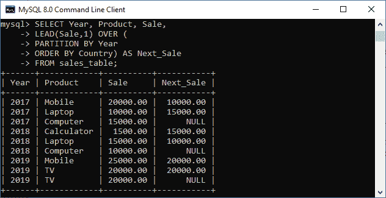
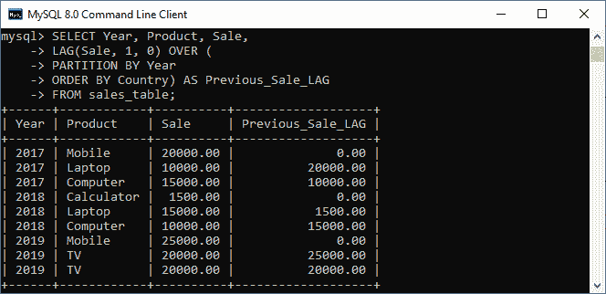

# MySQL LEAD 和 LAG 函数

> 原文：<https://www.javatpoint.com/mysql-lead-and-lag-function>

LEAD 和 LAG 是 MySQL 中的一个窗口函数，用于访问分区内当前行中指定行的 ***前后值*** 。这些函数是非聚合函数。

[MySQL](https://www.javatpoint.com/mysql-tutorial) 中的**窗口函数**用于对分区或窗口内的每一行执行操作或计算。这些函数产生的结果类似于使用聚合函数进行的计算。但是，与对整个表执行操作的聚合函数不同，窗口函数不会产生分组到一行中的结果。因此，每行都保持唯一的标识。在窗口功能中，我们必须了解这些事情:

*   发生功能评估的行称为**当前行**。
*   一个**窗口**是与当前行相关的一组行，或者使用哪个函数对该行进行操作。

让我们详细了解这些功能。

## MySQL LEAD 函数

这个函数允许我们向前查看行或后续行，以从当前行获取/访问该行的值。计算同一输出中当前行和后续行之间的差异是一种非常有用的方法。

以下是在 MySQL 中使用 LEAD 函数的通用**语法**:

```

LEAD(expression, offset , default_value) OVER (
    PARTITION BY (expr)
    ORDER BY (expr)
)

```

### 参数说明

LEAD 函数语法包含以下参数。

| 参数 | 描述 |
| 表示 | 它是一个**列名**或其值由函数返回的任何内置函数。 |
| 抵消 | 它包含当前行之后的行数。应该是**正整数**值。如果是**零**，该函数计算当前行的结果。如果我们**省略**这个，函数默认使用 1。 |
| 默认值 | 当当前行没有后续行时，该值将返回。如果我们忽略这一点，函数将返回**空值**。 |
| 超过 | OVERIt 负责将行划分成组。如果**为空**，该函数使用所有行执行操作。 |
| 分区依据 | 它将结果集中的行分成应用了函数的分区。如果我们没有指定这个子句，所有的行在结果集中被视为一行。 |
| 以...排序 | 在应用函数之前，它确定分区中的行顺序。 |

### MySQL LEAD()函数示例

在这里，我们将了解 LEAD 函数如何与 MySQL 表一起工作。首先，我们需要使用下面的语句创建一个名为 **sales_table** 的表。

```

CREATE TABLE sales_table (
	Employee_Name VARCHAR(45) NOT NULL,
	Year INT NOT NULL,
	Country VARCHAR(45) NOT NULL,
	Product VARCHAR(45) NOT NULL,
	Sale DECIMAL(12,2) NOT NULL,
	PRIMARY KEY(Employee_Name, Year)  
);

```

接下来，我们将使用 **INSERT** 语句向该表中添加记录，如下所示:

```

INSERT INTO sales_table VALUES
('Stephen', 2017, 'India', 'Laptop', 10000),  
('Stephen', 2018, 'India', 'Laptop', 15000),  
('Stephen', 2019, 'India', 'TV', 20000),  
('Bob', 2017, 'US', 'Computer', 15000),  
('Bob', 2018, 'US', 'Computer', 10000),  
('Bob', 2019, 'US', 'TV', 20000),  
('Mandy', 2017, 'Canada', 'Mobile', 20000),  
('Mandy', 2018, 'Canada', 'Calculator', 1500),  
('Mandy', 2019, 'Canada', 'Mobile', 25000);

```

我们可以使用 [**SELECT** 语句](https://www.javatpoint.com/mysql-select)将记录验证到一个表中。它将给出如下输出:



以下陈述找到了每个员工的**销售和下一个销售明细:**

```

SELECT Year, Product, Sale,   
LEAD(Sale,1) OVER (
PARTITION BY Year
ORDER BY Country) AS Next_Sale  
FROM sales_table;

```

该示例首先将按年份划分的结果集划分为多个分区，然后使用国家列对每个分区进行排序。最后，我们在每个分区上应用了 LEAD()函数来获取下一个销售细节。下面的输出解释得更清楚:



在输出中，我们可以看到每个分区中的空值。当后续行跨越分区边界时，每个分区最后一行中的下一个值总是变为空。

## MySQL LAG 函数

这个函数允许我们查看关于倒序行或前一行的信息，以从当前行中获取/访问前一行的值。计算同一结果集中当前行和前一行之间的差异是一种非常有用的方法。

以下是在 MySQL 中使用 LAG 函数的通用**语法**:

```

LAG (expression, offset , default_value) OVER (
    PARTITION BY (expr)
    ORDER BY (expr [ASC|DESC])
)

```

### 参数说明

LAG 函数语法包含以下参数。

| 参数 | 描述 |
| 表示 | 它是一个**列名**或任何内置函数。 |
| 抵消 | 它包含当前行之前的行数。应该是**零**或任意**正整数**值。如果是**零**，该函数计算当前行的结果。如果我们**省略**这个，函数默认使用 1。 |
| 默认值 | 当我们没有当前行的前一行时，该值将返回。如果我们忽略这一点，函数将返回**空值**。 |

其他参数如 OVER、PARTITION BY、ORDER BY 子句含义与 LEAD 函数相同。

### MySQL LAG()函数示例

在这里，我们将了解 LAG 函数如何与 MySQL 表一起工作。我们可以使用上表 **sales_table** 进行演示。

以下陈述找到了每个员工的**销售额和以前的销售明细:**

```

SELECT Year, Product, Sale,   
LAG(Sale, 1, 0) OVER (
PARTITION BY Year
ORDER BY Country) AS Previous_Sale_LAG
FROM sales_table;

```

该示例首先将按年份划分的结果集划分为多个分区，然后使用国家列对每个分区进行排序。最后，我们在每个分区上应用 LAG()函数来获取之前的销售明细。执行上述语句后，我们可以看到下面的输出:



在输出中，我们可以看到每个分区中的 0.00 值。它指示表中不存在的行的值。如果我们没有提供默认值，它将变成空值。

#### 注意:在 MySQL 版本中引入了 LEAD()和 LAG()函数。所以我们不能在以前的版本中使用它。它们总是与 OVER()子句一起使用。如果我们没有使用这个子句，它会产生一个错误。

* * *