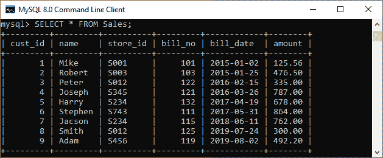
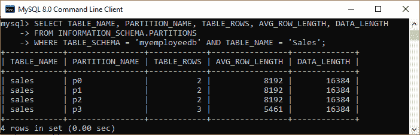
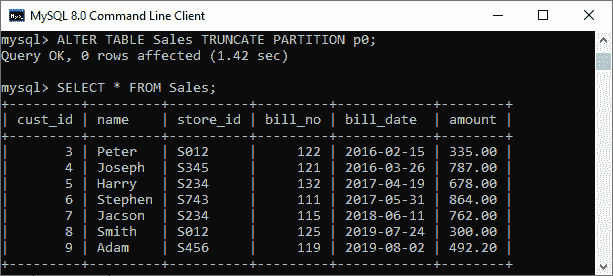
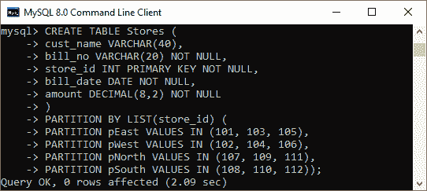
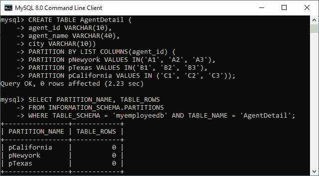
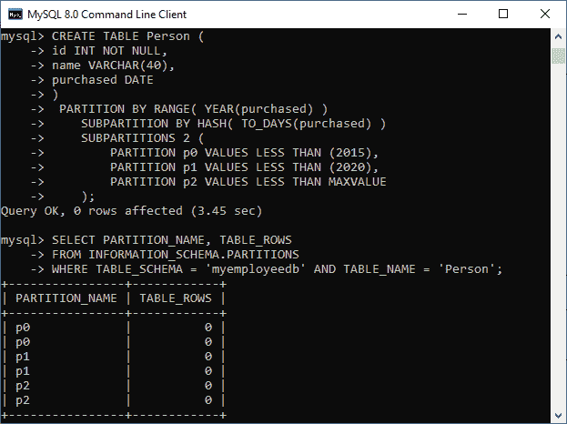

# MySQL 中什么是分区？

> 原文：<https://www.javatpoint.com/mysql-partitioning>

MySQL 中的分区用于将一个表的行拆分或分区到不同位置的独立表中，但它仍然被视为单个表。它根据我们根据需要设置的规则，在文件系统中分布表的部分数据。我们为完成表数据划分而设置的规则被称为划分函数(模数、线性或内部散列函数等)。).所选函数基于我们指定的分区类型，并将用户提供的表达式作为其参数。用户表达式可以是列值，也可以是作用于列值的函数，具体取决于所使用的分区类型。

MySQL 8.0 仅支持 InnoDB 和 NDB 存储引擎中的分区。其他存储引擎，如 MyISAM、MERGE、CSV 和 FEDERATED，不能支持分区。

[MySQL](https://www.javatpoint.com/mysql-tutorial) 主要有两种划分形式:

**1。水平分割**

这种分区根据我们的逻辑将一个表的行分成多个表。在水平分区中，每个表中的列数是相同的，但是不需要保持相同的行数。它在物理上划分了表，但在逻辑上被视为一个整体。目前，MySQL 只支持这种分区。

**2。垂直分区**

这种分区将表拆分成多个表，其中包含的列比原始表少。它使用一个额外的表来存储剩余的列。目前，MySQL 不支持这种分区。

**分区的好处**

以下是 MySQL 中分区的好处:

*   它优化了查询性能。当我们对表进行查询时，它只扫描表中满足特定语句的部分。
*   可以将大量数据存储在一个表中，该表可以保存在单个磁盘或文件系统分区上。
*   它为管理数据库中的数据提供了更多的控制。

**如何在 MySQL 中对表进行分区？**

我们可以使用 [CREATE TABLE](https://www.javatpoint.com/mysql-create-table) 或者 [ALTER TABLE 语句](https://www.javatpoint.com/mysql-alter-table)在 MySQL 中创建一个分区。下面是使用 CREATE TABLE 命令创建分区的语法:

```sql

CREATE TABLE [IF NOT EXISTS] table_name
(column_definitions)
[table_options]
[partition_options]

```

```sql

partition_options: It provides control on the table partition.

   PARTITION BY
        { [LINEAR] HASH(exp)
        | [LINEAR] KEY [ALGORITHM={1 | 2}] (colm_list)
        | RANGE{(exp) | COLUMNS(colm_list)}
        | LIST{(exp) | COLUMNS(colm_list)} }
    [PARTITIONS num]
    [SUBPARTITION BY
        { [LINEAR] HASH(exp)
        | [LINEAR] KEY [ALGORITHM={1 | 2}] (colm_list) }
      [SUBPARTITIONS num]
    ]
    [(partition_definition [, partition_definition] ...)]

partition_definition: It defines each partition individually.

    PARTITION part_name
        [VALUES
            {LESS THAN {(exp | val_list) | MAXVALUE}
            |
            IN (val_list)}]
        [[STORAGE] ENGINE = engine_name]
        [COMMENT = 'string' ]
        [DATA DIRECTORY = 'data_dir']
        [INDEX DIRECTORY = 'index_dir']
        [MAX_ROWS = max_number_of_rows]
        [MIN_ROWS = min_number_of_rows]
        [TABLESPACE = tablespace_name]
        [(subpartition_definition [, subpartition_definition] ...)]

subpartition_definition: It is optional.

    SUBPARTITION logical_name
        [[STORAGE] ENGINE [=] engine_name]
        [COMMENT [=] 'string' ]
        [DATA DIRECTORY [=] 'data_dir']
        [INDEX DIRECTORY [=] 'index_dir']
        [MAX_ROWS [=] max_number_of_rows]
        [MIN_ROWS [=] min_number_of_rows]
        [TABLESPACE [=] tablespace_name]

```

下面是使用 ALTER TABLE 命令创建分区的语法:

```sql

ALTER TABLE [IF EXISTS] tab_name
(colm_definitions)
[tab_options]
[partition_options]

```

### MySQL 分区的类型

MySQL 主要有六种分区类型，如下所示:

1.  范围划分
2.  列表分区
3.  列分区
4.  HASH 分区
5.  密钥分区
6.  子分区

让我们详细讨论每个分区。

**MySQL 范围划分**

这种分区允许我们根据指定范围内的列值对表中的行进行分区。给定的范围总是连续的，但不应相互重叠，并且还使用 **VALUES 小于**运算符来定义范围。

在下面的示例中，我们将创建一个名为**“Sales”**的表，该表包含五列 cust_id、名称、store_id、账单编号、账单日期和金额。接下来，我们将根据我们的需求，通过几种方式使用范围来划分这个表。这里，我们将使用 **bill_date** 列进行分区，然后使用 PARTITION BY RANGE 子句以四种方式对表的数据进行分区:

```sql

CREATE TABLE Sales ( cust_id INT NOT NULL, name VARCHAR(40), 
store_id VARCHAR(20) NOT NULL, bill_no INT NOT NULL, 
bill_date DATE PRIMARY KEY NOT NULL, amount DECIMAL(8,2) NOT NULL) 
PARTITION BY RANGE (year(bill_date))( 
PARTITION p0 VALUES LESS THAN (2016), 
PARTITION p1 VALUES LESS THAN (2017), 
PARTITION p2 VALUES LESS THAN (2018), 
PARTITION p3 VALUES LESS THAN (2020));

```

接下来，我们需要将记录插入表中，如下语句:

```sql

INSERT INTO Sales VALUES 
(1, 'Mike', 'S001', 101, '2015-01-02', 125.56), 
(2, 'Robert', 'S003', 103, '2015-01-25', 476.50), 
(3, 'Peter', 'S012', 122, '2016-02-15', 335.00), 
(4, 'Joseph', 'S345', 121, '2016-03-26', 787.00), 
(5, 'Harry', 'S234', 132, '2017-04-19', 678.00), 
(6, 'Stephen', 'S743', 111, '2017-05-31', 864.00), 
(7, 'Jacson', 'S234', 115, '2018-06-11', 762.00), 
(8, 'Smith', 'S012', 125, '2019-07-24', 300.00), 
(9, 'Adam', 'S456', 119, '2019-08-02', 492.20);

```

为了验证记录，我们将执行以下语句:

```sql

SELECT * FROM Sales;

```

我们可以看到记录被成功地插入到销售表中。



我们可以使用下面的查询看到 CREATE TABLE 语句创建的分区:

```sql

SELECT TABLE_NAME, PARTITION_NAME, TABLE_ROWS, AVG_ROW_LENGTH, DATA_LENGTH
FROM INFORMATION_SCHEMA.PARTITIONS
WHERE TABLE_SCHEMA = 'myemployeedb' AND TABLE_NAME = 'Sales';

```

我们将获得以下输出，其中成功创建了四个分区:



**删除 MySQL 分区**

有时我们的表包含分区表中无用的数据。在这种情况下，我们可以根据需要删除单个或多个分区。以下语句用于删除 Sales 表的分区 **p0** 中的所有行:

```sql

ALTER TABLE Sales TRUNCATE PARTITION p0;

```

成功执行后，我们可以看到这两行从表中被删除了。



我们可以使用下面的查询来验证分区表:

```sql

SELECT PARTITION_NAME, TABLE_ROWS 
FROM INFORMATION_SCHEMA.PARTITIONS
WHERE TABLE_SCHEMA = 'myemployeedb' AND TABLE_NAME = 'Sales';

```

在输出中，我们可以看到分区 p0 不包含任何行。


### MySQL 列表分区

它与范围分区相同。这里，分区是基于与一组离散值列表中的一个相匹配的列来定义和选择的，而不是基于一组连续的值范围。这是通过**按列表(exp)** 划分子句来执行的。exp 是返回整数值的表达式或列值。VALUES IN(value _ list)语句将用于定义每个分区。

在下面的例子中，假设我们有 12 家商店，根据它们所在的地区分布在四个特许经营中。该表解释得更清楚:

| 地区 | 商店身份证号码 |
| 东方 | 101, 103, 105 |
| 西 | 102, 104, 106 |
| 北 | 107, 109, 111 |
| 南方 | 108, 110, 112 |

我们可以对上表进行分区，其中属于同一区域的存储的行将存储在同一分区中。以下语句使用列表分区在同一区域中排列存储，如下所示:

```sql

CREATE TABLE Stores ( 
	cust_name VARCHAR(40), 
	bill_no VARCHAR(20) NOT NULL, 
	store_id INT PRIMARY KEY NOT NULL, 
	bill_date DATE NOT NULL, 
	amount DECIMAL(8,2) NOT NULL
)
PARTITION BY LIST(store_id) ( 
PARTITION pEast VALUES IN (101, 103, 105), 
PARTITION pWest VALUES IN (102, 104, 106), 
PARTITION pNorth VALUES IN (107, 109, 111), 
PARTITION pSouth VALUES IN (108, 110, 112));

```

成功执行后，会给出如下输出；



### MySQL HASH 分区

该分区用于基于预定义数量的分区来分发数据。换句话说，它根据用户定义表达式返回的值拆分表。它主要用于将数据均匀地分布到分区中。它是用 PARTITION BY HASH(expr)子句执行的。在这里，我们可以根据要哈希的 column_name 和表被划分到的分区数量来指定一个列值。

此语句用于使用 create table 命令创建表**存储**，并对将它分成四个分区的**存储 _id** 列使用散列法:

```sql

CREATE TABLE Stores ( 
	cust_name VARCHAR(40), 
	bill_no VARCHAR(20) NOT NULL, 
	store_id INT PRIMARY KEY NOT NULL, 
	bill_date DATE NOT NULL, 
	amount DECIMAL(8,2) NOT NULL
)
PARTITION BY HASH(store_id)
PARTITIONS 4;

```

#### 注意:如果不使用 PARTITIONS 子句，默认情况下分区数为 1。如果不使用 PARTITIONS 关键字指定数字，将会引发错误。

### MySQL COLUMN 分区

这种分区允许我们在分区键中使用多列。这些列的目的是将行放在分区中，并确定哪个分区将被验证以匹配行。主要分为两种类型:

*   范围列分区
*   列表列分区

它们支持使用非整数列来定义范围或值列表。它们支持以下数据类型:

*   **所有整数类型:** TINYINT、SMALLINT、MEDIUMINT、INT (INTEGER)和 BIGINT。
*   **字符串类型:** CHAR、VARCHAR、BINARY 和 VARBINARY。
*   DATE 和 DATETIME 数据类型。

**范围列划分:**与范围划分类似，只是有一点不同。它使用基于各种列的范围作为分区键来定义分区。定义的范围属于非整数类型的列类型。

**以下是范围列分区的语法。**

```sql

CREATE TABLE tab_name
PARTITIONED BY RANGE COLUMNS(colm_list) (
    PARTITION part_name VALUES LESS THAN (val_list)[,
    PARTITION parti_name VALUES LESS THAN (val_list)][,
    ...]
)

colm_list: It is a list of one or more columns.
    colm_name[, colm_name][, ...]

val_list: It is a list of values that supplied for each partition definition and have the same number of values as of columns.
    val[, val][, ...]

```

让我们用下面的例子来理解它。

```sql

CREATE TABLE test_part (A INT, B CHAR(5), C INT, D INT)
PARTITION BY RANGE COLUMNS(A, B, C) 
 (PARTITION p0 VALUES LESS THAN (50, 'test1', 100), 
 PARTITION p1 VALUES LESS THAN (100, 'test2', 200), 
 PARTITION p2 VALUES LESS THAN (150, 'test3', 300), 
 PARTITION p3 VALUES LESS THAN (MAXVALUE, MAXVALUE, MAXVALUE));

```

在这个例子中，表**“test _ part”**包含四列 A、B、C 和 d。我们已经按照 A、B、C 的顺序使用了分区中的前三列。并且，每个列表值用于定义一个分区，该分区包含与 INT、CHAR 和 INT 顺序相同的三个值。执行后，我们将获得如下输出，并成功通过 [SELECT 语句](https://www.javatpoint.com/mysql-select)验证。


**列表列分区:**它以单列或多列的列表作为分区键。它使我们能够使用整数类型以外的各种类型的列作为分区列。在这个分区中，我们可以使用字符串数据类型、日期和日期时间列。

下面的例子解释得更清楚。假设一家公司在三个城市有许多代理商进行营销。我们可以按如下方式组织:

| 城市 | 营销代理 |
| 纽约 | A1、A2、A3 |
| 得克萨斯州 | B3 B2 B1 |
| 加利福尼亚 | C1、C2、C3 |

以下语句使用列表列分区来组织代理:

```sql

CREATE TABLE AgentDetail ( 
agent_id VARCHAR(10),
agent_name VARCHAR(40), 
city VARCHAR(10)) 
PARTITION BY LIST COLUMNS(agent_id) ( 
PARTITION pNewyork VALUES IN('A1', 'A2', 'A3'), 
PARTITION pTexas VALUES IN('B1', 'B2', 'B3'), 
PARTITION pCalifornia VALUES IN ('C1', 'C2', 'C3'));

```

成功执行后，我们将获得如下输出:



### MySQL 密钥分区

它类似于 hash 分区，其中 HASH 分区使用用户指定的表达式，MySQL Server 为键提供哈希函数。如果我们使用其他存储引擎，MySQL Server 会使用自己的内部散列函数，该函数通过使用 PARTITION BY KEY 子句来执行。这里，我们将使用 KEY 而不是 HASH，它只能接受零个或多个列名的列表。

如果表包含一个[主键](https://www.javatpoint.com/mysql-primary-key)，并且我们没有为分区指定任何列，那么主键就被用作分区键。下面的例子解释得更清楚:

```sql

CREATE TABLE AgentDetail ( 
	agent_id INT NOT NULL PRIMARY KEY,
	agent_name VARCHAR(40)
)
PARTITION BY KEY()
PARTITIONS 2;

```

如果表有唯一键但不包含主键，则使用[唯一键](https://www.javatpoint.com/mysql-unique-key)作为分区键。

```sql

CREATE TABLE AgentDetail ( 
	agent_id INT NOT NULL UNIQUE KEY,
	agent_name VARCHAR(40)
)
PARTITION BY KEY()
PARTITIONS 2;

```

### 子分区

它是一个复合分区，进一步分割分区表中的每个分区。下面的例子帮助我们更清楚地理解它:

```sql

CREATE TABLE Person ( 
	id INT NOT NULL PRIMARY KEY,
	name VARCHAR(40),
	purchased DATE
)
 PARTITION BY RANGE( YEAR(purchased) )
    SUBPARTITION BY HASH( TO_DAYS(purchased) )
    SUBPARTITIONS 2 (
        PARTITION p0 VALUES LESS THAN (2015),
        PARTITION p1 VALUES LESS THAN (2020),
        PARTITION p2 VALUES LESS THAN MAXVALUE
    );

```

执行以下语句来验证子分区:

```sql

SELECT PARTITION_NAME, TABLE_ROWS 
FROM INFORMATION_SCHEMA.PARTITIONS
WHERE TABLE_SCHEMA = 'myemployeedb' AND TABLE_NAME = 'Person';

```

它将给出如下输出:



* * *