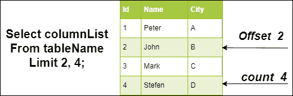
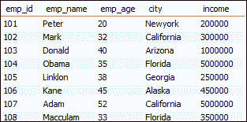
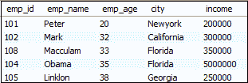
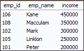
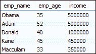
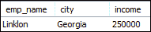

# MySQL 限制

> 原文：<https://www.javatpoint.com/mysql-limit>

MySQL Limit 查询用于**限制**从结果集中返回的行数，而不是**取数**整个 MySQL 数据库中的集合。Limit 子句与 SELECT 语句一起使用，只返回指定的行数。此查询只接受一个或两个参数，它们的值应该为零或任何正整数。

在这种情况下，当表包含数千行，或者您只想返回最近插入的数据时，这是非常重要的。换句话说，如果您对从查询中返回的所有行不感兴趣，请在 SELECT 语句中使用 MySQL Limit 子句。它提高了查询的性能，甚至在表包含大量数据时停止了系统崩溃。

为了只从表中获取指定的行，MySQL 使用了 **LIMIT** 子句，而 SQL 使用了 **TOP** 子句，Oracle 使用了带有 **SELECT** 语句的 **ROWNUM** 子句。

### 句法

以下是 [MySQL](https://www.javatpoint.com/mysql-tutorial) 中使用 Limit 查询的语法:

```

SELECT column_list
FROM table_name
LIMIT offset, count;

```

在上面的语法中，我们可以看到:

**Column_list:** 是要返回的列的名称。

**Table_name:** 是包含您的列名的表的名称。

**偏移量:**指定要返回的行数。行的偏移量从 0 开始，而不是从 1 开始。

**计数:**它指定您想要返回的最大行数。

下面的视觉表现更清楚地解释了这一点:



#### 注意:如果您只使用 Limit 子句指定了一个参数，MySQL 会假定这是为了确定从结果集中返回输出的最大行数。在这种情况下，Limit 子句的参数、偏移量和计数是等效的。

### 带有顺序条款的限制条款

用户需要使用带有[订单依据条款](https://www.javatpoint.com/mysql-order-by)的限制条款。不使用 Order By 子句，您将获得一个**未指定顺序**的结果。在这种情况下，很难知道查询从哪些行返回结果。因此，使用带有限制条款的[分组依据条款](https://www.javatpoint.com/mysql-group-by)来获取特定顺序的行是一个好习惯。

以下语法可用于以唯一的顺序获得结果:

```

SELECT column_list
FROM table_name
GROUP BY order_expression
LIMIT offset, count;

```

### MySQL 限制示例

让我们在数据库中创建一个包含以下数据的示例表，并使用各种示例来理解 Limit 子句在 MySQL 中的工作方式:

**表:员工**



### 1.MySQL 限制返回最高或最低行

以下陈述用于获得前五名年轻员工:

```

SELECT * FROM employees
ORDER BY emp_age
LIMIT 5;

```

该语句首先使用 Group By 子句对员工年龄进行排序，然后 Limit 子句返回前五名的结果。执行上述步骤后，我们将获得以下输出:



### 2.MySQL 限制使用偏移量获取行的范围

有时你想得到一个介于值范围之间的结果。例如，您有大量的行要在应用程序上显示数据，然后将其分成页面，每个页面在一个表中最多包含 10 行。在这种情况下，您可以使用以下查询来获取一系列行:

```

SELECT emp_id, emp_name, income FROM employees
ORDER BY income DESC
LIMIT 3,7;

```

该语句从第 3 行开始返回行，最多返回第 7 行。它还按照从高到低的顺序对员工的收入进行排序。执行查询，您将获得以下输出:



### 3.带 WHERE 子句的 MySQL 限制

MySQL Limit 也可以配合 [WHERE 子句](https://www.javatpoint.com/mysql-where)使用。它首先检查表中的指定条件，并生成与该条件匹配的行。

此查询选择年龄大于 30 岁的前五名员工。在这里，我们还使用 Order By 子句，使用员工的收入对他们进行降序排序。

```

SELECT emp_name, emp_age, income FROM employees
WHERE emp_age>30
ORDER BY income DESC
LIMIT 5;

```

成功执行上述语句后，我们将获得以下输出:



### 4.MySQL LIMIT 获取第 n 个最高或最低值

有时我们想得到第 n 个最高或最低值的行。在这种情况下，我们可以使用下面的 MySQL LIMIT 子句来获得预期的结果:

```

SELECT column_list
FROM table_name
ORDER BY expression
LIMIT n-1, 1;

```

在此语法中，LIMIT n-1，1 子句返回从第 n 行开始的 1 行。

例如，以下查询返回收入第二高的员工信息:

```

SELECT emp_name, city, income FROM employees
ORDER BY income
LIMIT 1, 1;

```

执行上面的语句，它将给出以下查询:



需要注意的是，上述查询仅在您的表不包含两名有一定收入的员工时有效。在这种情况下，我们将使用 **DENSE_RANK ()** 来获得更精确的结果。

* * *