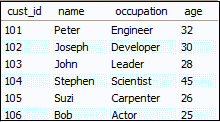
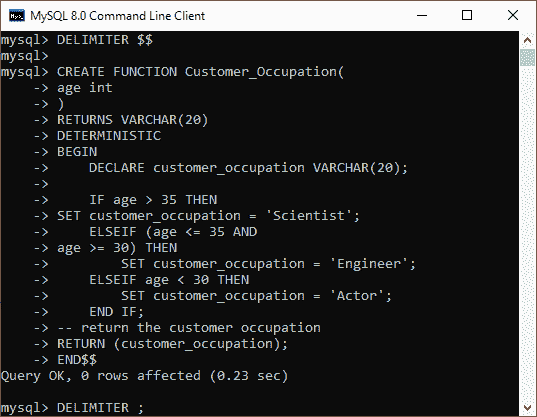
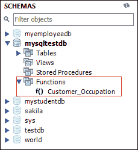
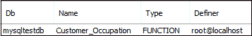
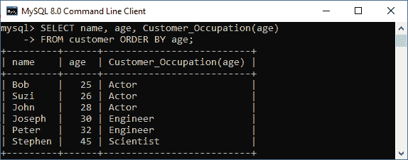
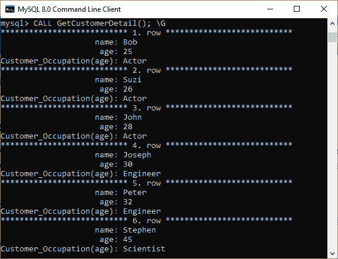

# MySQL 存储函数

> 原文：<https://www.javatpoint.com/mysql-stored-function>

MySQL 中的存储函数是一组执行某些任务/操作并返回单个值的 SQL 语句。它是 MySQL 中存储程序的类型之一。当您要创建一个存储函数时，请确保您拥有 CREATE ROUTINE 数据库权限。一般来说，我们使用这个函数来封装存储程序或 [SQL](https://www.javatpoint.com/sql-tutorial) 语句中可重用的常见业务规则或公式。

存储函数与 [MySQL](https://www.javatpoint.com/mysql-tutorial) 中的过程几乎相似，但有如下不同:

*   功能参数可以只包含**输入参数**，但不能指定该参数，而程序可以允许**输入、输出、输入参数**。
*   存储的函数只能返回函数头中定义的单个值。
*   存储函数也可以在 SQL 语句中调用。
*   它可能不会产生结果集。

因此，当我们的程序的目的是计算并只返回一个值或创建一个用户定义的函数时，我们将考虑存储函数。

在 MySQL 中创建存储函数的语法如下:

```sql

DELIMITER $$

CREATE FUNCTION fun_name(fun_parameter(s))
RETURNS datatype
[NOT] {Characteristics}
fun_body;

```

### 使用的参数

存储的函数语法使用下面讨论的以下参数:

| 参数名称 | 描述 |
| 趣味名称 | 它是我们希望在数据库中创建的存储函数的名称。它不应该与 MySQL 的内置函数名相同。 |
| 趣味参数 | 它包含函数体使用的参数列表。它不允许指定输入、输出、输入输出参数。 |
| 数据类型 | 它是函数返回值的数据类型。它应该是任何有效的 MySQL 数据类型。 |
| 特征 | 仅当声明中定义了特征(确定性、无 SQL 或读取 SQL 数据)时，才接受 CREATE FUNCTION 语句。 |
| 有趣的身体 | 此参数有一组执行操作的 SQL 语句。它至少需要一个 RETURN 语句。当执行 return 语句时，函数将自动终止。函数体如下:BEGIN - SQL 语句 END $$ DELIMITER |

## MySQL 存储函数示例

通过这个例子，让我们了解存储函数在 MySQL 中是如何工作的。假设我们的数据库有一个名为**“客户”**的表，其中包含以下数据:



现在，我们将使用下面的语句创建一个基于**年龄**返回**客户职业**的函数。

```sql

DELIMITER $$
CREATE FUNCTION Customer_Occupation(
	age int
) 
RETURNS VARCHAR(20)
DETERMINISTIC
BEGIN
    DECLARE customer_occupation VARCHAR(20);
    IF age > 35 THEN
		SET customer_occupation = 'Scientist';
    ELSEIF (age <= 35 AND 
			age >= 30) THEN
        SET customer_occupation = 'Engineer';
    ELSEIF age < 30 THEN
        SET customer_occupation = 'Actor';
    END IF;
	-- return the customer occupation
	RETURN (customer_occupation);
END$$
DELIMITER;

```

在命令行工具上执行上述语句，如下所示:



一旦函数创建成功，我们可以在 MySQL 工作台中的函数部分看到它，如下图所示:



我们还可以使用以下语句查看当前数据库中所有可用的存储函数:

```sql

SHOW FUNCTION STATUS WHERE db = 'mysqltestdb';

```

执行上述命令后，我们将获得如下输出:



### 存储函数调用

现在，我们将看到如何使用 SQL 语句调用存储函数。以下语句使用**客户 _ 职业**存储函数得到结果:

```sql

SELECT name, age, Customer_Occupation(age)
FROM customer ORDER BY age;

```

它将给出如下输出。



我们还可以在另一个存储程序中调用上述函数，例如过程、函数、触发器或任何其他 MySQL 内置函数。

### 过程中的存储函数调用

在这里，我们将看到如何在存储过程中调用这个函数。该语句在数据库中创建一个使用**Customer _ occulation()**存储函数的过程。

```sql

DELIMITER $$
CREATE PROCEDURE GetCustomerDetail()
BEGIN
	SELECT name, age, Customer_Occupation(age) FROM customer ORDER BY age;
END$$
DELIMITER ;

```

以下语句可用于调用存储过程:

```sql

CALL GetCustomerDetail();

```

我们将获得如下输出:



* * *