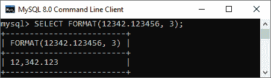
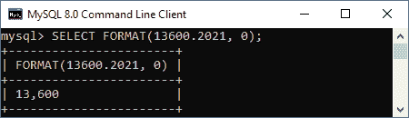
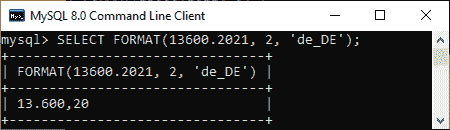
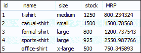
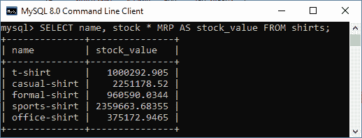
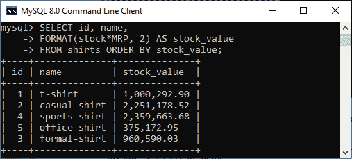

# MySQL 数字格式函数

> 原文：<https://www.javatpoint.com/mysql-number-format-function>

MySQL 中的 FORMAT 函数用于将数字格式化为“# # # #”的格式。## "，在某些小数位四舍五入。格式化数字后，它将以**字符串**的形式返回该值。

当我们计算数据库中的值，如库存周转率或产品的平均净价时，这个函数是有益的。计算结果是一个有许多小数位的小数值。在这种情况下，需要对这些数字进行格式化，以便用户能够理解。

因此，我们在 MySQL 中使用以下 FORMAT [函数的语法](https://www.javatpoint.com/mysql-functions)

```sql

FORMAT(N, D, locale);

```

该函数接受以下讨论的三个参数:

| 参数 | 说明 |
| 普通 | 这是一个我们想要格式化的数字。 |
| D | 我们要四舍五入的是小数位数。如果 D 为 0，结果将返回一个没有任何位置的字符串。 |
| 现场 | 这是一个可选的参数。它指定用于确定小数点结果的区域设置、数千个分隔符以及分隔符之间的分组。默认情况下， [MySQL](https://www.javatpoint.com/mysql-tutorial) 将使用 en_us 区域设置。 |

## MySQL 版本支持

FORMAT 功能可以支持以下 [MySQL 版本](https://www.javatpoint.com/mysql-versions):

*   MySQL 8.0
*   MySQL 5.7
*   MySQL 5.6
*   MySQL 5.5
*   MySQL 5.1
*   MySQL 5.0
*   MySQL 4.1
*   MySQL 4.0
*   MySQL 3.23.3

## MySQL FORMAT 函数示例

让我们通过各种例子来理解 FORMAT 函数在 MySQL 中是如何工作的。

以下函数将数字格式化到小数点后三位。

```sql

mysql> SELECT FORMAT(12342.123456, 3);

```

执行上述函数后，我们将获得以下输出:



接下来，下面的语句使用 FORMAT 函数，其中第二个参数是**零**。

```sql

mysql> SELECT FORMAT(13600.2021, 0);

```

执行后，我们将得到下面的输出，在这里我们可以看到结果已经产生，没有任何小数位。



以上两个函数默认使用 **en_US** 区域设置。这是因为我们没有为任何区域设置提供函数。现在，该语句使用 **de_DE** 区域设置而不是 en_US。

```sql

mysql> SELECT FORMAT(13600.2021, 2, 'de_DE');

```

我们将获得下面的输出，在这里我们可以看到 de_DE locale 使用(，)逗号运算符作为十进制标记。



让我们了解一下数据库中的上述功能。假设我们的数据库具有包含如下数据的下表:



我们可以使用以下语句计算衬衫的**股票价值**:

```sql

mysql> SELECT name, stock * MRP AS stock_value FROM shirts;

```

它将给出如下的输出，由于小数点后有很多位，看起来不太好。



我们可以使用 FORMAT 函数使它变得更好。执行以下语句，返回最多两位小数的股票价值。

```sql

mysql> SELECT i, 
FORMAT(stock*MRP, 2) AS stock_value 
FROM shirts ORDER BY stock_value;d, name

```

它将给出如下输出。



* * *