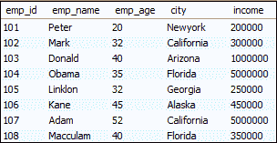
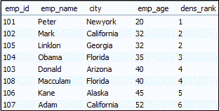
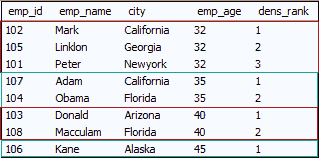
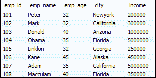
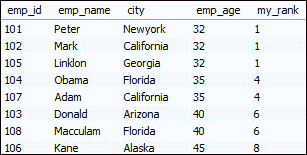
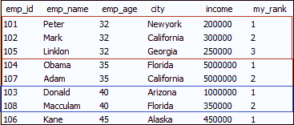
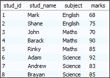
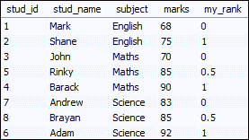
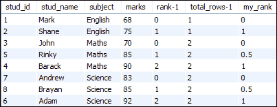

# MySQL 排名函数

> 原文：<https://www.javatpoint.com/mysql-ranking-functions>

MySQL 使用了一个排名函数，允许我们对数据库中一个分区的每一行进行排名。排名函数也是 MySQL 中窗口函数的一个子部分。MySQL 中的排名函数可以与以下子句一起使用:

*   他们总是用 **OVER()** 工作
*   他们根据的**顺序给每一行分配一个等级**
*   他们按顺序给每一行分配一个等级。
*   他们总是给行分配一个等级，从每个新分区一个开始。

#### 注意:需要注意的是，从 8.0 版本开始，MySQL 就支持排名和窗口功能。

[MySQL](https://www.javatpoint.com/mysql-tutorial) 支持以下三类排名功能:

1.  稠密秩
2.  军阶
3.  排名百分比

现在，我们将详细讨论每个排名函数:

### MySQL 密集 _rank()

它是一个函数，为分区或结果集中的每一行分配一个等级，没有任何间隔。行的等级总是以**连续的顺序**分配(从前一行增加一行)。有时你会得到一个值之间的联系，然后 dense_rank 将分配给它相同的排名，它的下一个排名将是它的下一个连续的数字。

以下是 dense_rank()的语法:

```sql

SELECT column_name 
DENSE_RANK() OVER (
    PARTITION BY expression
    ORDER BY expression [ASC|DESC])
AS 'my_rank' FROM table_name;

```

在上面的语法中，PARTITION BY 子句将结果集按 FROM 子句进行分区，然后对每个分区应用 dense_rank 函数。接下来， [ORDER BY 子句](https://www.javatpoint.com/mysql-order-by)应用于每个分区，以指定行的顺序。

### 例 1

让我们了解一下 MySQL dense_rank()函数是如何工作的。因此，首先，创建一个包含以下数据的表:

**表:员工**



此语句使用 dense_rank()函数为每行分配秩值。

```sql

SELECT emp_id, emp_name, city, emp_age,
DENSE_RANK() OVER (ORDER BY emp_age) dens_rank
FROM employees;

```

执行上述语句后，我们将获得以下输出:



### 例 2

让我们看另一个将结果集划分为分区的例子。下面的语句使用密集的 rank()函数来分配每行的值，并使用 **emp_age** 将结果集划分为分区:

```sql

SELECT emp_id, emp_name, city, emp_age,
DENSE_RANK() OVER (PARTITION BY emp_age ORDER BY city) dens_rank
FROM employees;

```

成功执行上述查询后，我们将获得以下输出:



### MySQL 排名()

它是一个函数，为分区或结果集中的每一行分配一个有间隔的等级。行的等级总是不以连续的顺序分配(即，从前一行增加 1)。有时候你会得到两个值之间的联系，然后 rank()函数会给它分配相同的等级，下一个等级值将是它的前一个等级加上一些重复的数字。

以下是 rank()的语法:

```sql

SELECT column_name 
RANK() OVER (
    PARTITION BY expression
    ORDER BY expression [ASC|DESC])
AS 'my_rank' FROM table_name;

```

在上面的语法中，PARTITION BY 子句将结果集按 [FROM 子句](https://www.javatpoint.com/mysql-from)进行划分，然后 rank()函数应用于每个分区，并在分区边界与其他分区交叉时重新初始化。接下来，ORDER BY 子句应用于每个分区，根据一个或多个列名对行进行排序。

让我们拿一个之前创建的表，用不同的例子来看看 rank() [函数在 MySQL](https://www.javatpoint.com/mysql-functions) 中的工作情况。

**表:员工**



### 例 1

此语句使用 rank()函数为每行分配秩值。

```sql

SELECT emp_id, emp_name, city, emp_age,
RANK() OVER (ORDER BY emp_age) my_rank
FROM employees;

```

上面的查询将给出以下输出:



### 例 2

让我们看另一个将结果集划分为分区的例子。以下语句使用 rank()函数分配每行的值，并使用 **emp_age** 将结果集划分为分区，并根据 **emp_id** 对它们进行排序:

```sql

SELECT *,
RANK() OVER (PARTITION BY emp_age ORDER BY emp_id) my_rank
FROM employees;

```

执行上述语句，我们将获得以下输出:



### MySQL 百分比 _ 排名()

它是一个为分区或结果集中的行计算**百分位等级**(相对等级)的函数。该函数返回一个介于 0 和 1 之间的数字。

以下是 percent_rank()的语法:

```sql

SELECT column_name 
PERCENT_RANK() OVER (
    PARTITION BY expression
    ORDER BY expression [ASC|DESC])
AS 'my_rank' FROM table_name;

```

对于指定的行，此函数使用以下公式计算排名:

```sql

(rank-1) / ( total_rows-1)

```

在这里，

**rank:** 是 rank()函数返回的每行的排名。

**total_rows:** 它表示分区中存在的总行数。

#### 注意:这是为了确保在使用该函数时，必须使用 ORDER BY 子句。否则，所有行都被认为是重复的，并被赋予相同的等级，即 1。

让我们创建一个包含以下数据的“学生”表，并查看 percent_rank()函数在 MySQL 中的工作情况。

**表:学生**



### 例 1

此语句使用 percent_rank()函数计算按标记列排序的每一行的排名值。

```sql

SELECT stud_id, stud_name, subject, marks,
PERCENT_RANK() OVER (PARTITION BY subject ORDER BY marks) my_rank
FROM students;

```

上面的查询将给出以下输出:



要了解上述公式的工作原理，请考虑以下查询:

```sql

SELECT stud_id, stud_name, subject, marks, rank() 
OVER ( partition by subject order by marks )-1 
AS 'rank-1', count(*) over (partition by subject)-1
AS 'total_rows-1', 
PERCENT_RANK() OVER (PARTITION BY subject ORDER BY marks) my_rank
FROM students;

```

它将给出以下输出:



* * *