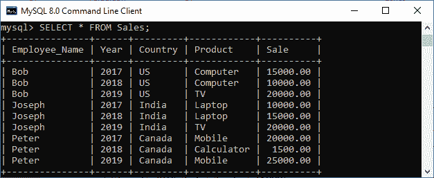
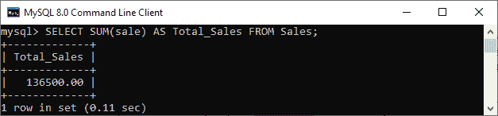
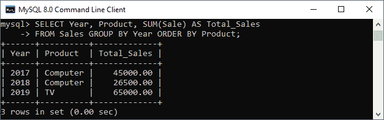
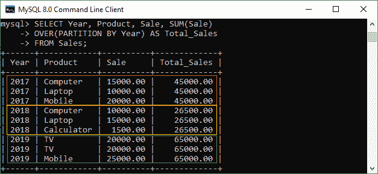
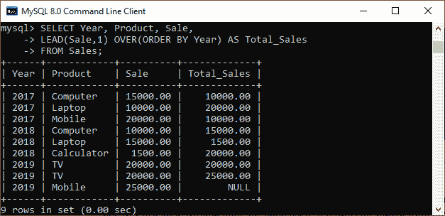

# MySQL 窗口函数

> 原文：<https://www.javatpoint.com/mysql-window-functions>

MySQL 中的一个窗口函数，用于对与**当前行**相关的一组行进行计算。当前行是发生函数求值的行。窗口函数执行的计算类似于使用聚合函数进行的计算。但是，与对整个表执行操作的聚合函数不同，窗口函数不会产生分组到一行中的结果。这意味着窗口函数对一组行执行操作， ***为每行生成一个聚合值*** 。因此，每行都保持唯一的标识。

窗口功能是 [MySQL 版本](https://www.javatpoint.com/mysql-versions) 8 发布中引入的新功能，提高了查询的执行性能。这些功能允许我们更有效地解决查询相关问题。

### 句法

以下是使用窗口函数的基本语法:

```

window_function_name(expression) 
OVER (
	[partition_defintion]
	[order_definition]
	[frame_definition]
)

```

在语法中，可以看到我们首先指定了窗口函数的名称，然后是一个表达式。然后，我们指定 **OVER** 子句，该子句包含三个表达式，即 ***分区定义、顺序定义和框架定义*** 。

它确保 OVER 子句总是有一个左括号和右括号，即使它没有任何表达式。

让我们看看 OVER 子句中使用的每个表达式的语法:

### 分割条款

该子句用于**将**行划分或断开为分区，分区边界将这些分区分开。window 函数对每个分区进行操作，当它越过分区边界时，它将被再次初始化。该子句的语法如下:

```

PARTITION BY <expression>[{,<expression>...}]

```

在 partition 子句中，我们可以定义一个或多个用逗号分隔的表达式。

### 订单条款

此子句用于指定分区内的行顺序。以下是 ORDER BY 子句的语法:

```

ORDER BY <expression> [ASC|DESC], [{,<expression>...}]

```

我们还可以使用它来对多个键上的分区内的行进行排序，其中每个键由一个表达式指定。该子句还可以定义一个或多个用逗号分隔的表达式。虽然 ORDER BY 子句可以用于所有窗口函数，但建议将其与顺序敏感窗口函数一起使用。

### 框架条款

一帧是窗口功能中当前分区 的 ***子集。所以我们使用 frame 子句来定义当前分区的子集。使用 frame 子句创建当前分区子集的语法如下:***

```

frame_unit {<frame_start>|<frame_between>}

```

我们可以使用当前行来定义一个框架，该框架允许相对于当前行的位置在分区内移动。

在语法中， **frame_unit** 可以是**row 或 RANGE** 负责定义框架行和当前行之间的关系类型。如果 frame_unit 是 row，那么 frame rows 和当前行的偏移量就是行号。而如果 frame_unit 为 RANGE，则偏移量为行值。

**帧开始**和**帧之间**表达式用于指定帧边界。frame_start 表达式有三个内容:

**无界前置**:这里，帧从当前分区的第一行开始。

**N predicated:**这里，N 是一个文字数字或一个用数字计算的表达式。它是当前第一行之前的行数。

**当前行:**指定最近计算的行

frame_between 表达式可以写成:

```

BETWEEN frame_boundary_1 AND frame_boundary_2

```

上面的表达式可以有以下内容之一:

**frame_start:** 我们之前已经解释过了。

**无界跟随**:指定分区最后一行的帧结束。

**N FOLLOWING:** 是当前第一行之后的行的物理 N。

如果 OVER 子句中没有指定 frame_definition，那么默认情况下 [MySQL](https://www.javatpoint.com/mysql-tutorial) 使用下面的框架:

```

RANGE BETWEEN UNBOUNDED PRECEDING AND CURRENT ROW

```

### 窗口功能概念

在本节中，我们将了解如何使用 MySQL 中的窗口[功能。因此，让我们首先使用以下语句创建一个名为**“销售”**的表:](https://www.javatpoint.com/mysql-functions)

```

CREATE TABLE Sales(
	Employee_Name VARCHAR(45) NOT NULL,
	Year INT NOT NULL,
            Country VARCHAR(45) NOT NULL,
	Product VARCHAR(45) NOT NULL,
	Sale DECIMAL(12,2) NOT NULL,
	PRIMARY KEY(Employee_Name, Year)
);

```

接下来，我们必须使用 [INSERT 语句](https://www.javatpoint.com/mysql-insert)将记录添加到表中，如下所示:

```

INSERT INTO Sales(Employee_Name, Year, Country, Product, Sale)
VALUES('Joseph', 2017, 'India', 'Laptop', 10000),
('Joseph', 2018, 'India', 'Laptop', 15000),
('Joseph', 2019, 'India', 'TV', 20000),
('Bob', 2017, 'US', 'Computer', 15000),
('Bob', 2018, 'US', 'Computer', 10000),
('Bob', 2019, 'US', 'TV', 20000),
('Peter', 2017, 'Canada', 'Mobile', 20000),
('Peter', 2018, 'Canada', 'Calculator', 1500),
('Peter', 2019, 'Canada', 'Mobile', 25000);

```

要验证表中的记录，请使用 SELECT 语句:

```

mysql> SELECT * FROM Sales;

```

执行后，我们可以看到记录被成功添加到表中。



为了理解窗口函数，让我们首先看看聚合函数在 MySQL 中是如何工作的。聚合函数计算多行并将结果集生成为一行。因此，执行下面的语句，该语句使用聚合函数“SUM”并返回给定年份所有员工的总销售额:

```

mysql> SELECT SUM(sale) AS Total_Sales FROM Sales;

```

**输出**



同样，我们将**“SUM”**函数与对行子集起作用的 **GROUP BY** 子句一起使用。因此，执行以下语句，返回按特定年份分组的所有产品的总销售额:

```

mysql> SELECT Year, Product, SUM(Sale) AS Total_Sales 
FROM Sales 
GROUP BY Year 
ORDER BY Product;

```

**输出**



在这两个例子中，我们可以看到一个聚合函数在执行查询后将行数减少到一行中。

与聚合函数类似，window 函数也适用于行的子集，但它不会将结果集缩减为一行。这意味着窗口函数对一组行执行操作，并为每行生成一个聚合值。**例如，**执行以下语句，返回每个产品的销售额以及给定年份的产品总销售额:

```

mysql> SELECT Year, Product, Sale, SUM(Sale) 
OVER(PARTITION BY Year) AS Total_Sales 
FROM Sales;

```

**输出**



在上面的例子中，我们可以看到窗口操作使用了 **OVER** 子句，该子句负责将查询行划分为由窗口函数处理的组。这里，OVER 子句按年对行进行分区，并在每个分区上生成一个和。成功计算后，它会生成对应于每个分区行的总和。

### 窗口函数的类型

我们可以将窗口功能主要分为以下三种类型:

### 聚合函数

它是一个对多行进行操作并在单行中产生结果的函数。一些重要的聚合函数是:

计数、求和、AVG、最小值、最大值以及更多。

### 排名函数

它是一个函数，允许我们对给定表中分区的每一行进行排序。一些重要的排名功能包括:

等级、密集等级、百分比等级、行数、CUME DIST 等。

### 分析函数

它是一个函数，局部用幂级数表示。一些重要的分析功能包括:

NTILE、LEAD、LAG、NTH、FIRST_VALUE、LAST_VALUE 等。

**分析函数示例**

这里，我们将使用 **NTILE** 窗口功能。该函数将一个**整数值**作为参数，将该组分为多个整数值。例如，如果我们使用 **NTILE(4)，**，那么它将总记录分成四组。当总记录为奇数时，它将第一行中的奇数记录相加。以下查询更清楚地解释了这一点。

```

SELECT Year, Product, Sale, 
NTile(4) OVER() AS Total_Sales 
FROM Sales;

```

**输出**


在上面的输出中，我们可以看到总共有 9 行。因此，NTILE 函数将其分成四行，第一行将增加一行。

让我们看看另一个使用**“LEAD”**功能的例子。此函数用于查询表中的多行，而不连接表本身。这意味着我们可以从当前行访问**下一行**的数据。它返回下一行的输出。执行以下语句以更清楚地理解它:

```

SELECT Year, Product, Sale, 
LEAD(Sale,1) OVER(ORDER BY Year) AS Total_Sales 
FROM Sales;

```

**输出**



* * *