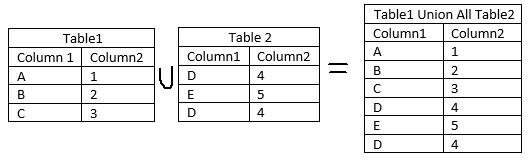
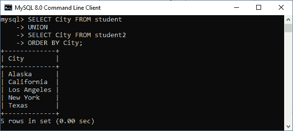
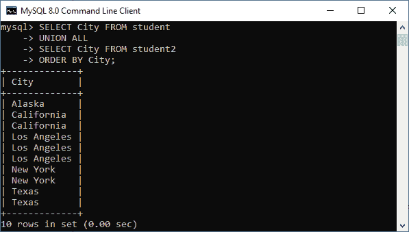

# 联合和联合所有的区别

> 原文：<https://www.javatpoint.com/mysql-union-vs-union-all>

UNION 和 UNION ALL 是数据库中用于组合多个表的结果集的两个最基本的 SQL 运算符。 ***这些运算符允许我们使用多个 SELECT 查询，检索所需的结果，然后将它们组合成最终输出*** 。在本文中，我们将看到它们之间的不同之处。在进行比较之前，我们将简要讨论这些运算符。

### 什么是联合运营商？

[MySQL 中的 Union 运算符](https://www.javatpoint.com/mysql-union)允许我们将多个 SELECT 查询的两个或多个结果组合成一个结果集。它的默认功能是**从表格中删除重复的行**。该运算符语法始终使用第一个 [SELECT 语句](https://www.javatpoint.com/mysql-select)中的列名作为输出的列名。

**[MySQL](https://www.javatpoint.com/mysql-tutorial) 联盟必须遵循以下基本规则:**

*   在所有查询中，列的数量和顺序应该相同。
*   每个选择查询的相应列位置必须具有兼容的数据类型。
*   在不同的 SELECT 查询中选择的列名必须是相同的顺序。
*   第一个 SELECT 查询的列名将是输出的列名。

#### 注:我们必须知道联合和加入是不同的。

1.  JOIN 组合来自多个不同表的数据，而 UNION 组合来自多个相似表的数据。
2.  JOIN 水平追加输出，而 UNION 垂直组合结果集。

下图更清楚地解释了这一点:


要阅读更多关于联合运营商的信息，请点击此处。

### 什么是联合所有？

UNION ALL 运算符组合来自多个 SELECT 查询的两个或多个结果，并将所有记录返回到一个结果集中。它不会从 SELECT 语句的输出中删除重复的行。

我们可以用下面的视觉表现来理解它。



### 联合与联合所有操作员

下表快速解释了它们的主要区别:

| 联盟 | 联合所有 |
| 它组合了来自多个表的结果集，**将不同的记录**返回到一个结果集中。 | 它组合了来自多个表的结果集，**将所有记录**返回到一个结果集中。 |
| 以下是 UNION 运算符的基本**语法**:
从表 1 中选择列 _ 列表
UNION
从表 2 中选择列 _ 列表； | 以下是 UNION ALL 运算符的基本**语法**:
从表 1 中选择列 _ 列表
UNION ALL
从表 2 中选择列 _ 列表； |
| 它有一个默认功能，可以从输出中消除重复的行。 | 它没有从输出中消除重复行的功能。 |
| 其**性能较慢**，因为查找然后删除重复记录需要时间。 | 它的**性能之所以快**是因为它没有消除重复的行。 |
| 大多数数据库用户更喜欢使用这个操作符。 | 大多数数据库用户不喜欢使用此运算符。 |

### 联合和联合所有示例

让我们通过一个例子来理解 Union 和 Union All 运营商的区别。假设我们有一个名为“**学生**”和“**学生 2** ”的表，其中包含以下数据:

**表:学生**


**表:学生 2**


以下 SQL 语句使用 UNION 查询从两个表中返回城市的不同名称:

```sql

SELECT City FROM student
UNION
SELECT City FROM student2
ORDER BY City;

```

执行上面的语句后，我们将得到下面的输出，因为 Union 运算符只返回不同的值。



以下 SQL 语句使用 UNION ALL 查询从两个表中返回**所有城市名称，包括重复的**:

```sql

SELECT City FROM student
UNION ALL
SELECT City FROM student2
ORDER BY City;

```

执行上述语句后，我们将得到下面的输出，因为 Union All 运算符返回完整的记录，而不消除不同的值。



* * *