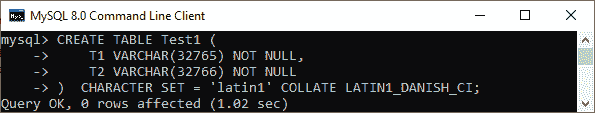
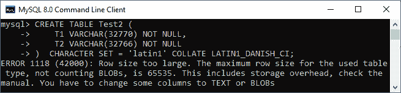
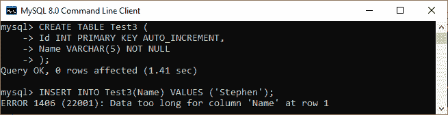
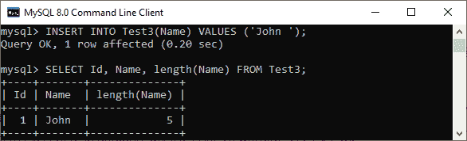
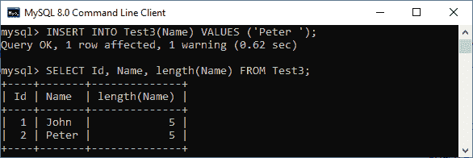

# MySQL VARCHAR

> 原文：<https://www.javatpoint.com/mysql-varchar>

MySQL 中的 Varchar 是一种用于存储文本的数据类型，其长度最大可达 **65535 个字符**。表中的 varchar 列属于**可变长度字符串**，可以包含数字或字符或两者。在版本 5.0.3 之前，这种数据类型只能存储 255 个字符，但在此版本和更高版本中，它最多可以存储 65535 个字符。它可以作为一个 1 字节或 2 字节的长度前缀加上实际大小存储在 MySQL 中。

长度前缀指定字符串值的字节长度，而不是我们设置的最大长度。如果值不需要超过 255 个字节，则列使用长度前缀加一个字节。如果值需要超过 255 个字节，则一列使用长度前缀加两个字节。

[MySQL](https://www.javatpoint.com/mysql-tutorial) 中一个 VARCHAR 的最大长度以 65，535 字节的最大行大小为准，除了 TEXT/BLOB 列和使用的字符集之外，所有列都共享该最大行大小。这意味着总列不应超过 65535 字节。

**让我们借助一个例子来理解。**

我们将创建两个表，并将其命名为 Test1 和 Test2。这两个表都包含两个名为 T1 和 T2 的列。执行以下语句创建一个表“ **Test1** ”:

```sql

CREATE TABLE Test1 (
    T1 VARCHAR(32765) NOT NULL,
    T2 VARCHAR(32766) NOT NULL
)  CHARACTER SET = 'latin1' COLLATE LATIN1_DANISH_CI;

```

上面的语句成功创建了一个表，因为列长度 T1 = 32765 加 2 字节，T2 = 32766 加 2 字节等于 65535 (32765+2+32766+2)。因此，列长度满足 varchar 的最大行大小，即 65535。



现在，我们来看看如果列大小**超过**varchar 65535 的最大大小会发生什么。执行下面的语句，增加 T1 列的大小，创建一个表**测试 2** :

```sql

CREATE TABLE Test2 (
    T1 VARCHAR(32770) NOT NULL,
    T2 VARCHAR(32766) NOT NULL
)  CHARACTER SET = 'latin1' COLLATE LATIN1_DANISH_CI;

```

执行上述语句后，MySQL 会产生错误。这意味着最大行大小不能超过 65，535 字节。无论如何，如果增加，语句就会失败，MySQL 就会产生错误。



在另一种情况下，假设我们使用下面的语句创建了一个名为 **Test3** 的表:

```sql

CREATE TABLE Test3 (
	Id INT PRIMARY KEY AUTO_INCREMENT,
	Name VARCHAR(5) NOT NULL
);

```

接下来，使用下面的语句将值插入表中:

```sql

INSERT INTO Test3(Name) VALUES ('Stephen');

```

现在，执行上面的语句。MySQL 给出错误消息: ***第 1 行*** 的“名称”列数据太长。输出解释得更清楚。



### MySQL VARCHAR 和 Spaces

存储 varchar 值时，MySQL 不会为它们填充空间。MySQL 在存储或检索 varchar 值时也保留了尾随空格。我们可以通过下面的例子来理解，一个[插入语句](https://www.javatpoint.com/mysql-insert)在表**测试 3** 的**名称**列中添加值:

```sql

INSERT INTO Test3(Name) VALUES ('John ');

```

接下来，执行 SELECT 语句来检索这些值。

```sql

SELECT Id, Name, length(Name) FROM Test3;

```

它将给出以下输出，其中 MySQL 在计算长度时包含了尾随空格，因为它不会增加列的长度。



然而，当我们试图插入一个尾随空格超过列长度的 varchar 值时，MySQL 将**截断尾随空格。此外，MySQL 发布了一条**警告**。下面的例子解释得更清楚:**

```sql

INSERT INTO Test3(Name) VALUES ('Peter ');

```

上面的语句在名称列中插入一个长度为**六**的值。该值仍然插入到列中，但是 [MySQL 在添加该值之前会截断](https://www.javatpoint.com/mysql-truncate-table)的尾随空格。我们可以使用下面的查询进行验证，在该查询中，我们可以看到 insert 语句已成功添加，但有一条警告给出: ***第 1 行*** 列“名称”的数据被截断:



### Char 和 Varchar 数据类型的区别

char 和 varchar 数据类型都遵循 **[ASCII](https://www.javatpoint.com/ascii-full-form) 字符**。它们几乎相同，但在存储和从数据库中检索数据方面有所不同。下表总结了 char 和 varchar 数据类型之间的本质区别:

| 茶 | 可变长字符串 |
| 它代表性格。 | 它代表可变字符。 |
| 它以固定长度存储我们在创建表时声明的值。 | 它将值存储在具有一个或两个字节长度前缀的可变长度字符串中。 |
| 此数据类型可以用尾随空格填充，以保持指定的长度。 | 存储时，此数据类型不能填充任何字符，包括空格。 |
| 它不能超过 255 个字符。 | 最多可容纳 65535 个字符。 |
| 它支持静态内存分配。 | 它支持动态内存分配。 |

* * *