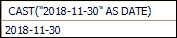
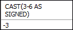
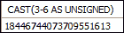
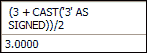
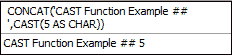
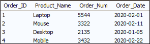
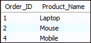

# MySQL CAST()函数

> 原文：<https://www.javatpoint.com/mysql-cast-function>

MySQL 中的 CAST()函数用于将一个值从一种数据类型转换为表达式中指定的另一种数据类型。它主要用于 WHERE、HAVING 和 JOIN 子句。这个函数类似于 [MySQL](https://www.javatpoint.com/mysql-tutorial) 中的 CONVERT()函数。

以下是该函数可以完美工作的数据类型:

| 数据类型 | 描述 |
| 日期 | 它将该值转换为“YYYY-MM-DD”格式的日期数据类型。它支持' 1000-01-01 '到' 9999-12-31 '范围内的日期。 |
| DATETIME | 它将该值转换为“YYYY-MM-DD HH:MM:SS”格式的日期时间数据类型。它支持从“1000-01-01 00:00:00”到“9999-12-31 23:59:59”的范围。 |
| 时间 | 它将该值转换为“时:分:秒”格式的时间数据类型。它支持' 838:59:59 '到' 838:59:59 '的时间范围。 |
| 茶 | 它将一个值转换为包含固定长度字符串的 CHAR 数据类型。 |
| 小数 | 它将值转换为包含十进制字符串的 DECIMAL 数据类型。 |
| 签名 | 它将一个值转换为包含有符号 64 位整数的 SIGNED 数据类型。 |
| 无符号的 | 它将一个值转换为包含无符号 64 位整数的 UNSIGNED 数据类型。 |
| 二进制的 | 它将一个值转换为包含 BINARY 字符串的 binary 数据类型。 |

### 句法

以下是 MySQL 中 CAST() [函数的语法:](https://www.javatpoint.com/mysql-functions)

```sql

CAST(expression AS datatype);

```

### 参数说明

该语法接受两个参数，将在下面讨论:

| 参数 | 要求 | 描述 |
| 表示 | 需要 | 它是一个将被转换成另一个特定数据类型的值。 |
| 数据类型 | 需要 | 它是需要转换表达式值的值或数据类型。 |

### 返回值

转换后，它将返回一个我们想要转换的数据类型的值。

### MySQL 版本支持

CAST 功能可以支持以下 [MySQL 版本](https://www.javatpoint.com/mysql-versions):

*   MySQL 8.0
*   MySQL 5.7
*   MySQL 5.6
*   MySQL 5.5
*   MySQL 5.1
*   MySQL 5.0
*   MySQL 4.1
*   MySQL 4.0

让我们通过下面的例子来理解 MySQL CAST()函数。我们可以直接在 SELECT 语句中使用 CAST 函数。

### 例 1

该语句将该值转换为 DATE 数据类型。

```sql

SELECT CAST("2018-11-30" AS DATE);

```

**输出**



### 例 2

该语句将该值转换为 SIGNED 数据类型。

```sql

SELECT CAST(3-6 AS SIGNED);

```

**输出**



### 例 3

该语句将该值转换为 UNSIGNED 数据类型。

```sql

SELECT CAST(3-6 AS UNSIGNED);

```

**输出**



### 例 4

有时需要显式地将字符串转换为整数，使用以下语句将值转换为 integer 数据类型。

```sql

SELECT (3 + CAST('3' AS SIGNED))/2;

```

**输出**



### 例 5

下面的语句首先将整数值转换为字符串数据类型，然后与另一个指定的字符串进行串联。

```sql

SELECT CONCAT('CAST Function Example ## ',CAST(5 AS CHAR));

```

**输出**



### 例 6

在这个例子中，我们将看到 CAST 函数如何处理表。让我们首先创建一个包含以下数据的表“**订单**”:



在上表中，我们可以看到 Order_Date 是日期数据类型。现在，如果我们想获得选定时间范围内的产品名称，请执行下面的语句。这里，在评估 WHERE 条件之前，将文本字符串转换为时间戳值。

```sql

SELECT Order_ID, Product_Name FROM Orders 
WHERE Order_Date 
BETWEEN CAST('2020-02-01' AS DATETIME) AND CAST('2020-02-28' AS DATETIME);

```

该语句将产生以下输出:



* * *