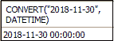
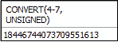
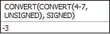
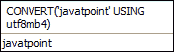
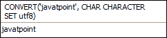
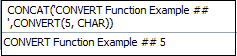
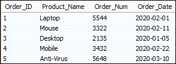
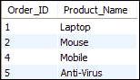

# MySQL 转换()函数

> 原文：<https://www.javatpoint.com/mysql-convert-function>

MySQL 中的 CONVERT()函数用于将一个值从一种数据类型转换为表达式中指定的另一种数据类型。MySQL 还允许它将一个指定值从一个字符集转换到不同的**字符集**。

以下是该函数可以完美工作的数据类型:

| 数据类型 | 描述 |
| 日期 | 它将该值转换为只负责日期部分的 DATE 数据类型。它总是以“YYYY-MM-DD”格式出现。它支持' 1000-01-01 '到' 9999-12-31 '范围内的日期。 |
| DATETIME | 它将该值转换为负责日期和时间部分的 DATETIME 数据类型。它总是产生“YYYY-MM-DD HH:MM:SS”格式。它支持从“1000-01-01 00:00:00”到“9999-12-31 23:59:59”的范围。 |
| 时间 | 它将该值转换为只负责时间部分的时间数据类型。它总是以“时:分:秒”的格式出现。它支持' 838:59:59 '到' 838:59:59 '的时间范围。 |
| 茶 | 它将一个值转换为 CHAR 数据类型，该数据类型具有固定长度的字符串。 |
| 签名 | 它将一个值转换为 SIGNED 数据类型，该数据类型具有带符号的 64 位整数。 |
| 无符号的 | 它将一个值转换为 UNSIGNED 数据类型，该数据类型具有无符号 64 位整数。 |
| 小数 | 它将一个值转换为 decimal 数据类型，该数据类型包含一个 DECIMAL 字符串。 |
| 二进制的 | 它将一个值转换为具有二进制字符串的 BINARY 数据类型。 |

### 句法

以下是 [MySQL](https://www.javatpoint.com/mysql-tutorial) 中 **CONVERT()** 函数的语法:

```

CONVERT(expression, datatype);
OR,
CONVERT(expression USING character_set);

```

### 参数说明

该语法接受以下参数，这些参数将在下面讨论:

| 参数 | 要求 | 描述 |
| 表示 | 需要 | 它是一个将被转换成另一个特定数据类型的指定值。 |
| 数据类型 | 需要 | 它指定了我们想要转换的数据类型。 |
| 字符集 | 需要 | 它指定了我们想要转换的字符集。 |

### 返回值

它将返回一个我们想要转换的数据类型或字符集的值。

### MySQL 版本支持

该功能可支持以下[版本](https://www.javatpoint.com/mysql-versions):

*   MySQL 8.0
*   MySQL 5.7
*   MySQL 5.6
*   MySQL 5.5
*   MySQL 5.1
*   MySQL 5.0
*   MySQL 4.1
*   MySQL 4.0

让我们通过下面的例子来理解 MySQL CONVERT()函数。我们可以直接在 SELECT 语句中使用 CONVERT 函数。

### 例 1

当我们实现该语句时，它会将该值转换为 DATETIME 数据类型。

```

SELECT CONVERT("2018-11-30", DATETIME);

```

**输出**



### 例 2

当我们实现该语句时，它会将该值转换为 UNSIGNED 数据类型。

```

SELECT CONVERT(4-7, UNSIGNED);

```

**输出**



### 例 3

当我们实现该语句时，它会将该值转换为 SIGNED 数据类型。

```

SELECT CONVERT(CONVERT(4-7, UNSIGNED), SIGNED);

```

**输出**



### 例 4

当我们实现该语句时，它会将字符串值转换为 utf8mb4 字符集。

```

SELECT CONVERT('javatpoint' USING utf8mb4);

```

**输出**



### 例 5

有时需要在不同的字符集之间转换字符串。在这种情况下，我们使用以下语句进行转换:

```

SELECT CONVERT('javatpoint', CHAR CHARACTER SET utf8mb4);

```

**输出**



### 例 6

下面的语句首先将整数值转换为字符串数据类型，然后与另一个指定的字符串进行串联。

```

SELECT CONCAT('CONVERT Function Example ## ',CONVERT(5, CHAR));

```

**输出**



### 例 7

在本例中，我们将看到 CONVERT 函数如何处理该表。让我们首先创建一个表“**订单**，该表包含以下数据:



在上表中，**订单 _ 日期**是日期数据类型。因此，如果我们想要在选定的时间范围内获得产品名称，请执行下面的语句。

```

SELECT Order_ID, Product_Name FROM orders 
WHERE Order_Date 
BETWEEN CONVERT('2020-02-01', DATETIME) AND CONVERT('2020-03-10', DATETIME);

```

我们将获得以下输出:



### CAST 和 CONVERT 函数的区别

[CAST 功能](https://www.javatpoint.com/mysql-cast-function)和 CONVERT 功能的主要区别总结在下表中:

| 塞内加尔 | CAST()函数 | CONVERT()函数 |
| **1。** | 我们使用它将一种数据类型转换成另一种数据类型。 | 我们使用它将一种数据类型转换成另一种数据类型。 |
| **2。** | 它不能让我们转换字符集。 | 它可以用来转换字符集。 |
| **3。** | 它是 ANSI-SQL 规范的一部分。 | 它不是 ANSI-SQL 规范的一部分。 |
| **4。** | 它使用“AS”来分隔参数。 | 它使用“逗号(，”或“USING”来分隔参数。 |

* * *