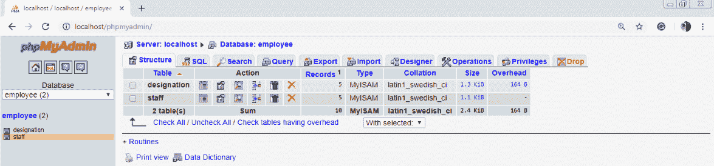
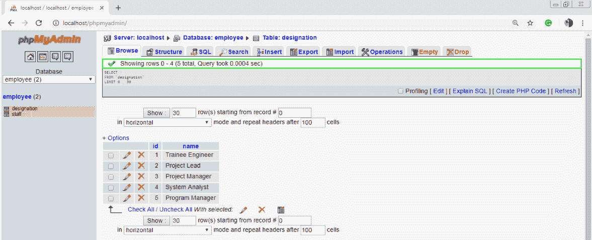
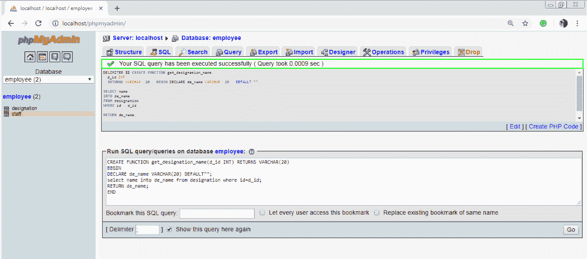
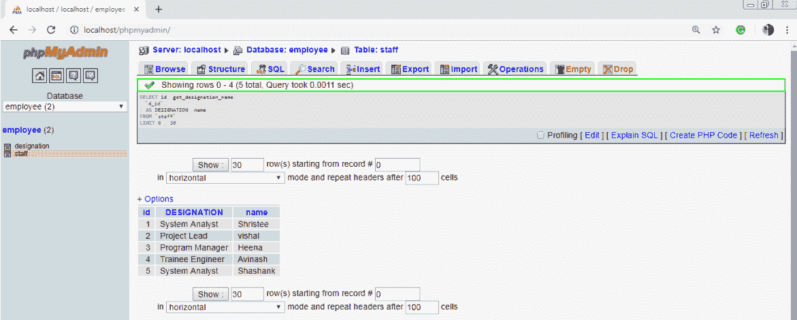
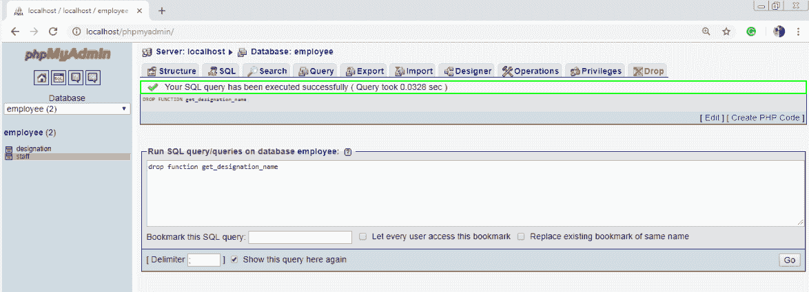

# MySQL 函数

> 原文：<https://www.javatpoint.com/mysql-functions>

## 创建函数

在 MySQL 中，也可以创建函数。函数总是使用 return 语句返回值。该函数可用于 SQL 查询。

## 句法

```sql

CREATE FUNCTION function_name [ (parameter datatype [, parameter datatype]) ] 
RETURNS return_datatype
BEGIN
Declaration_section
Executable_section
END;

```

## 参数:

**函数名:**函数名

**参数:**参数个数。它可以是一个或多个。

**return_datatype:** 函数的返回值数据类型

**声明 _ 节:**声明所有变量。

**executive _ section:**函数的代码写在这里。

## 例 1

**步骤 1:** 创建数据库和表。

**数据库:**员工



表 1:名称



表 2:工作人员


**步骤 2:** 创建函数

**功能查询:**

```sql

DELIMITER $$ 
CREATE FUNCTION get_designation_name(d_id INT) RETURNS VARCHAR( 20 ) 
BEGIN 
DECLARE de_name VARCHAR( 20 ) DEFAULT "";
SELECT name INTO de_name FROM designation WHERE id = d_id;
RETURN de_name;
END $$

```



**步骤 3:** 执行功能

**查询:**

SELECT id，get_designation1(`d_id `)作为指定，名称 FROM 'staff '



## 删除函数

在 MySQL 中函数也可以去掉。当函数标识被删除时，它将从数据库中删除。

## 语法:

```sql

Drop function [ IF EXISTS ] function_name;

```

## 参数

**函数名:**要删除的函数的名称。

## 例 1:

drop 函数 get _ designation _ name



* * *