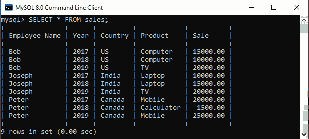
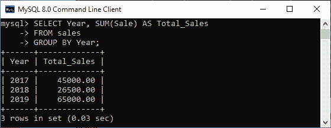
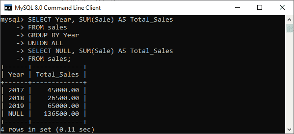
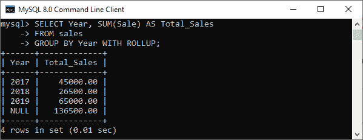
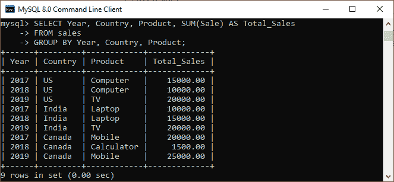
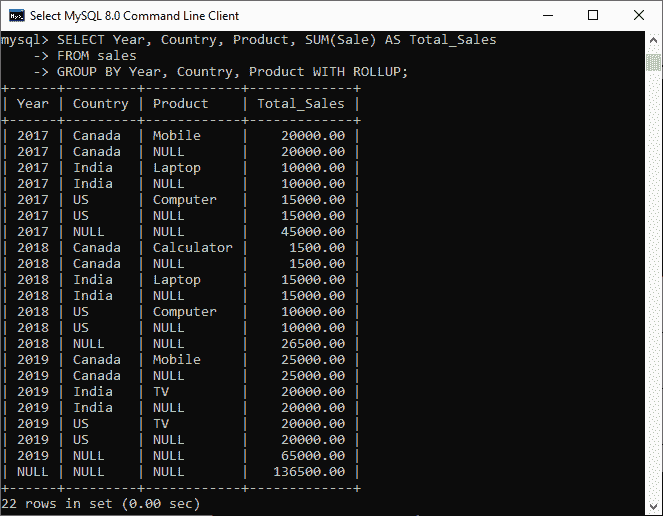
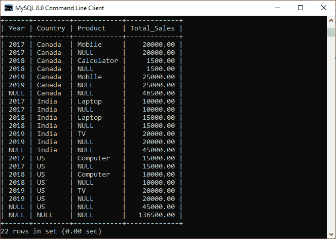
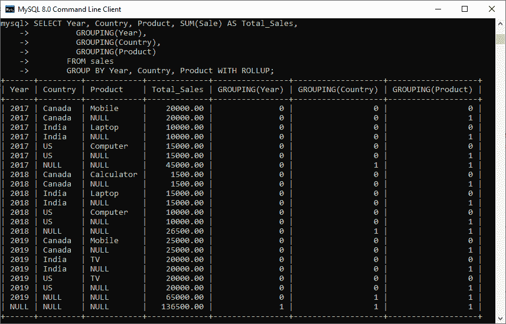
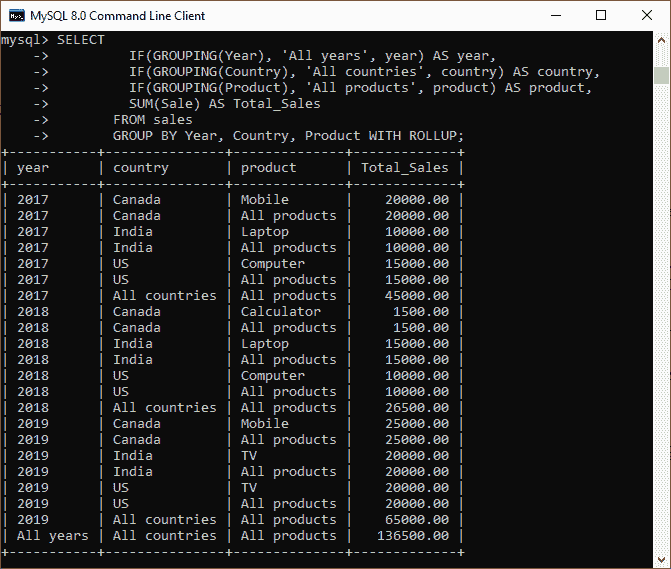
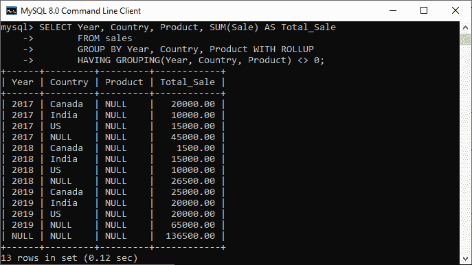

# MySQL ROLLUP

> 原文：<https://www.javatpoint.com/mysql-rollup>

MySQL 中的 ROLLUP 是一个修饰符，用于**生成汇总输出，包括表示超聚合(更高级)汇总操作的额外行**。它使我们能够使用一个查询总结多个分析级别的输出。它主要用于为 OLAP(在线分析处理)业务提供支持。

***roll up 修饰符只能与 [MySQL](https://www.javatpoint.com/mysql-tutorial) 中的 GROUP BY 查询一起使用。***

**语法:**

以下是使用 ROLLUP 修饰符的语法:

```

SELECT 
    column1, column2, column3, ...
FROM 
    table_name
GROUP BY
    column1, column2,... WITH ROLLUP; 

```

在这个语法中，我们需要在 SELECT 子句中指定查询结果中显示的**列名**。接下来，我们将提到**表名**。之后，我们已经指定了 **GROUP BY** 子句，包括我们想要聚合数据所基于的列名。最后，我们用 ROLLUP 修饰符指定**来获得额外一行中的超聚合输出。**

我们已经了解到 GROUP BY 查询应用了聚合函数，如 [MAX](https://www.javatpoint.com/mysql-max) 、 [MIN](https://www.javatpoint.com/mysql-min) 、 [SUM](https://www.javatpoint.com/mysql-sum) 、 [COUNT](https://www.javatpoint.com/mysql-count) 、 [AVG](https://www.javatpoint.com/mysql-average) 等。按单列或多列对输出行进行分组。“汇总”修饰符是使用“分组依据”查询的一个选项，该查询包括用于表示分类汇总的额外字段。这些额外的行称为超级聚合行，它是总计行的组合。因此，ROLLUP 修饰符允许我们基于 MySQL 中 [GROUP BY 子句中指定的列，在单个查询中创建多组集合行。](https://www.javatpoint.com/mysql-group-by)

## MySQL 汇总解释

如果我们想理解 ROLLUP 修饰符，我们必须知道什么是分组集。分组集是我们想要分组以获得结果输出的一组列。例如，假设我们有一个包含以下数据的表**“销售额”**:



如果我们想总结每年的结果，我们将使用如下简单的 GROUP BY 子句:

```

SELECT Year, SUM(Sale) AS Total_Sales 
FROM sales 
GROUP BY Year;

```

它将给出以下输出，显示每年的总销售额:



在上面的查询中，分组集由列名 Year 表示。如果我们需要在一个查询中一起生成多个分组集，我们可以使用 UNION ALL 运算符，如下所示:

```

SELECT Year, SUM(Sale) AS Total_Sales 
FROM sales 
GROUP BY Year
UNION ALL
SELECT NULL, SUM(Sale) AS Total_Sales 
FROM sales;

```

在这个查询中，我们可以看到空列。这是因为 [UNION](https://www.javatpoint.com/mysql-union) ALL 子句要求所有查询具有相同的列数。为了满足这个要求，我们在第二个查询的选择列表中添加了空值。

当我们执行查询时，我们得到以下输出:



**年**列的输出中的空值代表总计超总值。但是，由于该查询能够生成每年的总销售额以及总销售额，因此它有两个问题:

1.  这使得查询相当长。
2.  这降低了查询的性能，因为数据库引擎在内部执行两个独立的查询，并将结果集组合成一个输出。

为了解决这些问题，MySQL 允许我们使用 ROLLUP 子句，该子句在一个查询中提供两个层次的分析。ROLLUP 子句是 GROUP BY 子句的扩展，它生成另一行并显示总计(超级聚合)值。

让我们看看在 GROUP BY 子句中添加 WITH ROLLUP 修饰符后的结果，它显示了所有年份值的总计:

```

SELECT Year, SUM(Sale) AS Total_Sales 
FROM sales 
GROUP BY Year WITH ROLLUP;

```

当我们执行该命令时，我们将获得如下输出:



在这个输出中，我们可以在**年列**中看到**空值**，该值标识超聚合线。它清楚地表明，ROLLUP 子句不仅生成小计，而且给出全年总销售额的总计。

如果 GROUP BY 子句有多个列，则 ROLLUP 修饰符具有更复杂的效果。在这种情况下，**roll up 修饰符假定在 GROUP BY 子句**中指定的列之间存在层次结构。每次列值发生变化时，查询都会在结果的末尾生成一个额外的超级聚合汇总行。

例如，假设我们在 GROUP BY 子句中指定了如下三列:

```

GROUP BY c1, c2, c3 WITH ROLLUP

```

“累计”修改器采用如下层次结构:

```

c1 > c2 > c3

```

并生成以下分组集:

```

(c1, c2, c3)
(c1, c2)
(c1)
()

```

请参见下面的查询以更清楚地解释它:

```

SELECT Year, Country, Product, SUM(Sale) AS Total_Sales
FROM sales
GROUP BY Year, Country, Product;

```

如果没有 ROLLUP，基于 GROUP BY 子句中指定的多个列的销售表摘要看起来像下面的输出。在这里，我们将仅在分析的年份/国家/产品级别获得汇总值。



添加了 ROLLUP 后，查询会产生几个额外的行:

```

SELECT Year, Country, Product, SUM(Sale) AS Total_Sales
FROM sales
GROUP BY Year, Country, Product WITH ROLLUP;

```

请参见以下输出:



上述输出在四个分析级别生成信息，解释如下:

*   首先，给定年份和国家的每组产品行都会生成一个额外的超级汇总汇总行，显示所有产品的总计。它会将产品列设置为空。
*   接下来，给定年份的每组行都会生成一个额外的超级汇总汇总行，显示所有国家和产品的总计。它会将“国家”和“产品”列设置为空。
*   最后，对于所有其他行，它会生成一个额外的超级聚合汇总行，显示所有列的总计。它会将年份、国家和产品列设置为空。

如果我们更改 GROUP BY 列中指定的列的顺序，我们将得到不同的结果:

```

SELECT Year, Country, Product, SUM(Sale) AS Total_Sales
FROM sales
GROUP BY Country, Year, Product WITH ROLLUP;

```

请参见以下输出:



### 分组()函数

grouped()函数用于检查结果集中的空值是否代表常规分组值、超聚合值或总计。当超聚合行中出现空值时，它返回一个。否则，它返回 0。

我们可以在选择列表中使用 GROUPING()函数、 **HAVING** 子句和 **ORDER BY** 子句。

请参见下面的查询:

```

SELECT Year, Country, Product, SUM(Sale) AS Total_Sales,
         GROUPING(Year),
         GROUPING(Country),
         GROUPING(Product)
       FROM sales
       GROUP BY Year, Country, Product WITH ROLLUP; 

```

当**年**列中的空值出现在超级聚合行中时，**分组(年)**返回 1，我们将得到以下输出。否则，它将返回零。

类似地，当国家列中的空值出现在超级聚合行中时，**分组(国家)**返回 1。否则，它将返回零。

此外，当产品列中的空值出现在超聚合行中时，**分组(产品)**返回 1。否则，它将返回零。



我们还可以使用 GROUPING()函数来用有意义的标签代替超聚合空值，而不是直接显示它。

下面的查询解释了如何将 **IF()** 函数与 GROUPING()函数相结合，用标签替换年份、国家和产品列中的超聚合空值:

```

SELECT
         IF(GROUPING(Year), 'All years', year) AS year,
         IF(GROUPING(Country), 'All countries', country) AS country,
         IF(GROUPING(Product), 'All products', product) AS product,
         SUM(Sale) AS Total_Sales
       FROM sales
       GROUP BY Year, Country, Product WITH ROLLUP;

```

我们将获得如下输出:



如果我们在 LOGGING()函数中有多个参数，它将返回一个表示组合每个表达式结果的位掩码的输出。这里，最低位产生最右边参数的结果。下面的例子将被这样评估:

**示例:**分组(年份、国家、产品)

```

  result for GROUPING(Product)
+ result for GROUPING(Country) << 1
+ result for GROUPING(Year) << 2

```

如果任何参数具有超聚合空值，则这种分组()的结果是非零的。在这种情况下，它将只返回超级聚合行，并使用以下查询过滤常规分组行:

```

mysql> SELECT Year, Country, Product, SUM(Sale) AS Total_Sale
       FROM sales
       GROUP BY Year, Country, Product WITH ROLLUP
       HAVING GROUPING(Year, Country, Product) <> 0;

```

它将给出以下输出:



* * *