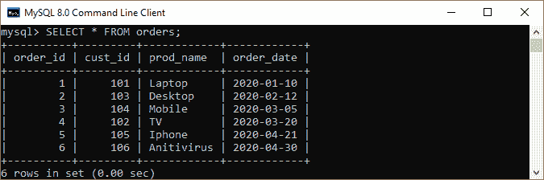
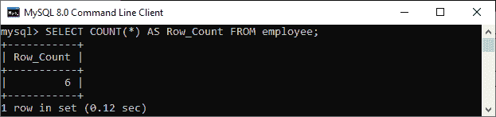
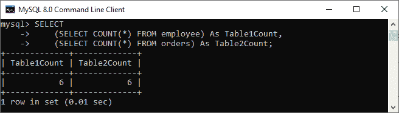
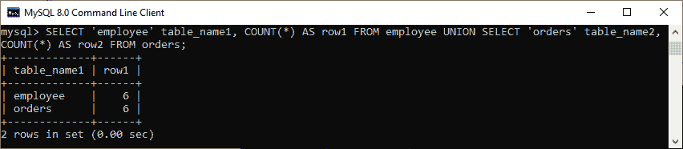
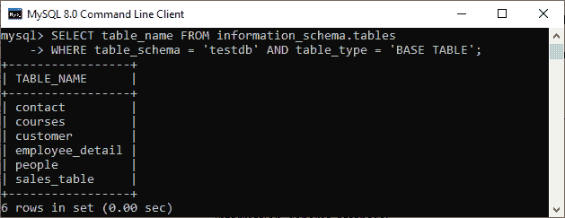
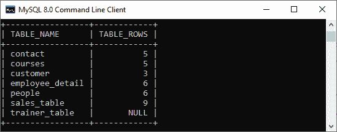
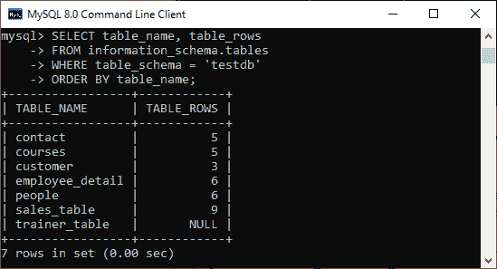

# MySQL ROW COUNT

> 原文：<https://www.javatpoint.com/mysql-row-count>

### 如何获取 MySQL 表中的行数？

行数是指**数据库**中有多少条记录可用。这是在开发和运营期间发现和监控表增长的一项关键活动。允许我们返回表中可用记录数的最简单、最流行的函数是 **MySQL COUNT()函数**。这是一个[聚合函数](https://www.javatpoint.com/mysql-aggregate-functions)，它对整个记录集进行处理，并产生一个单一的汇总输出。

我们可以使用 [MySQL COUNT()函数](https://www.javatpoint.com/mysql-count)来完成以下事情:

*   返回表中可用记录的数量。
*   通过查询或别名表返回行数。
*   获取列中非空值的计数。
*   获取列中不同或唯一值的计数。

### 语法:

以下是获取 [MySQL](https://www.javatpoint.com/mysql-tutorial) 中单个表的行数的语法:

```sql

SELECT COUNT (*)
FROM table_name
[WHERE conditions];

```

让我们用以下表格进行演示:

**表:员工**


**表:订单**



例如，如果我们想得到**雇员**表中的总行数，我们需要使用如下语法:

```sql

mysql> SELECT COUNT(*) AS Row_Count FROM employee;

```

我们应该得到如下截图的输出:



### 获取两个或更多表的行计数

如果我们想得到两个或多个表的行数，需要使用**子查询**，即每个单独的表有一个子查询。

### 例子

假设我们想在一个查询中得到**员工**和**订单**表的行数，我们必须执行如下查询:

```sql

mysql> SELECT 
    (SELECT COUNT(*) FROM employee) As Table1Count, 
    (SELECT COUNT(*) FROM orders) As Table2Count;

```

**输出:**

我们将获得如下输出结果:



我们也可以使用 [**UNION** 运算符](https://www.javatpoint.com/mysql-union)来获取两个或多个表的行数，其中运算符组合了单个 [SELECT 查询](https://www.javatpoint.com/mysql-select)返回的结果:

```sql

mysql> SELECT 'employee' table_name1, COUNT(*) AS row1 FROM employee UNION SELECT 'orders' table_name2, COUNT(*) AS row2 FROM orders;

```

我们将获得如下输出:



### 获取特定数据库中所有表的行计数

MySQL 还允许我们获取特定数据库中所有表的行数。以下是帮助我们统计特定数据库中所有表的行数的步骤:

**步骤 1:** 首先，我们需要获取数据库中所有可用的表名。

**第二步:**其次，创建一个 SQL 语句，该语句包含由 UNION 运算符分隔的所有表的计数查询。

**第三步:**最后，使用 MySQL Prepared 语句执行查询。

要获取特定数据库表的所有表名，请从 information_schema 数据库执行以下查询:

```sql

mysql> SELECT table_name FROM information_schema.tables
WHERE table_schema = 'testdb' AND table_type = 'BASE TABLE';

```

上述数据库有以下表格:



接下来，构造 SQL 语句。这里，我们将使用 GROUP_CONCAT 和 CONCAT 函数来构造语句:

```sql

SELECT 
    CONCAT(GROUP_CONCAT(CONCAT('SELECT \'',
                        table_name,
                        '\' table_name,COUNT(*) rows FROM ',
                        table_name)
                SEPARATOR ' UNION '),
            ' ORDER BY table_name')
INTO @sql 
FROM
    table_list;

```

在上面的查询中，table_list 是特定数据库中可用的表的名称，由第一步中使用的查询产生。因此，上面的 SQL 查询变成:

```sql

SELECT CONCAT(GROUP_CONCAT(CONCAT('SELECT \'', table_name,
                '\' table_name,COUNT(*) rows FROM ', table_name)
                SEPARATOR 'UNION'), ' ORDER BY table_name')
INTO @sql FROM
    (SELECT table_name FROM information_schema.tables
WHERE table_schema = 'testdb' AND table_type = 'BASE TABLE') table_list;

```

如果您使用的是 [MySQL 版本](https://www.javatpoint.com/mysql-versions) 8.0 或更高版本，则可以使用 [MySQL CTE(通用表表达式)](https://www.javatpoint.com/mysql-common-table-expression)来代替派生表:

```sql

WITH table_list AS (
SELECT table_name FROM information_schema.tables
WHERE table_schema = 'testdb' AND table_type = 'BASE TABLE') 
SELECT CONCAT(
            GROUP_CONCAT(CONCAT("SELECT '",table_name,"' table_name,COUNT(*) rows FROM ",table_name) SEPARATOR " UNION "),
            ' ORDER BY table_name')
INTO @sql
FROM table_list;

```

第三，使用准备好的语句执行@sql 语句，如下所示:

```sql

PREPARE stmt FROM  @sql;
EXECUTE stmt;
DEALLOCATE PREPARE stmt;

```

执行上述语句后，我们将获得如下输出:



### 用单一查询获取数据库中所有表的行计数

MySQL 还提供了一个查询来统计特定数据库中所有表的行数。最快的方法是直接从 **information_schema** 数据库查询数据。请参见以下声明:

```sql

mysql> SELECT table_name, table_rows
    FROM information_schema.tables
    WHERE table_schema = 'testdb'
    ORDER BY table_name;

```

执行后，我们将得到如下结果:



有时这个查询不会返回准确的结果。这是因为表中的实际行数和 information_schema 中的行数不同步。我们可以通过在从 information_schema 数据库查询行数之前运行 ANALYZE TABLE 语句来避免这种不准确的结果。

```sql

mysql> ANALYZE TABLE table_name, ...;

```

* * *